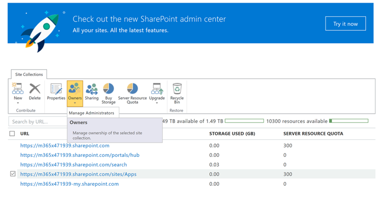

# Visualizzare o aggiungere un amministratore al Catalogo app SharePoint Online

Per installare correttamente CLO365, l'utente che effettua il provisioning della soluzione deve essere elencato come amministratore del catalogo app tenant.

1. Dal portale Office 365 amministrazione passare all'interfaccia SharePoint di amministrazione di SharePoint Online
1. **Selezionare** l'URL del Catalogo app dall'URL dell'elenco di raccolte 
1. Verificare che il programma di installazione clo365 sia elencato come uno degli amministratori del catalogo app.

Se il nome utente è elencato, è possibile tornare al provisioning del sito Learning personalizzato.  Se i passaggi successivi non vengono completati. 

## Aggiungere un amministratore

1. Nell'SharePoint admin center seleziona la casella di controllo accanto all'URL del catalogo app e seleziona la casella di riepilogo a discesa Proprietari.

1. Seleziona Gestisci amministratori dal menu a discesa 
1. Aggiungere la persona corretta come amministratore della raccolta siti e fare clic su OK per salvare le modifiche.
