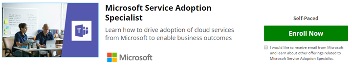

# Convalidare le proprie competenze - Diventare uno specialista nell'adozione di servizi

Se l'adozione dei servizi fa parte del tuo ruolo o vuoi approfondire la formazione formale su questo argomento, puoi iscriverti al corso online fornito da Microsoft nel nostro sito partner, EdX.org. 

Questo [corso on-line di Service Adoption Specialist](/learn/paths/m365-service-adoption/) è gratuito per il **controllo**.  Se desideri ricevere il certificato EdX per il completamento, è necessaria una commissione di $99,00.  Questo corso è stato creato da [Karuana Gatimu](https://linkedin.com/in/karuanagatimu) di Microsoft Teams Engineering con l'input di più esperti MICROSOFT MVP e Microsoft IT.  Le procedure consigliate contenute all'interno sono state raccolte dall'osservazione dell'intero settore e sono complementari a una formazione formale sulla gestione dei cambiamenti organizzativi.  

Questo corso contiene indicazioni pratiche, strumenti e contenuti aggiuntivi che ti consentiranno di convalidare le tue competenze in questa importante funzionalità aziendale.  

Per ulteriori informazioni, [vedere l'annuncio](https://aka.ms/AdoptionCertAnnouncement) sulla pubblicazione di questo corso. 

Partecipa alla community online di utenti aziendali e professionisti IT che apprendono sull'adozione all'indirizzo https://aka.ms/DriveAdoption .