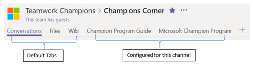

# Individuare la ChampionsFinding your Champions 

È probabile che già sapere chi sono i champions, anche se non si dispone un programma formale.  Questi sono utenti che:It is likely you already know who your champions are, even if you do not currently have a formal program.  These are people who:

Spesso visibili aiuto con tecnologia esistente usufruire di apprendimento e informazioni sulle nuove tecnologie potrebbe essere vocale sulle limitazioni di soluzioni corrente sono vero e le nuove tecnologie, anche prima che gli altri collaboratoriAre often seen helping others with existing technology Enjoy teaching and learning about new technology May be vocal about the limitations of current solutions Are keen to try new things, even before other co-workers

> [!NOTE]
> Champions sono diversi da utenti che condividono test del nuovo software per la sola tecnologia. Champions si basano sull' **aiuto** indipendentemente dal contesto.Champions are different from people who enjoy testing new software for the technology alone. Champions thrive on **helping others** regardless of context. 

## Avviare small e previsteStart small and grow

Se l'organizzazione non dispone di un programma da specialisti corrente o si desidera rafforzare quello che si sono invia un invito a un gruppo ristretto di persone noti adattare il profilo descritto in precedenza.  Raccogliere quindi per illustrare gli obiettivi di nuovo programma e ottenerne i commenti. True Champions desidera avere la propria voce ascoltare e la sensazione che fanno parte della creazione di un elemento.If your organization does not have a current Champion program or you would like to reinvigorate the one you have send an invitation to a small group of known people who fit the above profile.  Gather then together to discuss the goals of the new program and get their feedback. True Champions like to have their voice heard and feel as if they are a part of creating something.  

## Creare una strutturaProvide structure

Programmi da specialisti corretto dispongono di un coordinatore e una pianificazione regolare per soddisfare i problemi correnti.  Le riunioni mensile almeno sono una parte importante della creazione di una lingua positiva nella community e promuovere crescita.Successful champion programs have a leader and a regular schedule to meet and discuss current issues.  Monthly meetings at a minimum are an important part of creating a positive culture in the community and fostering growth.  

È inoltre possibile utilizzare Microsoft Teams per creare un hub programma degli Champions il lavoro del team.  In [questo articolo](https://docs.microsoft.com/en-us/MicrosoftTeams/teams-adoption-your-first-teams)è possibile per un esempio per tale struttura team.You can also use Microsoft Teams to create a hub for your Teamwork Champions' program.  An example for that team structure can be found in [this article](https://docs.microsoft.com/en-us/MicrosoftTeams/teams-adoption-your-first-teams).

