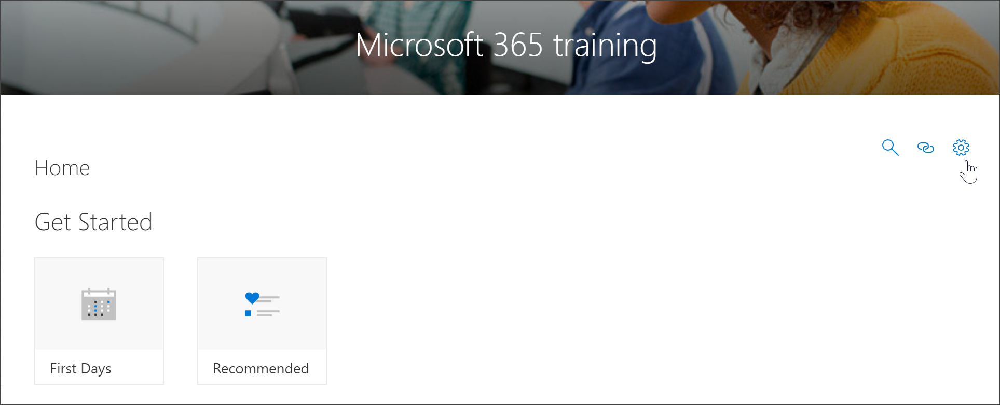
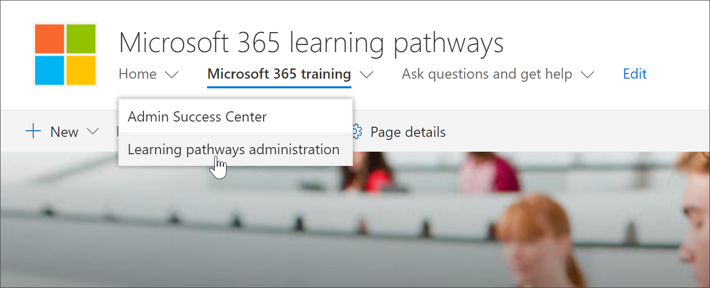

# Accedere alla pagina di amministrazione dell'apprendimento personalizzato

La pagina di amministrazione dell'apprendimento personalizzato è il punto di controllo centrale per l'amministrazione della web part Microsoft 365 Learning Pathwasy. La pagina Amministrazione percorsi di apprendimento è disponibile solo per gli amministratori di SharePoint. Gli utenti con privilegi dei membri che visitano il sito non vedranno l'opzione **amministra playlist** . Inoltre, solo gli amministratori avranno la possibilità di aprire la pagina di amministrazione dell'apprendimento personalizzato dalla voce di menu **Home** di SharePoint.  

> [!IMPORTANT]
> Le modifiche apportate nella pagina Custom Learning Administration, ad esempio per nascondere una sottocategoria di prodotti o una playlist, verranno riflesse in tutte le istanze della web part. Inoltre, è consigliabile che un solo amministratore al momento apportasse modifiche alla pagina Custom Learning Administrator, in quanto l'apprendimento personalizzato non fornisce il rilevamento delle collisioni se più persone usano l'amministrazione di apprendimento personalizzato contemporaneamente.  

## Accesso dalla web part di apprendimento personalizzato-metodo preferito
Come illustrato in questo esempio, l'apertura della pagina di amministrazione dell'apprendimento personalizzato dalla web part è il metodo preferito, poiché apre la pagina di amministrazione in una nuova finestra del browser. Con questo metodo, è facile capovolgersi tra le pagine a schede per controllare o modificare il proprio lavoro.  

1. Nella Home page di Microsoft 365 Learning pathways fare clic sul riquadro di **formazione di Office 365** .
2. Fare clic sul menu **sistema** e quindi su **amministra playlist**. 

## Accesso dalla voce di menu Home
Invece di passare a una pagina con una Web part, gli amministratori possono accedere alla pagina Microsoft Learning amministrazione dalla voce di menu **Home** di SharePoint. 

- Nella Home page di Microsoft 365 Learning pathways fare clic sul menu **Home** e quindi su **Microsoft Learning Administration**.

