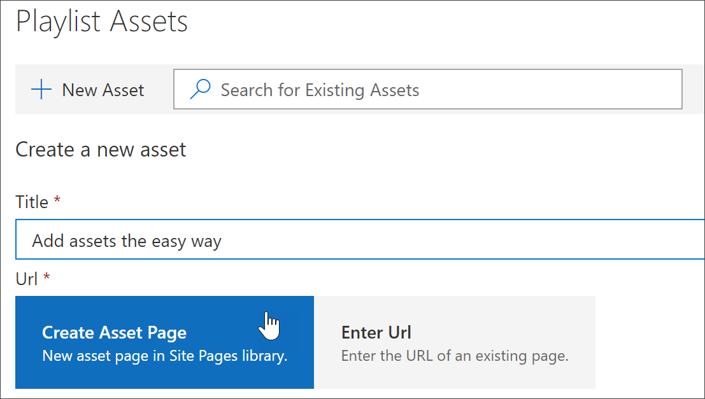
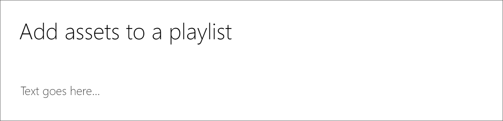
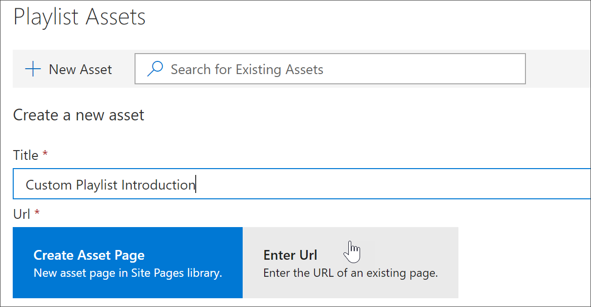
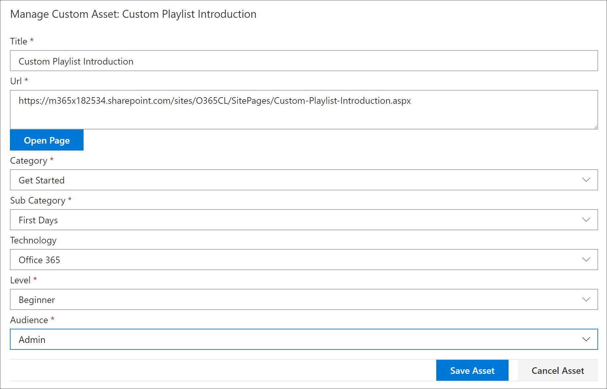
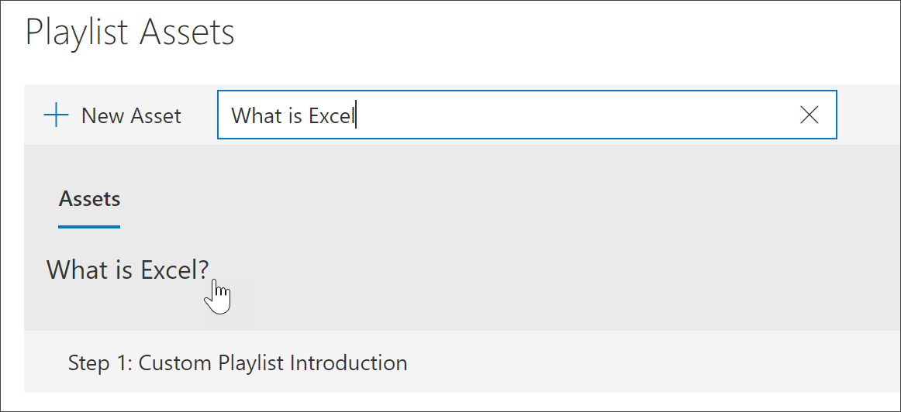
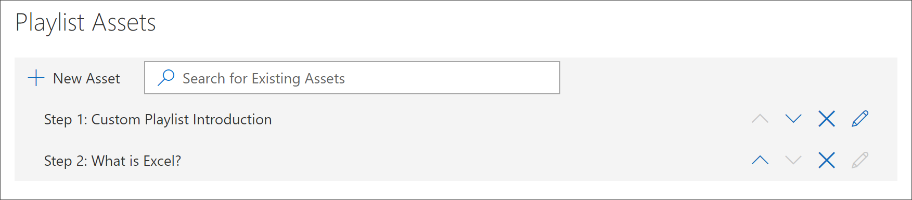
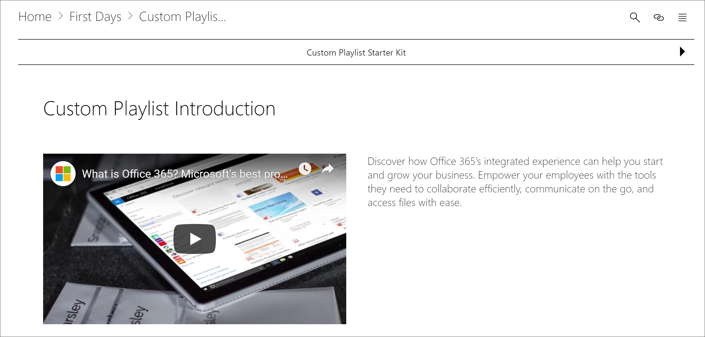

# Aggiungere risorse a un elenco di riproduzione personalizzatoAdd Assets to a Custom Playlist

Con l'apprendimento personalizzato, è possibile aggiungere le risorse seguenti a una playlist:With Custom Learning, you can add the following assets to a playlist:

- **Asset di apprendimento personalizzati esistenti** -sono risorse che fanno parte del catalogo Microsoft online o delle risorse che l'organizzazione ha già aggiunto all'apprendimento personalizzato.**Existing Custom Learning assets** - these are assets that are part of the Microsoft online catalog or assets that your organization has already added to Custom Learning.
- **Nuove risorse** : sono risorse che vengono aggiunte all'apprendimento personalizzato che sono state create dalle pagine di SharePoint che si creano o risorse di SharePoint già disponibili in un sito di SharePoint nell'organizzazione.**New assets** - these are assets that you add to Custom Learning that are built from SharePoint pages that you create or SharePoint assets that are already available on a SharePoint site in your organization. 

> [!TIP]
> Se una risorsa Microsoft playlist non soddisfa le proprie esigenze, creare una nuova playlist e quindi aggiungere le risorse Microsoft e tutte le risorse appena create alla playlist per creare l'esperienza desiderata. Non è possibile modificare le playlist di apprendimento personalizzate fornite da Microsoft, ma è possibile aggiungere risorse di apprendimento personalizzate a una playlist personalizzata.If a Microsoft playlist asset doesn't meet your needs, create a new playlist and then add the Microsoft assets and any newly created assets to the playlist to build the experience you want. You can't modify Custom Learning playlists supplied by Microsoft, but you can add Custom Learning-supplied assets to a custom playlist.   

## Creare una nuova risorsa per una playlistCreate a new asset for a playlist

Sono disponibili due opzioni per l'aggiunta di un nuovo asset a una playlist.There are two options for adding a new asset to a playlist.

- **Pagina Crea risorsa** -con questa opzione, l'apprendimento personalizzato genererà una nuova pagina di SharePoint vuota per l'utente e la aggiungerà alla playlist. È quindi possibile aggiungere contenuto alla pagina e salvarlo.**Create Asset Page** - with this option, Custom Learning will generate a new,  blank SharePoint page for you and add it to the playlist. You can then add content to the page and save it.  
- **Immettere l'URL** -con questa opzione, è possibile creare la pagina in anticipo oppure è già disponibile la pagina e si specifica l'URL per aggiungere la pagina alla playlist.**Enter the URL** - with this option, you build the page in advance or you already have the page available and you specify the URL to add the page to the playlist.

### Pagina Crea assetCreate Asset Page 
Con l'opzione **Crea pagina risorsa** , è possibile specificare un titolo per il bene, quindi fare clic su Crea pagina asset per creare e aprire una nuova pagina di SharePoint per la modifica.With the **Create Asset Page** option, you provide a title for the Asset, then click Create Asset page to create and open a new SharePoint page for editing. 

1.  Se la playlist non è ancora aperta per la modifica, dalla pagina **Custom Learning Administration** fare clic sulla playlist che si desidera modificare.If the playlist isn't already open for editing, from the **Custom Learning Administration** page, click the playlist you wish to edit. 
2. Per aggiungere un nuovo cespite a una playlist, fare clic su **nuovo asset**.To add a new asset to a playlist, click **New Asset**. 
3. Immettere un titolo. In questo esempio viene immesso "Aggiungi risorse a una playlist" e quindi fare clic su **Crea asset page**.Enter a title. In this example enter “Add Assets to a Playlist”, and then click **Create Asset Page**.

4. Fare clic su **Apri pagina**.Click **Open Page**.
5. Fare clic sull'icona **modifica** e quindi su **Modifica web part** nell'area titolo.Click the **Edit** icon, and then click **Edit Web part** in the Title area.
6. In **layout**fare clic su **normale**.Under **Layout**, click **Plain**. 
7. Aggiungere una nuova sezione a una colonna e quindi aggiungere del testo di esempio alla pagina in modo che sia simile all'esempio seguente.Add a new one-column section, and then add some sample text to the page so it looks like the following example. 

7. Fare clic su **pubblica**.Click **Publish**.
8. Tornare alla pagina **Custom Learning Administration** .Return to the **Custom Learning Administration** page. 
9. Compilare la parte restante delle proprietà del cespite, quindi fare clic su **Salva risorsa.**Fill out the remainder of the properties for the asset, and then click **Save Asset.**

### Immettere l'URLEnter the URL
Con l'opzione **immettere l'URL** , è possibile specificare un titolo per il bene, quindi fare clic su **immettere l'URL** per indicare la pagina di SharePoint che si desidera aggiungere alla playlist.With the **Enter the URL** option, you provide a title for the Asset, then click **Enter the URL** to specify the SharePoint page you want to add to the playlist. 

1.  Se la playlist non è aperta per la modifica, dalla pagina di **amministrazione dell'apprendimento personalizzato** fare clic sulla playlist che si desidera modificare.If the playlist isn't open for editing, from the **Custom Learning Administration** page, click the playlist you wish to edit. 
2. Per aggiungere un nuovo cespite a una playlist, fare clic su **nuovo asset**.To add a new asset to a playlist, click **New Asset**. 
3. Immettere un titolo. In questo esempio, immettere "Introduzione playlist personalizzata", quindi fare clic su **Immetti URL**.Enter a title. In this example, enter “Custom Playlist Introduction”, and then click **Enter URL**. 

4. Immettere l'URL della pagina di SharePoint creata in una precedente sezione [creare pagine di SharePoint per playlist personalizzate](custom_createnewpage.md) e quindi compilare il resto dei campi, come illustrato nella figura seguente.Enter the URL of the SharePoint page you created in a previous [Create SharePoint pages for custom playlists ](custom_createnewpage.md) section, and then fill out the remainder of the fields, as shown in the following illustration.

5. Fare clic su **Salva risorsa**.Click **Save Asset**. 

## Aggiungere una risorsa esistente a una playlistAdd an existing asset to a playlist

Le risorse esistenti sono costituite da risorse o risorse di apprendimento personalizzate fornite da Microsoft che sono già state aggiunte all'apprendimento personalizzato dall'organizzazione.Existing assets consist of Microsoft-provided Custom Learning assets or assets that have already been added to Custom Learning by your organization. 

- Nella casella di **ricerca** immettere una frase di ricerca e quindi selezionare una risorsa dai risultati della ricerca. In questo esempio, immettere "What ' s Excel?" per aggiungere un argomento introduttivo di Excel alla playlist.In the **Search** box, enter a Search phrase, and then select an asset from the Search results. In this example, enter “What is Excel?” to add an Excel intro topic to the playlist.

## Modificare, spostare ed eliminare risorseEdit, move, and delete assets
È possibile modificare le risorse personalizzate create, ma non le risorse di Microsoft. Tuttavia, è possibile rimuovere tutte le risorse da una playlist e cambiare le risorse degli ordini.You can edit custom assets that you create, but not assets from Microsoft. However, you can remove all assets from a playlist and change the order assets. 

### Modificare una risorsaEdit an asset
- Fare clic sul pulsante modifica di un asset, modificare il cespite e quindi fare clic su Salva risorsa.Click the Edit button for an asset, modify the asset, and then click Save Asset. 

### Spostare una risorsa in una playlistMove an asset in a playlist
- Fare clic sulla freccia verso l'alto o verso il basso a destra del cespite per spostare l'ordine dei cespiti nella playlistClick the up or down arrow to the right of the asset to move the asset order in the playlist

### Rimuovere una risorsa da una playlistRemove an asset from a playlist
- Fare clic sull'icona Rimuovi da playlist X per il cespite.Click the Remove from Playlist X icon for the asset. 

## Visualizzazione dell'elenco di riproduzione in azioneView the playlist in Action
Dopo aver aggiunto risorse a una playlist, chiudere la playlist e visualizzarla in azione.Now that you've added assets to a playlist, let's close the playlist and see it in action. 

1. Fare clic su **Chiudi playlist**.Click **Close Playlist**.
2. Fare clic sulla scheda con la pagina **training di Office 365** .Click the tab with the **Office 365 training** page.
3. Aggiornare la pagina e quindi fare clic su **primi giorni** in inizia. \*\*\*\*Refresh the page, and then click **First Days** under **Get Started**.
4. Fare clic su **personalizzato Learning Starter Kit** per visualizzare la prima playlist in azione.Click **Custom Learning Starter Kit** to view your first playlist in action. 

