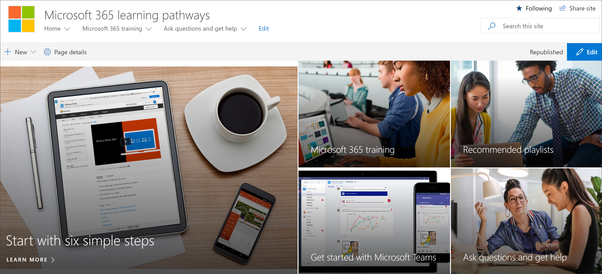
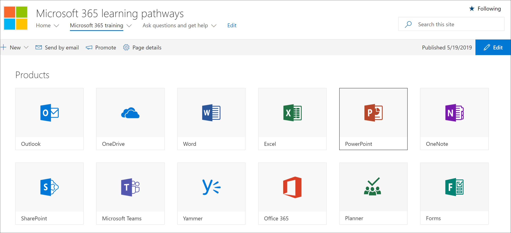

# Aggiungere un sito di apprendimento personalizzato per i proprietariAdd Owners Custom Learning site

Il sito apprendimento personalizzato per Office 365 è ospitato nel tenant di Office 365, quindi sarà necessario accedere a Office 365, se non si è già effettuato l'accesso, per accedere al sito.The Custom Learning for Office 365 site is hosted in your Office 365 tenant, so you'll need to sign in to Office 365, if you're not already signed in, to get to the site. 

## .Sign in to Office 365 

1.  Aprire il web browser e passare a office.com o alla posizione di accesso dell'organizzazione.Open your Web browser and navigate to office.com or your organization’s sign-in location. 
2.  Eseguire l'accesso con il nome utente e la password.Sign in with your user name and password.
3.  Passare al percorso del sito.Navigate to the location of the site. Se non è disponibile, è possibile trovarlo nella posta ricevuta dal servizio di provisioning PnP.If you don't have it available, you can find it in the mail you recieved from the PnP Provisioning Service. Selezionare SharePoint dalla home page di Office 365 e quindi selezionare il sito Apprendimento personalizzato **per Office 365.**Select SharePoint from the Office 365 Home page, and then select the **Custom Learning for Office 365** site. È possibile che sia stato denominato diverso.You may have named it different. 
5. Fare clic **sul riquadro formazione di Office 365** per visualizzare la famiglia completa di playlist di formazione disponibili con Apprendimento personalizzato e per verificare che l'apprendimento personalizzato funzioni come previsto.Click the **Office 365 training** tile to see the full suite of training playlist available with Custom Learning and to verify Custom Learning is working as expected. 

   

## Visualizzare tutto il contenuto di apprendimento personalizzatoView all the Custom Learning content
La pagina di formazione di Office 365 ospita la web part Apprendimento personalizzato configurata per mostrare tutta la formazione disponibile per l'apprendimento personalizzato.The Office 365 training page hosts the Custom Learning Web part configured to show all the training available for Custom Learning. 

1. Scorrere la pagina verso il basso per visualizzare tutte le categorie e le sottocategorie.Scroll down the page to view all the categories and subcategories.
2. Scalciare un po' le gomme.Kick the tires a bit. Fai clic su alcune sottocategorie e quindi su alcune playlist per avere un'immagine dell'organizzazione del contenuto didattico personalizzato.Click a few subcategories, and then click a few playlists to get a feel for how Custom Learning content is organized. 

## Aggiungere proprietari al sitoAdd Owners to Site
In quanto amministratore tenant, è improbabile che tu sia la persona che personalizza il sito, quindi dovrai assegnare alcuni proprietari al sito.As the Tenant Admin, it's unlikely you'll be the person customizing the site, so you'll need to assign a few owners to the site. I proprietari dispongono di privilegi amministrativi per il sito in modo che possano modificare le pagine del sito e rebrand il sito.Owners have administrative privileges on the site so they can modify site pages and rebrand the site. Hanno anche la possibilità di nascondere e mostrare il contenuto recapitato tramite la web part Apprendimento personalizzato.They also have the ability to hide and show content delivered through the Custom Learning Web part. Inoltre, possono creare playlist personalizzate e assegnarle a sottocategorie personalizzate.They'll also have the ability to build custom playlist and assign them to custom subcategories.  

1. Scegliere Autorizzazioni sito **dal** menu Impostazioni di SharePoint. From the SharePoint **Settings** menu, click **Site Permissions**.
2. Fare clic **su Impostazioni di autorizzazione avanzate**.Click **Advanced Permission Settings**.
3. Fare **clic su Apprendimento personalizzato per i proprietari di Office 365**.Click **Custom learning for Office 365 Owners**.
4. Fare **clic** su Nuovo Aggiungi utenti a questo gruppo, aggiungere le persone che si desidera siano proprietari  >  e quindi fare clic su **Condividi.**Click **New** > **Add Users to this group**, add the people you want to be Owners, and then click **Share**.

