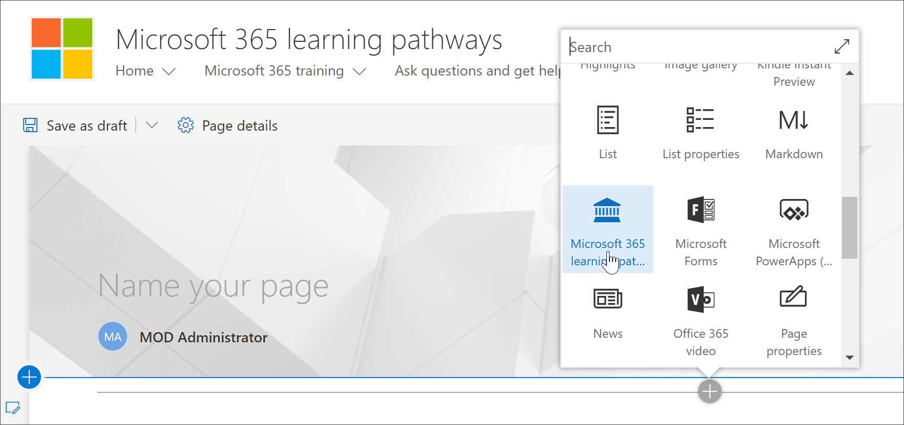
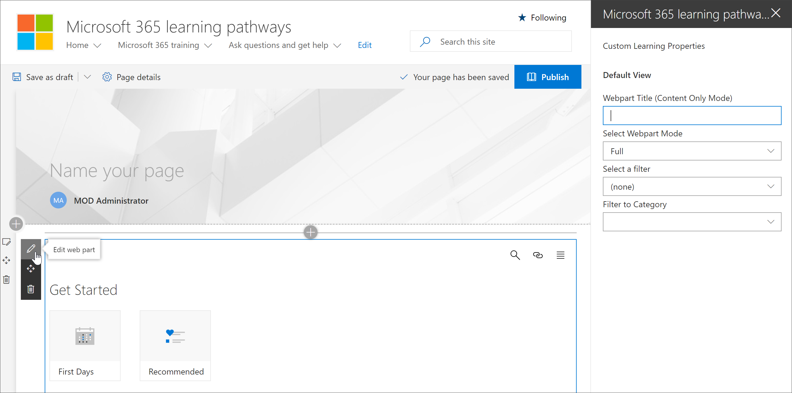
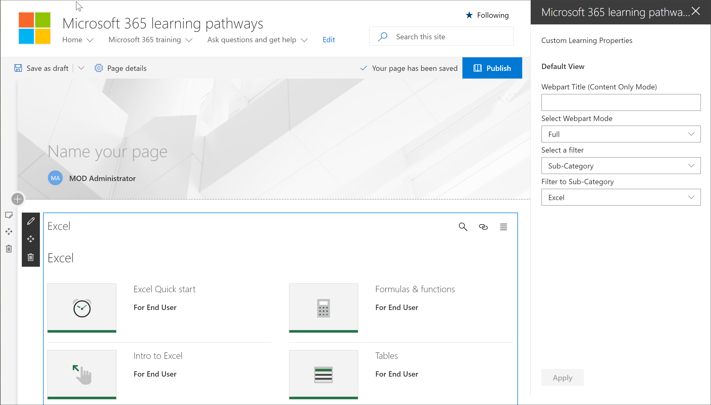

# Aggiungere e modificare la Web part percorsi di apprendimento di Microsoft 365

Microsoft 365 Learning pathways offre la flessibilità necessaria per aggiungere la Web part Microsoft 365 Learning pathways a una pagina di SharePoint e quindi filtrare il contenuto della web part in modo da soddisfare gli obiettivi di apprendimento per la pagina. Ad esempio, è possibile creare una pagina "make the switch to OneDrive", quindi aggiungere la Web part e configurarla in modo da visualizzare le playlist personalizzate di migrazione di OneDrive create appositamente per la propria organizzazione.

1.  Fare clic sull'icona dell'ingranaggio di SharePoint e quindi fare clic su **Aggiungi pagina**.
2.  Fare clic su **Aggiungi una nuova sezione (+)** sul lato sinistro della pagina, quindi fare clic su **una colonna**.
3.  Fare **+** clic su, quindi selezionare Web part **Microsoft 365 Learning pathways** . 

## Modificare la Web part di apprendimento personalizzata
È possibile modificare la Web part per i percorsi di apprendimento di Microsoft 365 per visualizzare tutti i contenuti di apprendimento personalizzati disponibili o una categoria specifica, una sottocategoria, una playlist o un asset. 

1.  Fare clic su **Modifica web part**.

2. Nel riquadro proprietà di apprendimento personalizzate filtrare la Web part per gli elementi seguenti. 

- Modalità WebPart: Full
- Filtro: Sottocategoria
- Sottocategoria: Excel

3. La pagina dovrebbe avere un aspetto simile all'immagine seguente: 

## Aggiungere un titolo e pubblicare la pagina
1. Nell'area titolo della pagina digitare "creare la propria esperienza".
2. Fare clic sull'icona **Modifica web part** nell'area titolo, selezionare **normale** in **layout**e quindi chiudere il riquadro **Proprietà** .
3. Fare clic su **Pubblica**.
