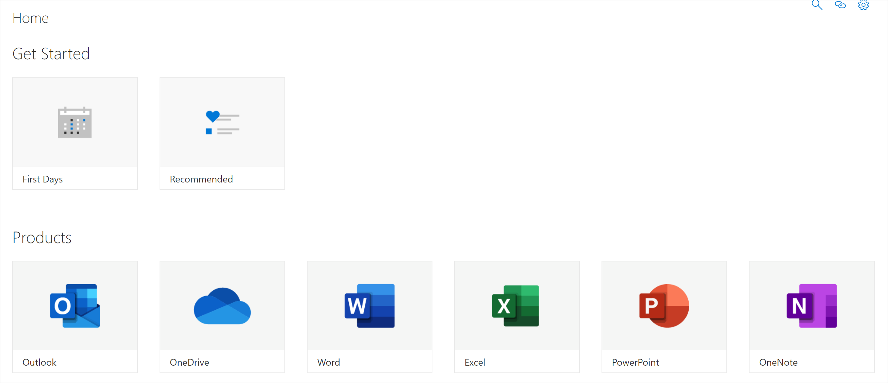

# Informazioni sulle pagine dell'applicazione di SharePoint

L'apprendimento personalizzato fornisce due pagine dell'applicazione di SharePoint che è necessario conoscere come amministratore dell'apprendimento personalizzato. Queste due pagine non sono modificabili. 

- CustomLearningAdmin. aspx
- CustomLearningAdmin. aspx

## CustomLearningAdmin. aspx

La pagina CustomLearningAdmin. aspx fornisce caratteristiche amministrative per l'apprendimento personalizzato, tra cui la visualizzazione e la creazione e la modifica di sottocategorie e playlist. Questa pagina e la relativa funzionalità verranno illustrate più dettagliatamente nelle sezioni successive.

### Visualizzazione di CustomLearningAdmin. aspx

1. Fare clic sull'icona **delle impostazioni** di SharePoint e quindi fare clic su **contenuto del sito**. 
2. Fare clic su **CustomLearningAdmin. aspx**. 

## CustomLearningViewer. aspx
La pagina CustomLearningViewer. aspx fornisce un visualizzatore per la visualizzazione di contenuto di apprendimento personalizzato nella web part. Ad esempio, se si copia un collegamento di playlist e lo si condivide con un collaboratore, il collegamento, quando si fa clic, porta l'utente nella pagina del visualizzatore e visualizza il contenuto collegato. Questa pagina e la relativa funzionalità verranno illustrate in modo più dettagliato negli argomenti successivi.

### Visualizzazione di CustomLearningViewer. aspx

1. Fare clic sull'icona **delle impostazioni** di SharePoint e quindi fare clic su **contenuto del sito**. 
2. Fare clic su **CustomLearningViewer. aspx**. 

