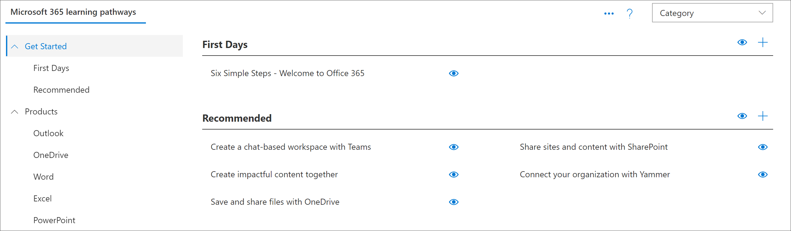

# Informazioni sulle pagine dell'applicazione SharePoint

Learning sono disponibili due SharePoint di applicazioni che è consigliabile conoscere come amministratore. Queste due pagine non sono modificabili e non devono essere eliminate. 

- CustomLearningAdmin.aspx
- CustomLearningViewer.aspx

## CustomLearningAdmin.aspx

La pagina CustomLearningAdmin.aspx offre funzionalità amministrative per i percorsi di apprendimento, tra cui nascondere e visualizzare il contenuto e creare e modificare sottocategorie e playlist. Questa pagina e le relative funzionalità verranno descritte in modo più dettagliato nelle sezioni successive.

### Visualizzare CustomLearningAdmin.aspx

1. Fare clic sull SharePoint Impostazioni e quindi su Pagine **sito Contenuto**   >  **sito.** 
2. Fare **clic su CustomLearningAdmin.aspx.** 

## CustomLearningViewer.aspx
La pagina CustomLearningViewer.aspx fornisce un visualizzatore per la visualizzazione del contenuto dei percorsi di apprendimento nella web part. Se ad esempio si copia un collegamento playlist e lo si condivide con un collega, quando si fa clic sul collegamento, l'utente viene visualizzato nella pagina Visualizzatore e viene visualizzato il contenuto collegato. 

### Visualizzare CustomLearningViewer.aspx

1. Fare clic sull SharePoint Impostazioni e quindi su Pagine **sito Contenuto**   >  **sito.** 
2. Fare **clic su CustomLearningViewer.aspx.** 

