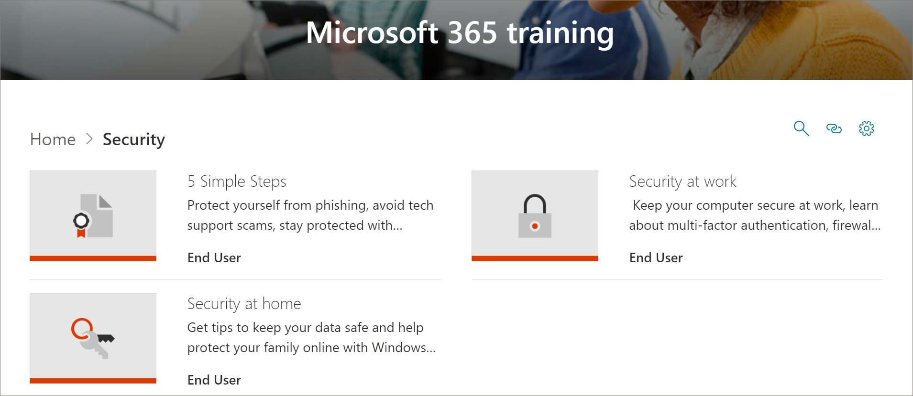
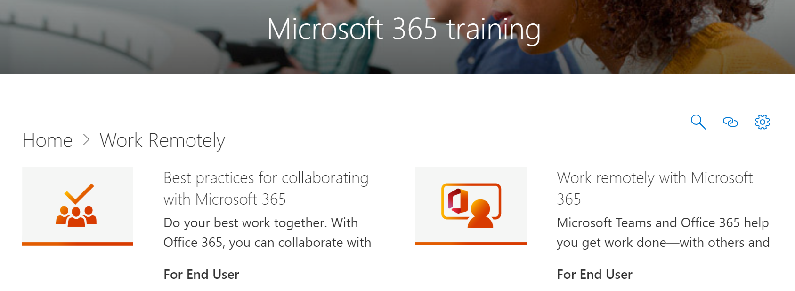

# Aggiornamenti dei contenuti dei percorsi di apprendimento di Microsoft 365
I percorsi di apprendimento si impegnano a rispettare un ciclo trimestrale di aggiornamento del contenuto. Per ulteriori informazioni su come vengono applicati gli aggiornamenti del contenuto e su come gestire gli aggiornamenti del contenuto, vedere [Gestire gli aggiornamenti del contenuto.](custom_contentupdatesmanage.md) 

## Aggiornamenti del contenuto di marzo 2021
Di seguito sono elencati gli aggiornamenti del contenuto per marzo 2021. 

### Ambiente di lavoro ibrido
Per aiutare le organizzazioni a passare a un ambiente di lavoro ibrido, in cui i dipendenti lavorano da casa e in ufficio, abbiamo fornito playlist per aiutare gli utenti a eseguire riunioni più efficaci, creare ambienti di riunione inclusivi, collaborare in modo asincrono e raggiungere grandi gruppi di destinatari con eventi live. La sottocategoria ibrida dell'area di lavoro include le playlist e le risorse seguenti.

#### Eseguire riunioni efficaci
- Eseguire riunioni efficaci
- Riunioni ibride
- Considerazioni relative allo spazio per riunioni ibride
- Operazioni da eseguire prima, durante e dopo le riunioni ibride
- Pianificare riunioni efficaci
- Pianificare e condurre riunioni efficaci
- Coinvolgere il gruppo di destinatari prima, durante e dopo le riunioni ibride
- Elenco di controllo delle riunioni
- Ridurre l'affaticamento delle riunioni

#### Creare ambienti di riunioni inclusivi
- Creare ambienti di riunioni inclusivi
- Rendere accessibili le riunioni e i contenuti correlati per tutti
- Limitare le distrazioni nelle riunioni
- Creare empatia tra fusi orari

#### Collaborazione asincrona e creazione condivisa
- Ridurre o sostituire le riunioni con la collaborazione asincrona
- Collaborare e creare in modalità condivisa contenuto condiviso
- Procedure consigliate per la collaborazione in Microsoft 365
- Creare file di Microsoft 365 in modalità condivisa
- Collaborazione e creazione condivisa di documenti
- Collaborazione con SharePoint, Teams e OneDrive
- Collaborazione in Teams
- Usare raccolte documenti in SharePoint
- Risoluzione dei problemi comuni di creazione condivisa

#### Raggiungere grandi gruppi di destinatari con eventi live
- Usare eventi live per raggiungere grandi gruppi di destinatari
- Introduzione all'uso di Microsoft Teams per gli eventi live
- Pianificare e pianificare un evento live in Teams
- Organizzare un'uniforme live

### Microsoft Teams
Microsoft Teams è stato aggiornato con i contenuti seguenti.

#### Gestire la playlist delle riunioni
La playlist Gestisci riunione include il nuovo asset seguente.
- Suggerimenti per le riunioni di Teams

#### Playlist di Teams in viaggio
La playlist di Teams in viaggio è stata aggiornata con le nuove risorse seguenti.
- Avviare un canale in viaggio
- Creare un canale in viaggio
- Gestire le notifiche in viaggio

#### Gestire le pianificazioni dei team con i turni
La playlist Gestisci pianificazioni team con Turni è stata aggiunta con le risorse seguenti.
- Che cos'è Shifts
- Turni per i manager
- Creare una pianificazione turni
- Gestire una pianificazione turni
- Turni per i lavoratori sul posto

#### Walkie Talkie, Attività e Complimenti
La playlist Walkie Talkie, Tasks e Praise è stata aggiunta con gli asset seguenti.
- Walkie-talkie
- Usare l'app Attività in Teams
- Attività per i responsabili
- Attività per i lavoratori di prima linea
- Comunicazione e complimenti

#### Creare approvazioni
La playlist Di creazione approvazione è stata aggiunta con gli asset seguenti.
- Che cos'è l'approvazione?
- Creare un'approvazione
- Creare un'approvazione da una chat

### Elenchi
Una nuova sottocategoria e una nuova playlist di elenchi sono state aggiunte ai percorsi di apprendimento.

#### Introduzione a Elenchi
La playlist Introduzione a Elenchi include i nuovi asset seguenti.
- Creare un elenco dall'app Elenchi
- Creare un elenco in un canale di Teams
- Aggiungere o modificare voci di elenco
- Creare o modificare la visualizzazione di un elenco
- Modificare una visualizzazione elenco
- Trovare e gestire l'elenco
- Condividere un elenco o una voce di elenco
- Tenere traccia delle informazioni aziendali

### Forms
La playlist Crea un modulo e visualizza i risultati è stata aggiornata con le nuove risorse seguenti.

#### Creare una maschera e visualizzare i risultati
- Creare un nuovo modulo o un nuovo quiz
- Condividere un modulo per ottenere risposte
- Visualizzare i risultati del modulo
- Usare la logica di diramazione nel modulo
- Aggiungere sezioni al sondaggio o al questionario

### Excel
Excel nei percorsi di apprendimento è stato aggiornato con il contenuto seguente.

#### Introduzione a Excel
La playlist Introduzione a Excel include il nuovo asset seguente.
- Creare un elenco a discesa

#### Tipi di dati collegati
Ai percorsi di apprendimento con le risorse seguenti è stata aggiunta una nuova playlist di tipi di dati collegati. 
- Convertire il testo in un tipo di dati Organizzazione
- Utilizzare il Selettore dati per specificare i tipi di dati dell'organizzazione
- Visualizzare e inserire dati da un tipo di dati Organizzazione

#### Formule e funzioni
Alla playlist Formule e funzioni sono stati aggiunti due nuovi asset.
- Funzione XLOOKUP
- Funzione MATCH

### SharePoint
Tutte le playlist e le risorse di SharePoint sono state aggiornate. Le playlist aggiornate includono:
- SharePoint Online Quick Start
- Introduzione a SharePoint Online
- Creare siti, post ed elenchi
- Condividere e sincronizzare con SharePoint

## Aggiornamenti del contenuto di settembre 2020
Di seguito sono elencati gli aggiornamenti del contenuto per settembre 2020. 

### Sicurezza
È stata aggiunta una nuova sottocategoria di sicurezza con playlist e asset per aiutare gli utenti a lavorare in modo più sicuro in ufficio e a casa. 

#### Playlist "Cinque semplici passaggi"
- Proteggersi dal phishing
- Evitare le truffe di supporto tecnico
- Lavorare da casa in modo più sicuro
- Mantenere aggiornato il PC
- Protezione con la sicurezza di Windows

#### Playlist "Sicurezza a casa"
- Suggerimenti per mantenere al sicuro i dati
- Mantenere il computer sicuro a casa
- Proteggere la famiglia online con Sicurezza di Windows   

#### Playlist "Sicurezza sul lavoro"
- Proteggere il computer sul luogo di lavoro
- Che cos'è l'autenticazione a più fattori?
- Protezione firewall e di rete nella sicurezza di Windows
- Impedisci modifiche alle impostazioni di sicurezza con Protezione anti-manomissione

### Playlist "Introduzione a Teams"
È stata aggiunta una nuova playlist "Introduzione a Teams" alla sottocategoria "Inizia/Primi giorni" per aiutare gli utenti a iniziare a usare Teams. La playlist include:
- Benvenuto in Microsoft Teams  
- Iniziare a utilizzare il team
- Lavorare nei canali  
- Caricare e condividere file 
- Chat start e aggiunta  
- Partecipare a una riunione di Teams 
- Gestire le riunioni 
 
### Nozioni di base su Microsoft 365
Nella categoria Prodotti, la sottocategoria "Office 365 Basics" è stata aggiornata alla categoria "Microsoft 365 Basics". Gli asset ritirati nella categoria "Office 365 Basics" sono ancora disponibili se sono stati aggiunti a una playlist personalizzata.

#### Playlist "Introduzione"
- Che cos'è Microsoft 365?
- Accesso
- Office.com

#### Playlist "Crea e salva"
- Uso delle app desktop
- Uso Office.com app
- Salvare i file nel cloud
- Sincronizzare i file su richiesta con OneDrive

#### Playlist "Condividi e collabora"
- Condividere file in Microsoft 365
- Coautore
- Utilizzare @mentions
- Follow-up

#### Playlist "Usare Microsoft Teams"
- Benvenuto in Microsoft Teams
- Panoramica su team e canali
- Creare e formattare un post
- Chat start e aggiunta
- Effettuare chiamate
- Partecipare a una riunione di Teams
- Suggerimenti per riunioni migliori

#### Playlist "Ottenere il massimo da Windows"
- Trovare documenti, app e altro ancora con la ricerca
- Microsoft Edge
- Microsoft Search in Bing

#### Playlist "Lavoro da qualsiasi luogo"
- App OneDrive per dispositivi mobili
- App Outlook per dispositivi mobili

#### Playlist "Funzionalità interessanti di Microsoft 365"
- PowerPoint Designer
- Idee in Excel
- Editor in Word
- Rendere accessibile il contenuto

### Playlist "Crea grafico" in Access
Alla sottocategoria "Products\Access" è stata aggiunta una "Creazione di una playlist grafico".  
- Creare un istogramma
- Creare un grafico a barre
- Creare un grafico a linee
- Creare un grafico a torta
- Creare un grafico combinato

### Aggiornamenti di Teams
La sottocategoria "Product\Microsoft Teams" è stata aggiornata con le risorse seguenti. 

#### Playlist "Gestisci riunioni"
- Partecipare a una riunione di Teams
#### Playlist "Usare post e messaggi"
- Creare e formattare un post

### Planner 
Gli asset seguenti sono stati aggiunti alla playlist "Use Planner" in "Products\Planner".
#### Usare la playlist di Planner
- Da fare e Planner
- Vedere le attività di Planner in Attività
- Usare l'app Attività in Teams

### Word
L'asset seguente è stato aggiornato nella playlist "Condividi e crea in modalità condivisa con Word".

#### Playlist "Condividi e crea in modalità condivisa con Word"
- L'asset "Collabora ai documenti di Word con la creazione condivisa in tempo reale" è stato aggiornato. 

### Office per il web
L'asset seguente è stato aggiornato nella playlist "Office per il Web: Word per il Web".

#### Playlist "Office per il Web: Word per il Web"
- Trascrivere le registrazioni

### PowerPoint (nuovo, aggiornato)
Le risorse seguenti sono state aggiornate o aggiunte alle playlist Products\PowerPoint. 

#### Playlist "Tabelle & testo con PowerPoint"
- Modificare l'input penna scritto a mano in forme, testo o matematica in PowerPoint (nuovo)

#### Presentazione della playlist
- Registrare una presentazione (aggiornata)

### Guide introduttive di Office (aggiornate)
Le guide introduttive di Office per tutti i prodotti Office sono state aggiornate. 

## Aggiornamenti del contenuto di aprile 2020
 In risposta agli eventi correnti, l'aggiornamento del contenuto di aprile 2020 fornisce playlist di apprendimento e risorse progettate per consentire il lavoro remoto nell'organizzazione. È stato aggiunto un nuovo set di playlist di Lavoro in remoto e sono stati aggiornati i contenuti di Microsoft Teams, in particolare per le riunioni di Teams. È stato inoltre aggiunto un nuovo set di playlist di Office per il Web e sono state aggiunte nuove risorse di Microsoft Forms. È stato inoltre fornito un elenco delle risorse di Lavoro remoto per gli amministratori.  
 
 Per ulteriori informazioni su come vengono applicati gli aggiornamenti del contenuto e su come gestire gli aggiornamenti del contenuto, vedere [Gestire gli aggiornamenti del contenuto.](custom_contentupdatesmanage.md) Di seguito sono elencati gli aggiornamenti dei contenuti dei percorsi di apprendimento di Microsoft 365 di aprile 2020. 

### Office 365 è stato ridenobrato in Microsoft 365
Office 365 è stato ridenobrato in Microsoft 365. La modifica del nome si riflette in tutto il contenuto dei percorsi di apprendimento di Microsoft 365. 

### Playlist nuove o aggiornate
Le playlist seguenti sono state aggiunte o aggiornate.  

#### Lavorare in remoto (2 nuove playlist/11 nuovi asset)
È stata aggiunta una nuova sottocategoria Lavoro in remoto ai percorsi di apprendimento con le playlist e le risorse seguenti: 

##### Lavorare in remoto (cinque nuovi asset)
- Lavorare in remoto con Office 365
- Introduzione a Office.com
- Comunicare o incontrarsi
- Archiviare i file di lavoro
- Alternative avanzate
##### Procedure consigliate per la collaborazione con Office 365 (6 nuove risorse)
- Informazioni di base
- Condividere
- Coautore
- Chat nei file
- Meet
- Dispositivi mobili

### Teams (nove nuove risorse/sei asset aggiornati)
Sono stati apportati diversi aggiornamenti al contenuto di Teams. 
#### Collaborare in team e canali (una risorsa nuova/una aggiornata)
- Creare e usare canali privati (nuovo)
- Mostrare o nascondere i canali (aggiornati)
#### Avviare chat e chiamate (due nuove/una aggiornate)
- Chat start e pin (nuove)
- Nascondere chat, eliminare messaggi (nuovi)
- Effettuare chiamate (aggiornate)
#### Esplorare app e strumenti (uno nuovo)
- Usare le app (nuove)
#### Utilizzare post e messaggi
- Inserire un messaggio in più canali (nuovo)
#### Gestire le riunioni (tre nuove/quattro risorse aggiornate)
- Partecipare a una riunione di Teams (nuovo)
- Creare riunioni istantanee con Riunione immediata (aggiornato)
- Meet in a channel (new)
- Gestire le riunioni (nuove)
- Visualizzare lo schermo durante una riunione (aggiornato)
- Mostra diapositive di PowerPoint (aggiornate)
- Spostarsi durante una riunione di Teams (aggiornato)
#### Usare post e messaggi (uno nuovo)
- Inserire un messaggio in più canali (nuovo)

### Office per il web
Office per il Web offre un set di playlist per gli scenari in cui gli utenti desiderano creare, condividere e collaborare con Office sul Web. Questo set di contenuti è utile anche per le organizzazioni che stanno passando da Google G Suite a Microsoft 365.
#### Introduzione (cinque nuove risorse)
- Informazioni di base
- Trovarlo con la ricerca
- Creare nuovi documenti
- Tornare al lavoro
- File consigliati
#### Outlook per il Web
- Informazioni su Outlook per il Web
- Creare una risposta a un messaggio di posta elettronica
- Organizzare la posta in arrivo
- Creare una firma e una risposta automatica
- Pianificare un appuntamento o una riunione
- Creare una modifica di un contatto
- Cercare messaggi di posta elettronica, contatti ed eventi
#### Word per il Web
- Informazioni su Word per il Web
- Modificare il layout del documento
- Inserire tabelle e immagini
- Collaborare online
- Elementi interessanti in Word per il Web
#### Excel per il Web
- Informazioni su Excel per il Web
- Creare formule
- Inserire una tabella pivot
- Ottenere informazioni dettagliate con le idee
- Collaborare
- Risparmiare tempo con Anteprima anteprima
- Disegnare un'immagine con formattazione condizionale
#### PowerPoint per il Web
- Informazioni su PowerPoint per il Web
- Inserire immagini, forme e altro ancora
- Animazioni e transizioni
- Creare una presentazione con altri utenti
- Quando si è pronti per la presentazione
- Progettazione di diapositive
#### Condividere i documenti
- Condividere i documenti
- Creare un collegamento condivisibile
- Proteggere la documentazione solo a persone specifiche
- Condividere con utenti esterni all'organizzazione 

### Microsoft Forms 
Su richiesta, sono disponibili anche alcuni nuovi asset di Forms. 
#### Moduli (quattro nuovi asset) 
- Creare un modulo 
- Condividere un modulo 
- Visualizzare i risultati di un modulo 
- Domande frequenti su Microsoft Forms 

### Risorse per il supporto della forza lavoro remota
È possibile utilizzare i percorsi di apprendimento per creare una pagina di destinazione nel sito dei percorsi di apprendimento per il supporto dei lavoratori remoti. In alternativa, è possibile aggiungere la web part percorsi di apprendimento a una pagina di supporto esistente nel sito dei percorsi di apprendimento e filtrare la web part per visualizzare le playlist Di lavoro in remoto. Ecco un elenco di alcune delle principali risorse di Microsoft per il supporto del lavoro remoto nell'organizzazione. 
- [Come implementare Microsoft Teams](https://docs.microsoft.com/microsoftteams/how-to-roll-out-teams)
- [Riunioni e conferenze in Microsoft Teams](https://docs.microsoft.com/microsoftteams/deploy-meetings-microsoft-teams-landing-page)
- [Supportare i lavoratori remoti con Microsoft Teams](https://docs.microsoft.com/microsoftteams/support-remote-work-with-teams)
- [Domande frequenti: Supporto del personale remoto](https://docs.microsoft.com/microsoftteams/faq-support-remote-workforce)
- [I primi 9 modi in cui Microsoft IT consente il lavoro remoto per i dipendenti](https://www.microsoft.com/microsoft-365/blog/2020/03/12/top-9-ways-microsoft-it-enabling-remote-work-employees/)
- [Formazione su Microsoft Teams](https://docs.microsoft.com/microsoftteams/training-microsoft-teams-landing-page)
- [Education: Microsoft Education Center](https://education.microsoft.com) 
- [Formazione: introduzione all'apprendimento remoto](https://education.microsoft.com/resource/4c0c02c0)

Per ulteriori informazioni su come personalizzare i percorsi di apprendimento, vedere [Personalizzare i percorsi di apprendimento.](custom_overview.md) 

## Aggiornamenti del contenuto di novembre 2019
Benvenuto nell'aggiornamento dei contenuti dei percorsi di apprendimento di Microsoft 365. A partire dall'aggiornamento di novembre 2019, verrà fornito un inventario aggiornato del catalogo dei percorsi di apprendimento su base trimestrale. Per l'aggiornamento di novembre 2019, le nuove sottocategorie e playlist di contenuto seguenti sono state aggiunte al catalogo dei percorsi di apprendimento. Per ulteriori informazioni su come vengono applicati gli aggiornamenti del contenuto e su come gestire gli aggiornamenti del contenuto, vedere [Gestire gli aggiornamenti del contenuto.](custom_contentupdatesmanage.md)    

### Teams
Sono state aggiunte diverse nuove playlist alla sottocategoria di Teams.
- Utilizzare post e messaggi (quattro risorse)
- Caricare e trovare file (due asset)
- Configurare e partecipare a eventi live (quattro risorse)
- Gestire il feed attività (due risorse)
- Teams in viaggio (due risorse)

### Microsoft 365 Success Center
È stata aggiunta una sottocategoria dei percorsi di apprendimento di Microsoft 365 Success Center all'esperienza dei percorsi di apprendimento. Success Center fornisce le playlist seguenti.
- Novità e modifiche (tre asset)
- Pianificare il contenuto di apprendimento (due risorse)
- Personalizzare i percorsi di apprendimento (otto risorse?)
- Guidare l'adozione dei percorsi di apprendimento (una risorsa)
- Misurare l'impatto dei percorsi di apprendimento (una risorsa)

### Outlook
Le playlist seguenti sono state aggiunte alla sottocategoria di Outlook. 
- Outlook mobile: gestire la posta in arrivo (otto risorse)
- Outlook mobile: utenti e connessioni (cinque risorse)
- Outlook mobile: ricerca e condivisione (quattro risorse)

### OneDrive
Le risorse video seguenti sono state aggiunte per OneDrive. 
- La configurazione dell'iPhone o dell'iPad è stata aggiunta alla playlist Introduzione a OneDrive
- Attivare Backup di OneDrive è stato aggiunto alla playlist Gestisci i file con OneDrive

### Planner
Le playlist e gli asset seguenti sono stati aggiunti al catalogo.  
- Guida introduttiva di Planner (sei risorse)
- Usare Planner (otto risorse)

### Accessibilità
La sottocategoria Accessibilità del contenuto è stata aggiunta con le playlist seguenti. 
- Panoramica e risorse sull'accessibilità di Microsoft 365 (tre risorse)
- Creare messaggi di posta elettronica più accessibili in Outlook (tre risorse)
- Creare documenti di Word più accessibili (otto risorse)
- Creare cartelle di lavoro di Excel più accessibili (tre risorse)
- Creare diapositive più accessibili in PowerPoint (cinque risorse)

### Sway
La sottocategoria Sway del contenuto è stata aggiunta con le playlist seguenti. 
- Guida introduttiva di Sway (quattro asset)
- Condividere e accedere a Sway (cinque asset)
- Aggiungere contenuto a Sway (11 asset)
- Personalizzare Sway (cinque asset)

### Access
- Guida introduttiva di Access (quattro risorse)
- Introduzione ad Access (tre risorse)
- Creare un database di Access (due risorse)
- Aggiungere tabelle (due asset)
- Usare le relazioni (cinque risorse)
- Aggiungere e modificare dati (due risorse)
- Gestire i dati con query (cinque risorse)
- Creare moduli (una risorsa)
- Creare report (due risorse)
- Proteggere i database (una risorsa)

