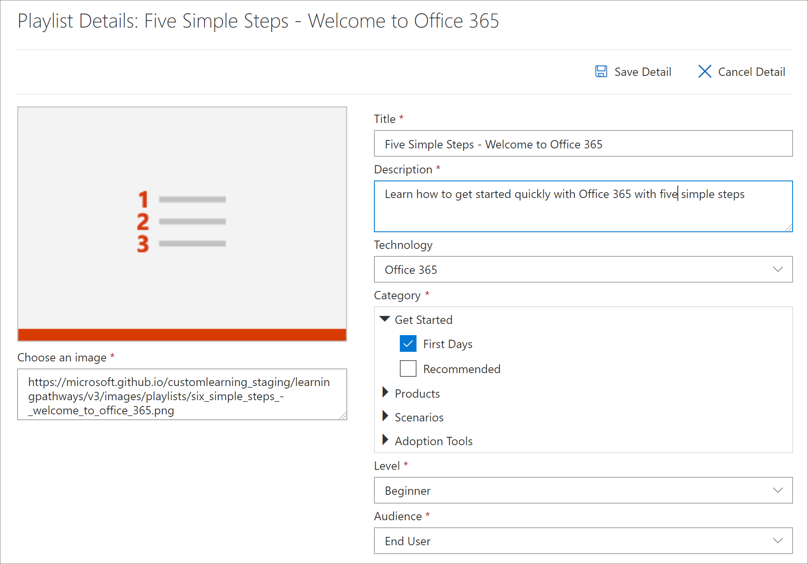

# Copiare una playlistCopy a Playlist
Molto spesso, le organizzazioni devono modificare una playlist fornita da Microsoft rimuovendo o sostituendo un asset con un asset creato dall'organizzazione.Quite often, organizations need to modify a Microsoft-supplied playlist by removing or replacing an asset with an asset created by the organization. Ad esempio, potresti voler rimuovere un passaggio dalla playlist Inizia con sei passaggi semplici.For example, you might want to remove a step from the Start with Six Simple Steps playlist. Ora puoi usare la funzionalità Copy Playlist dei percorsi di apprendimento per copiare facilmente la playlist Six Simple Steps e rimuovere semplicemente un asset, sostituire un asset o aggiungere nuovi asset.Now you can use the learning pathways Copy Playlist feature to easily copy the Six Simple Steps playlist and simply remove an asset, replace an asset, or add new assets. 

## Per copiare una playlistTo copy a playlist

1. Nella home page Microsoft 365 percorsi  di apprendimento fare clic su **Office 365 formazione.**From the Microsoft 365 learning pathways **Home** page, click **Office 365 training**.
2. Fare clic **sull'icona** Amministrazione.Click the **Administration** icon.
3. In **First Days** fare clic su Six Simple Steps - Welcome to **Office 365** playlist e quindi fare clic su **Copy Playlist.**Under **First Days**, click the **Six Simple Steps - Welcome to Office 365** playlist, and then click **Copy Playlist**. 
4. Fare **clic su Modifica** dettagli e  quindi compilare i campi **Titolo** e Descrizione come illustrato nell'esempio seguente, quindi fare clic su **Salva dettagli.**Click **Edit Detail**, and then fill in the **Title** and **Description** fields as shown in the following example, then click **Save Detail**.  
 

## Aggiungere o rimuovere risorse da una playlistAdd or remove assets from a playlist
Con le playlist personalizzate puoi:With custom playlists, you can:
- aggiungere e rimuovere risorse Microsoft, ma non modificarle da Microsoftadd and remove Microsoft assets, but not edit the assets from Microsoft
- aggiungere, rimuovere e modificare asset SharePoint esistenti personalizzati dall'organizzazione o SharePoint risorse create dall'utente.add, remove, and edit custom existing SharePoint assets from your organization or SharePoint assets that you create. 

### Rimuovere un asset da una playlistRemove an asset from a playlist
- Scorri verso il basso **nella pagina** Amministrazione e quindi in **Asset playlist** fai clic sull'icona di eliminazione per **Passaggio 5. Configurare le app per dispositivi mobili**.Scroll down the **Administration** page, and then under **Playlist Assets** click the delete icon for **Step 5. Set up mobile apps**. 

## Verificare che l'asset sia stato rimosso dalla playlistVerify the asset is removed from the playlist
1. Tornare alla scheda con la pagina **Microsoft 365 formazione.**Return to the tab with the **Microsoft 365 training** page.
2. Fai **clic su First Days** e quindi fai clic su Five Simple Steps - Welcome to **Office 365** playlist.Click **First Days**, then click the **Five Simple Steps - Welcome to Office 365** playlist. 
3. Fai clic sulla playlist per verificare che l'asset sia stato rimosso.Click through the playlist to verify that the asset has been removed.

