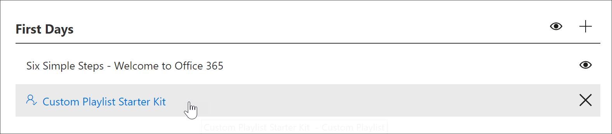

# Creare un elenco di riproduzione personalizzatoCreate a Custom Playlist

Quando si crea una playlist, è necessario innanzitutto creare la playlist con i dettagli della playlist e quindi aggiungere risorse alla playlist.When you create a playlist, you first create the playlist with the playlist details, and then add assets to the playlist. È possibile aggiungere una playlist a qualsiasi sottocategoria.You can add a playlist to any subcategory. Ad esempio, è possibile aggiungere una playlist alla sottocategoria **First Days** o a una sottocategoria di **prodotti** come **Excel**.For example, you can add a playlist to the **First Days** subcategory or a **Product** subcategory like **Excel**. In questa sezione vengono illustrate le modalità di creazione di una playlist e quindi l'aggiunta di risorse a una playlist nella sezione seguente, [aggiungere risorse a una playlist personalizzata](custom_addassets.md).In this section, we’ll cover how to create a playlist, and then cover adding assets to a playlist in the following section, [Add assets to a custom playlist](custom_addassets.md).

## Creare una playlistCreate a playlist 

1. Nella **Home** page di Microsoft 365 Learning pathways fare clic su **Office 365 Training**, selezionare il menu sistema dalla web part, quindi selezionare **amministra playlist**.From the Microsoft 365 learning pathways **Home** page, click **Office 365 training**, select the system menu from the Web part, and then select **Administer Playlist**. 
2. Selezionare una sottocategoria.Select a subcategory. In questo esempio vengono selezionati i **primi giorni**.In this example, select **First Days**.  
3. Fare clic sull'icona +.Click the + icon.  

4.  Compilare i campi dell'elenco di riproduzione come illustrato nell'esempio seguente.Fill out the fields in the playlist as shown in the following example. È possibile lasciare l'icona predefinita per questo esempio.You can leave the default icon for this example. 

5.  Al termine, selezionare **Salva dettaglio**.When you are done, select **Save Detail**. 

## Modificare una playlistEdit a playlist

- Dalla pagina **amministrazione apprendimento personalizzato** , fare clic sulla playlist, quindi fare clic su **Modifica dettagli**.From the **Custom Learning Administration** page, click the playlist, and then click **Edit Detail**.  

### Eliminare una playlistDelete a playlist

- Dalla pagina amministrazione apprendimento personalizzato, fare clic sull'icona di **eliminazione** per la playlist.From the Custom Learning Administration page, click the **Delete** icon for the playlist.  

