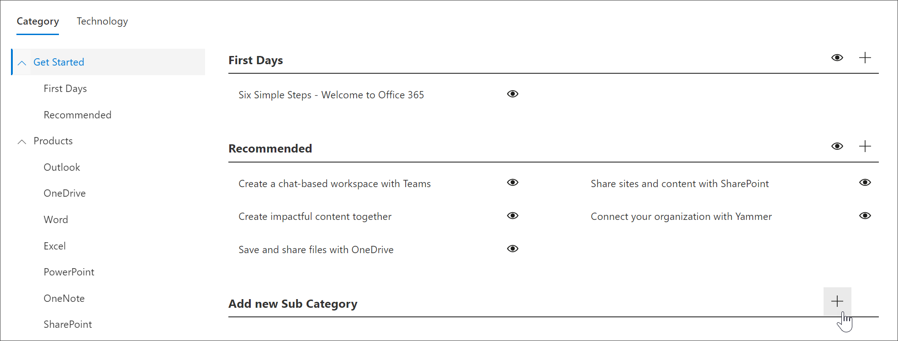

# Creare una sottocategoria 
In alcuni casi, è possibile creare una nuova sottocategoria. Ad esempio, se la sottocategoria First Days non funziona per l'organizzazione, è possibile creare una nuova sottocategoria e quindi aggiungervi elenchi di riproduzione per soddisfare le esigenze dell'organizzazione. 

1. Nella **Home** page di Microsoft 365 Learning pathways fare clic su **Microsoft 365 Training**, scegliere il menu **sistema** dalla web part e quindi fare clic su **amministra playlist**. 
2. Selezionare una **categoria**. In questo esempio, selezionare **inizia**.  
3. Scorrere verso il basso la pagina, 
3. Fare clic sull'icona **Aggiungi nuova sottocategoria +** .  

> [!TIP]
> Le sottocategorie fornite da Microsoft possono essere nascoste, ma non modificate o eliminate. 

## Modificare una sottocategoria
- Selezionare l'icona di **modifica** per Subcategory, apportare modifiche al titolo della sottocategoria e quindi fare clic su **Salva**.

## Nascondere una sottocategoria
- Selezionare il bulbo oculare per la sottocategoria per nasconderlo. 

## Eliminare una sottocategoria
- Selezionare l'icona **modifica** per sottocategoria, quindi selezionare **Elimina.** 
