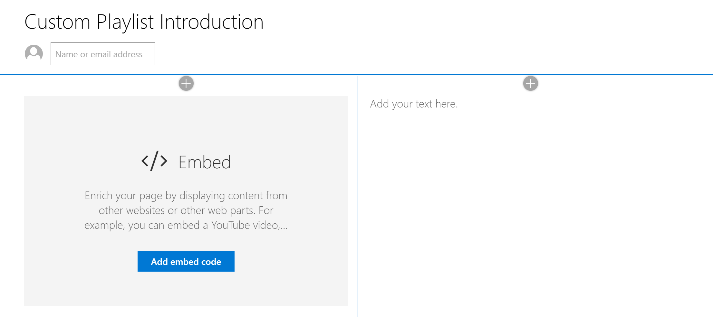
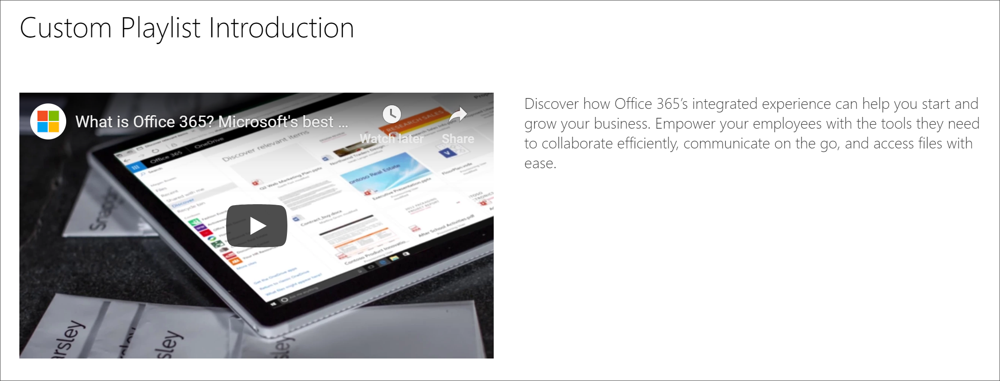

# Creare pagine di SharePoint per playlist personalizzateCreate SharePoint pages for Custom Playlists

Una delle caratteristiche esclusive dell'apprendimento personalizzato è la possibilità di creare playlist che vengono assemblate da risorse di Microsoft e da risorse di SharePoint create. In questo esempio viene creata una pagina di SharePoint prima della creazione di una playlist. La possibilità di creare playlist da pagine di SharePoint offre una vasta gamma di opportunità per creare pagine utilizzando le web part disponibili da Microsoft o dall'organizzazione. Ad esempio, una playlist può includere una pagina di SharePoint con video incorporati da YouTube o un modulo creato da moduli di Office 365 o un report incorporato di Power BI. In questo esempio viene illustrato come creare una pagina con la Web part embed e la Web part testo.One of the unique features of Custom Learning is the ability to create playlists that are assembled from assets from Microsoft and from SharePoint assets that you create. In this example, we’ll create a SharePoint page in advance of creating a playlist. The ability to build playlists from SharePoint pages offers a variety of opportunities to build pages using the Web parts available from Microsoft or your organization. For example, a playlist can include a SharePoint page with embedded videos from YouTube, or a form built from Office 365 Forms, or an embedded Power BI report. In this example, we’ll show you how to build a page with the Embed web part and the Text web part.  

## Creare una pagina di SharePoint per un elenco di riproduzione personalizzatoCreate a SharePoint page for a custom playlist

1. Fare clic sull' \*\*\*\* icona dell'ingranaGgio di SharePoint e quindi fare clic su **Aggiungi pagina**.Click the SharePoint **Gear** icon, and then click **Add a page**.
2. Fare clic su **Aggiungi una nuova sezione (+)** sul lato sinistro della pagina, quindi fare clic su **due colonne** per il layout della sezione.Click **Add a new section (+)** on the left-hand side of the page, and then click **Two Columns** for the section layout.
3. Nella colonna sinistra fare clic su + e quindi fare clic sulla Web part **Embed** .In the left column, click + , and then click the **Embed** web part. 
4. Nella colonna a destra fare clic su +, quindi fare clic sulla Web part **testo** . La pagina dovrebbe essere simile alla seguente.In the right column, click +, and then click the **Text** web part. Your page should look like this.

### Aggiungere un video e un testo da YouTubeAdd a video and text from YouTube

1. Nel browser Vai su YouTube. Per questo esempio, cercare "che cos'è Office 365 – le migliori app per la produttività di Microsoft".In your browser, go to YouTube. For this example, search for “What is Office 365 – Microsoft’s best productivity apps”.
2. Fare clic sul video per riprodurlo, quindi sospenderlo, quindi fare clic con il pulsante destro del mouse su di esso.Click the video to play it, then pause it, then right-click on it. 
3. Fare clic su **Copia codice embed**, quindi tornare alla pagina di SharePoint.Click **Copy embed code**, then return to the SharePoint page. 
4. Fare clic su **Aggiungi codice embed** nella web part **Embed** e quindi aggiungere il codice dal video di YouTube.Click **Add embed code** in the **Embed** web part, and then add the code from the YouTube video.
5. Tornare alla pagina di YouTube e copiare il testo della **Descrizione** del video.Return to the YouTube page and copy the **Description** text for the video. 
6. Tornare alla pagina di SharePoint, selezionare la Web part **testo** e quindi copiare il testo dal video di YouTube.Return to the SharePoint page, select the **Text** web part, then copy the text from the YouTube video.
7. Selezionare l'icona **Modifica web part** nell'area del titolo della pagina di SharePoint e quindi denominare la pagina "introduzione di playlist personalizzate".Select the **Edit web part** icon  in the Title area of the SharePoint page, and then name the page “Custom Playlist Introduction”. 
8. Per **layout**, selezionare **pianura**, quindi riquadro delle proprietà dell' **area del titolo** . La pagina dovrebbe avere un aspetto analogo al seguente.For **Layout**, select **Plain**, then close **Title Region** properties pane. The page should now look something like the following. 

### Pubblicare la paginaPublish the page

- Selezionare il pulsante **pubblica** . A questo punto si è pronti per aggiungere questa pagina di SharePoint alla playlist personalizzata.Select the **Publish** button. Now you're ready to add this SharePoint page to your custom playlist. 