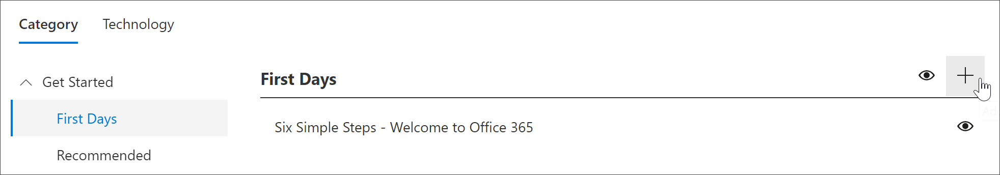
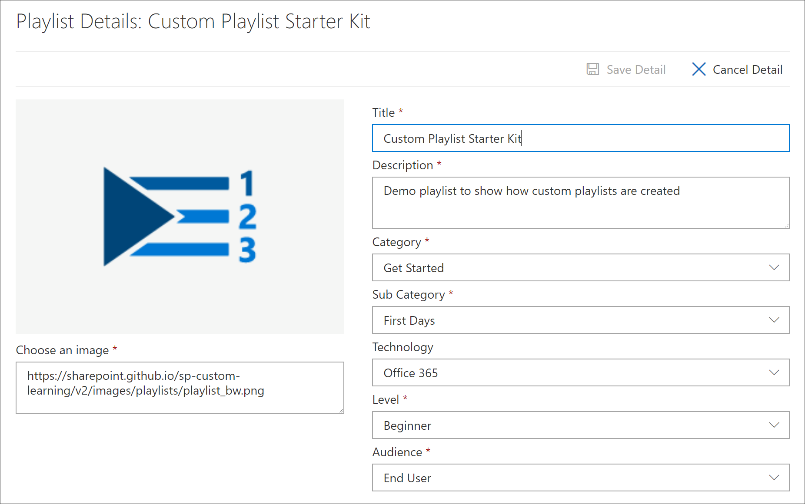
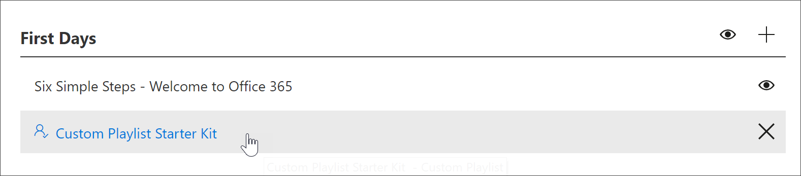
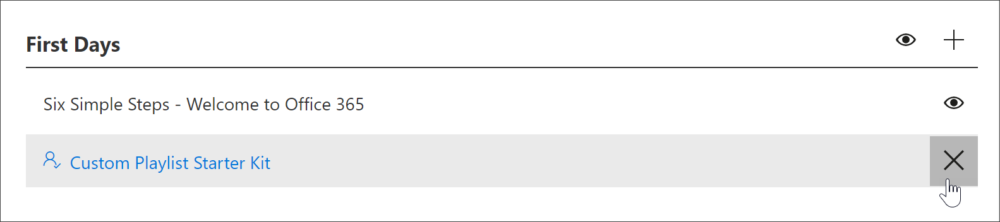

# Creare una playlist personalizzata

Con Microsoft 365 di apprendimento, puoi creare playlist personalizzate da zero personalizzate in base alle esigenze specifiche dell'organizzazione. Ad esempio, crea una playlist per l'onboarding di nuovi assunti Microsoft Teams. Oppure creare playlist per amministratori esecutivi con informazioni adatte al loro ruolo univoco. In alternativa, crea un primo giorno Microsoft 365 playlist con tre semplici passaggi anziché sei. Puoi aggiungere una playlist personalizzata a qualsiasi sottocategoria. Ad esempio, **First Days**, una **sottocategoria Product** come **Excel** o anche una sottocategoria creata dall'utente. In questa sezione verrà descritto come creare una playlist e quindi verrà illustrata l'aggiunta di risorse a una playlist nella sezione seguente, [Aggiungere risorse a una playlist personalizzata.](custom_addassets.md)

## Creare una playlist 

1. Nella home page Microsoft 365  percorsi di apprendimento fare clic su Office 365  **formazione** e quindi selezionare l'icona Amministra dalla web part. 
2. Selezionare la **sottocategoria** Amministra " icona. In questo esempio, selezionare **First Days**.  
3. Fai clic sull'icona +.  

4.  Compila i campi della playlist come mostrato nell'esempio seguente. Puoi lasciare l'icona predefinita per questo esempio. 

5.  Al termine, selezionare **Salva dettagli.** 

## Modificare una playlist

- Nella pagina **Amministrazione apprendimento personalizzata** fare clic sulla playlist e quindi su Modifica **dettagli.**  

### Eliminare una playlist

- Nella pagina Amministrazione apprendimento personalizzata fare clic **sull'icona** Elimina per la playlist.  

