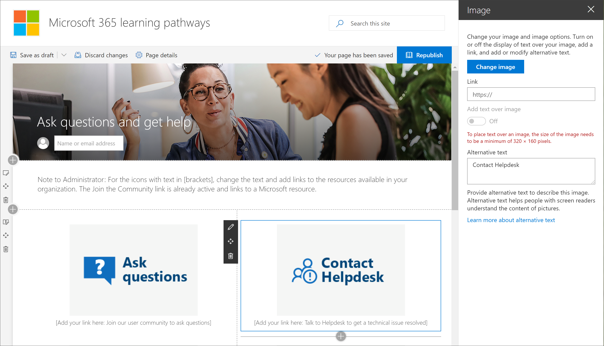

# Personalizzare il sitoCustomize the site

Il sito Microsoft 365 Learning pathways si basa su un modello di comunicazione di SharePoint, pertanto è facile modificare il sito in modo da soddisfare le esigenze dell'organizzazione.The Microsoft 365 learning pathways site is based on a SharePoint communication template, so it's easy to modify the site to meet the needs of your organization. È possibile modificare il nome del sito, il logo, le voci di menu e il contenuto delle pagine.You can change the site name, logo, menu items, and the content on the pages. 

> [!TIP]
> Raccogliere commenti e suggerimenti dai dipendenti e aggiornare periodicamente il sito.Gather feedback from your employees and periodically update the site. Ad esempio, è possibile aggiornare il calendario degli eventi di formazione Man mano che i nuovi eventi diventano disponibili.For example, you can update the Training events calendar as new events become available. Quando si avviano nuovi servizi, è possibile visualizzare il contenuto e creare playlist di formazione mirate progettate per il lancio dei nuovi servizi.When launching new services, you can unhide content and build targeted training playlists designed for the launch of the new services. 

## Personalizzazione del sito e delle pagine WebCustomize the site and web pages

Il sito percorsi di apprendimento è completamente personalizzabile.The learning pathways site is fully customizable. Se non si ha familiarità con il modo in cui personalizzare il sito di SharePoint o le pagine Web, è consigliabile leggere l'articolo [Personalizza il sito di SharePoint](https://support.office.com/article/customize-your-sharepoint-site-320b43e5-b047-4fda-8381-f61e8ac7f59b) in support.Office.com.If you are not familiar with how to customize your SharePoint site or web pages, we suggest you review the [Customize your SharePoint site](https://support.office.com/article/customize-your-sharepoint-site-320b43e5-b047-4fda-8381-f61e8ac7f59b) article on support.office.com. 

### Personalizzare fare domande e ottenere assistenzaCustomize Ask questions and get help

In qualità di amministratore del sito percorsi di apprendimento, una delle operazioni desiderate consiste nel cambiare i collegamenti nella pagina **Ottieni assistenza e supporto** per puntare alle risorse nell'organizzazione.As an administrator of the learning pathways site, one of the things you’ll want to do is change the links on the **Get Help and Support** page to point to resources in your organization. 

1.  Nella Home page percorsi di apprendimento fare clic sulla voce di menu fare **domande e ottenere la guida** .From the learning pathways Home page, click the **Ask questions and get help** menu item.
2.  Fare clic sul pulsante **Modifica**.Click the **Edit** button.
3.  Posizionare il puntatore del mouse su un'immagine dell'opzione della guida, quindi fare clic su **Modifica web part**.Hover over a Help option image, then click **Edit web part**.

4.  Nella casella **collegamento** immettere l'URL per la risorsa interna.In the **Link** box, enter the URL for the internal resource. 
5.  Ripetere i passaggi 3 e 4 per le altre due immagini che non sono collegate.Repeat steps 3 and 4 for the other two images that aren’t linked.

### Modificare il testo nella paginaChange the text on the page

1. Posizionare il puntatore del mouse sull'area di testo e quindi modificare il testo per la pagina.Hover over the text area, then edit the text for the page. 
2. Fare clic sul pulsante **pubblica** al termine dell'operazioneClick the **Publish** button when you’re done

## Altre opzioni di personalizzazioneOther customization options
Altre pagine che potrebbe essere opportuno prendere in considerazione la modifica sono le seguenti:Other pages you might want to consider editing are:

- Training Events Calendar. aspxTraining events calendar.aspx
- La Web part Hero in Home. aspxThe Hero web part on Home.aspx

