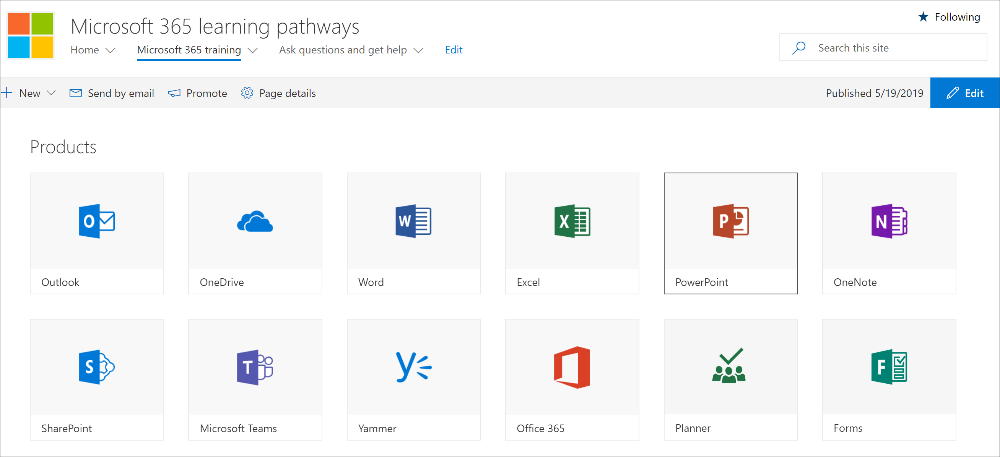

# Come esplorare il sito dei percorsi di apprendimento

> Nota: per esplorare il sito dei percorsi di apprendimento e le caratteristiche amministrative, sono necessarie le autorizzazioni amministratore, proprietario o membro della raccolta siti per il sito. Se non si dispone delle autorizzazioni necessarie, contattare l'amministratore del sito per il sito. Il sito dei percorsi di apprendimento è ospitato nel tenant di Office 365, quindi dovrai accedere a Office 365 per accedere al sito. Se non hai ancora effettuato l'Office 365, accedi ora. 

## . 

1.  Aprire il web browser e passare a office.com o alla posizione di accesso dell'organizzazione. 
2.  Eseguire l'accesso con il nome utente e la password.
3.  Passare al percorso del sito utilizzando l'URL fornito dall'amministratore tenant o selezionare SharePoint nella pagina Office 365 Home e quindi selezionare il sito. 

## Esplorare il sito dei percorsi di apprendimento

Il sito dei percorsi di apprendimento si basa su un modello di comunicazione SharePoint, quindi è facile modificare il sito per soddisfare le esigenze dell'organizzazione. È possibile modificare il nome del sito, il logo, le voci di menu e il contenuto delle pagine. Una delle pagine che si desidera modificare per l'organizzazione è la pagina Porre domande e ottenere assistenza. Diamo un'occhiata.

### Visualizzare la pagina Porre domande e ottenere assistenza

Il sito dei percorsi di apprendimento fornisce contenuto predefinito che consente di iniziare a creare il portale di formazione e supporto. In quanto amministratore o proprietario del sito, una delle operazioni che si desidera eseguire  è modificare i collegamenti nella pagina Domanda e ottenere assistenza in modo che puntino alle risorse dell'organizzazione. 

1.  Nella home page Microsoft 365 percorsi di apprendimento fare clic sulla voce di menu Porre domande e **ottenere** assistenza.
2.  Fare clic sul pulsante **Modifica**.
3.  Posizionare il puntatore del mouse sull'immagine di un'opzione della Guida, quindi **fare clic su Modifica web part.**

Per istruzioni sulla personalizzazione delle pagine del sito, vedere [Personalizzare il sito.](custom_edithelp.md)

### Visualizzare il contenuto dei percorsi di apprendimento nella web part
La Microsoft 365 di formazione ospita la web part Percorsi di apprendimento configurata per mostrare tutta la formazione disponibile per i percorsi di apprendimento. 

1. Scorrere la pagina verso il basso per visualizzare tutte le categorie e le sottocategorie.
2. Scalciare un po' le gomme. Fai clic su alcune sottocategorie e quindi su alcune playlist per avere un'esperienza di organizzazione del contenuto dei percorsi di apprendimento. 

Per istruzioni sulla personalizzazione della web part Percorsi di apprendimento, vedere [Personalizzare l'esperienza di apprendimento.](custom_overview.md)

### Ottenere una presentazione completa del sito e indicazioni per la personalizzazione
Per un'analisi dettagliata dei percorsi di apprendimento, dell'utilizzo del sito, della web part, delle funzionalità amministrative e delle indicazioni su come creare esperienze di apprendimento univoche per l'ambiente, vedere Personalizzare l'esperienza di [apprendimento](custom_overview.md)

## Operazioni successive
- [Personalizzare l'esperienza di apprendimento](custom_overview.md)
- [Adozione delle unità](driveadoption.md) 
