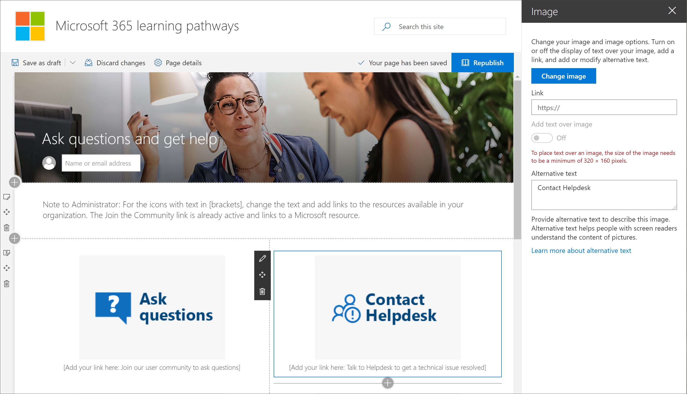

# Esplorare il sito di apprendimento personalizzatoExplore the Custom Learning site

> Nota: per esplorare il sito di apprendimento personalizzato e le sue caratteristiche amministrative, è necessario disporre delle autorizzazioni di amministratore, proprietario o membro della raccolta siti per il sito.Note: To explore the Custom Learning site and it's administrative features, you'll need Site Collection Admin, Owner, or Member permissions to the site. Se non si dispone delle autorizzazioni di necessario, rivolgersi all'amministratore del sito.If you don't have the neccesary permissions, contact the Site Administrator for the site. Il sito di apprendimento personalizzato per Office 365 è ospitato nel tenant di Office 365, quindi è necessario accedere a Office 365 per accedere al sito.The Custom Learning for Office 365 site is hosted in your Office 365 tenant, so you'll need to sign in to Office 365 to get to the site. Se non è già stato effettuato l'accesso a Office 365, accedere adesso.If you haven’t already signed into Office 365, sign in now. 

## .Sign in to Office 365 

1.  Aprire il Web browser e accedere a office.com o al percorso di accesso dell'organizzazione.Open your Web browser and navigate to office.com or your organization’s sign-in location. 
2.  Accedere con il nome utente e la password.Sign in with your user name and password.
3.  Passare al percorso del sito utilizzando l'URL fornito dall'amministratore del tenant oppure selezionare SharePoint dalla Home page di Office 365, quindi selezionare il sito.Navigate to the location of the site using the URL supplied by your tenant administrator or select SharePoint from the Office 365 Home page, and then select the site. 

## Esplorare il sito di apprendimento personalizzatoExplore the Custom Learning site

Il sito di apprendimento personalizzato si basa su un modello di comunicazione di SharePoint, pertanto è facile modificare il sito in modo da soddisfare le esigenze dell'organizzazione.The Custom Learning site is based on a SharePoint communication template, so it's easy to modify the site to meet the needs of your organization. È possibile modificare il nome del sito, il logo, le voci di menu e il contenuto delle pagine.You can change the site name, logo, menu items, and the content on the pages. Una delle pagine che si desidera modificare per l'organizzazione è la pagina fare domande e ottenere la guida.One of the pages you'll want to modify for your organization is the Ask questions and get help page. Diamo un'occhiata.Let's take a look.

### Visualizzare la pagina Chiedi informazioni e ottenere assistenzaView the Ask questions and get help page

Il sito di apprendimento personalizzato fornisce contenuti predefiniti che consentono di iniziare a creare il portale di formazione e supporto tecnico.The Custom Learning site provides default content to help you get starting building your training and support portal. In qualità di Admininstrator o proprietario del sito, una delle operazioni che si desidera eseguire è cambiare i collegamenti nella **pagina Chiedi e ottenere** il punto della pagina della Guida per le risorse nell'organizzazione.As an admininstrator or owner of the site, one of the things you’ll want to do is change the links on the **Ask question and get help page** point to resources in your organization. 

1.  Dalla Home page di apprendimento personalizzato, fare clic sulla voce di menu fare **domande e ottenere la guida** .From the Custom Learning Home page, click the **Ask questions and get help** menu item.
2.  Fare clic sul pulsante **Modifica**.Click the **Edit** button.
3.  Posizionare il puntatore del mouse su un'immagine dell'opzione della guida, quindi fare clic su **Modifica web part**.Hover over a Help option image, then click **Edit web part**.

Per istruzioni sulla personalizzazione delle pagine del sito, vedere [Customize the site](custom_edithelp.md).For instructions on customizing site pages, see [Customize the site](custom_edithelp.md).

### Visualizzazione del contenuto di apprendimento personalizzato nella web partView the Custom Learning content in the web part
La pagina Office 365 Training ospita la Web part Learning personalizzata configurata per visualizzare tutti i corsi di formazione disponibili per l'apprendimento personalizzato.The Office 365 training page hosts the Custom Learning Web part configured to show all the training available for Custom Learning. 

1. Scorrere verso il basso la pagina per visualizzare tutte le categorie e le sottocategorie.Scroll down the page to view all the categories and subcategories.
2. Calciare un po' le gomme.Kick the tires a bit. Fare clic su alcune sottocategorie, quindi fare clic su alcune playlist per ottenere un'idea del modo in cui è organizzato il contenuto di apprendimento personalizzato.Click a few subcategories, and then click a few playlists to get a feel for how Custom Learning content is organized. 

Per istruzioni sulla personalizzazione della web part per l'apprendimento personalizzato, vedere [Customize the Learning Experience](custom_overview.md).For instructions on customizing the Custom Learning web part, see [Customize the Learning Experience](custom_overview.md).

### Ottenere un tour completo del sito e una guida alla personalizzazioneGet a complete site tour and customization guidance
Per informazioni dettagliate sull'apprendimento personalizzato, incuding il sito, la Web part, le caratteristiche amministrative e le linee guida su come creare esperienze di apprendimento esclusive per l'ambiente in uso, vedere [Customize the Learning Experience](custom_overview.md) .For a detailed look at Custom Learning, incuding the site, the web part, administrative features, and guidance on how to build unique learning experiences for your environment, see [Customize the Learning Experience](custom_overview.md)

## Operazioni successiveNext Steps
- [Personalizzare l'esperienza di apprendimentoCustomize the Learning Experience](custom_overview.md)
- [Adozione di unitàDrive adoption](driveadoption.md) 
