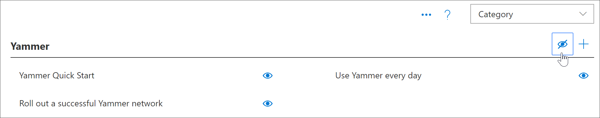

# Novembre 2019 versione 3,0 aggiornamenti delle funzionalitàNovember 2019 Version 3.0 Feature Updates
In base al feedback dei clienti, sono state aggiunte le seguenti nuove funzionalità ai percorsi di apprendimento versione 3,0.Based on customer feedback, the following new features have been added to Learning Pathways version 3.0.

## Aggiornamenti del contenuto e calendario editorialeContent Updates and Editorial Calendar
Una delle promesse dei percorsi di apprendimento è il contenuto aggiornato.One of the promises of learning pathways is up-to-date content. A tal fine, è stato fornito il primo aggiornamento del contenuto trimestrale.To this end, we've provided our first quarterly content update. L'aggiornamento del contenuto viene riflesso nell'articolo relativo all'aggiornamento del contenuto che verrà aggiornato trimestralmente.The content update is reflected our Content Update article which will be updated on a quarterly basis. Per gli aggiornamenti del contenuto, vedere [Learning pathways content updates](custom_contentupdates.md)For content updates, see [Learning pathways Content Updates](custom_contentupdates.md)

## Microsoft 365 centro risultatiMicrosoft 365 Success Center
È stato aggiunto un centro per il successo dei percorsi di apprendimento di Microsoft 365 per aiutare gli amministratori e i proprietari delle raccolte siti a ottenere il massimo dai percorsi di apprendimento.We've added a Microsoft 365 learning pathways Success Center to help Admins and Site Collection Owners get the most out of learning pathways. The Success Center fornisce collegamenti alle risorse di pianificazione e adozione e offre indicazioni sulla pianificazione, la personalizzazione, la Guida all'adozione e la misurazione dell'impatto dei percorsi di apprendimento.The Success Center provides links to planning and adoption resources and offers guidance on planning, customizing, driving adoption,and measuring impact of learning pathways. Per ulteriori informazioni, vedere [Learning pathways admin Success Center](custom_successcenter.md)For more information, see [Learning pathways Admin Success Center](custom_successcenter.md)

## Spostamento della playlistPlaylist navigation
In base al feedback dei clienti, è stato reso più evidente la navigazione con i pulsanti avanti e indietro.Based on customer feedback, we've made navigation more obvious with Next and Previous buttons. È stato inoltre aggiunto un sommario all'interno dell'area di spostamento per consentire agli utenti di visualizzare facilmente l'elenco completo degli elementi in una playlist e di passare direttamente a una risorsa in una playlist.We've also added a table of contents within the navigation area to enable users to easily see the full list of items in a playlist and to navigate directly to an asset in a playlist. 

## Copia di una playlistCopy a Playlist
Molti clienti hanno espresso la necessità di modificare solo alcuni elementi semplici in una playlist fornita da Microsoft, senza dover creare una playlist completamente nuova.Many customers have expressed the need to modify just a few simple things in a Microsoft-supplied playlist, without the need to create a completely new playlist. Ad esempio, una richiesta comune consiste nel rimuovere un passaggio dalla scaletta di inizio con sei semplici passaggi.For example,a common request is to remove a step from the Start with Six Simple Steps playlist. A questo punto è possibile copiare una playlist da una playlist esistente, inclusa una playlist del catalogo Microsoft, e quindi modificare la playlist.Now you can copy a playlist from an existing playlist, including a playlist from the Microsoft catalog,and then modify that playlist. Ad esempio, è ora possibile copiare sei semplici passaggi, eliminare 3 passaggi e trasformare la playlist in 3 semplici passaggi.For example, you can now copy six simple steps, delete 3 steps, and turn the playlist into 3 simple steps. Per ulteriori informazioni, vedere [copia di una playlist](custom_copyplaylist.md)For more information, see [Copy a playlist](custom_copyplaylist.md)

## Funzionalità di ricerca migliorateImproved Search capabilities 
Le funzionalità di ricerca durante la creazione di una playlist dalla pagina di amministrazione sono state migliorate.Search capabilities when building a playlist from the Administration page have been improved. I risultati della ricerca forniscono ulteriori dettagli per distinguere i nomi duplicati nei resi di ricerca.Search results provide additional details to distinguish duplicate names in Search returns. È inoltre possibile fare clic su un elemento dei risultati di ricerca per visualizzare un'anteprima del cespite.You can also click on a Search results item to preview the asset. Per ulteriori informazioni, vedere [creare un elenco di riproduzione personalizzato](custom_copyplaylist.md)For more information, see [Create a custom playlist](custom_copyplaylist.md)

