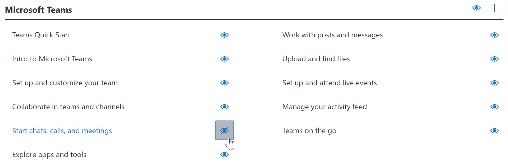
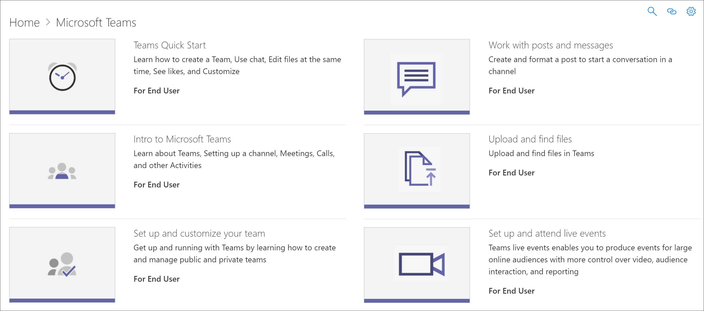

# Nascondere e visualizzare le playlistHide and show Playlists

Per personalizzare l'apprendimento personalizzato per l'ambiente in uso, potrebbe essere necessario nascondere le playlist fornite da Microsoft e sostituirle con playlist create per l'organizzazione.To tailor Custom Learning for your environment, you may need to hide playlists provided by Microsoft and replace them with playlists that you create for your organization. Ad esempio, un caso comune di utilizzo dei clienti consiste nel nascondere i sei semplici passaggi di playlist da Microsoft e sostituirli con una playlist creata per l'organizzazione o per il gruppo di utenti.For example, a common customer use case is to hide the Six Simple Steps playlist from Microsoft and replace it with a playlist that you create for your organization or user group. 

## Nascondere una playlistHide a playlist

1. Dalla **Home** page di apprendimento personalizzato, fare clic sul riquadro di **formazione di Office 365** .From the Custom Learning **Home** page, click the **Office 365 training** tile.
2. Dalla web part apprendimento personalizzato, selezionare il menu **sistema** , quindi selezionare **amministra playlist**.From the Custom Learning web part, select the **System** menu, then select **Administer Playlist**. È ora necessario aprire due schede: una con la pagina di **amministrazione dell'apprendimento personalizzata** ; e uno con la pagina di **formazione di Office 365** .You should now have two tabs open: One with the **Custom Learning Administration** page; and one with the **Office 365 training** page. 
3. Dalla pagina **amministrazione apprendimento personalizzato** , in **categoria**, selezionare una sottocategoria, quindi selezionare il bulbo oculare di una playlist per nasconderla.From the **Custom Learning Administration** page, under **Category**, select a subcategory, and then select the eyeball for a playlist to hide it. Per questo esempio, fare clic sulla prima sottocategoria **giorni** e quindi nascondere la sequenza di **sei passaggi semplici** .For this example, click the **First Days** subcategory, and then hide the **Six Simple Steps** playlist.  

### Verificare che la playlist sia nascostaVerify the playlist is hidden
- Per verificare che la playlist sia nascosta, selezionare la scheda Esplorazione con la pagina inizia **con Office 365** caricata e quindi aggiornare la pagina.To verify the playlist is hidden, select the browser tab with the **Get Started with Office 365** page loaded, and then refresh the page. Si dovrebbe ora vedere la sottocategoria **First Days** e **sei semplici passaggi** sono nascosti.You should now see the **First Days** subcategory and **Six Simple Steps** is hidden. In questo caso, è presente una sola playlist nella sottocategoria ed è nascosta, quindi l'apprendimento personalizzato nasconde anche la sottocategoria invece di visualizzare una sottocategoria vuota.In this case, there is only one playlist in the subcategory and it's hidden, so Custom Learning also hides the subcategory rather than display an empty subcategory. 

## Scopri una playlistUnhide a playlist

- Dalla pagina **amministrazione apprendimento personalizzato** , in **categoria**, selezionare una sottocategoria, selezionare una playlist e quindi selezionare il bulbo oculare della playlist nascosta per scoprirlo.From the **Custom Learning Administration** page, under **Category**, select a subcategory, select a playlist, and then select the eyeball for the hidden playlist to unhide it. In questo esempio, scoprire i **sei Simple Steps** playlist under the **First Days** Subcategory.For this example, unhide the **Six Simple Steps** playlist under the **First Days** subcategory.  

