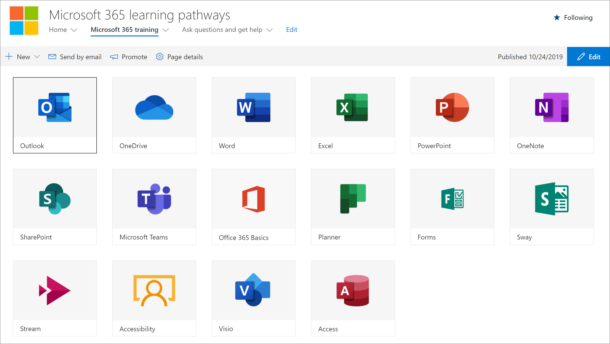

# Nascondere e visualizzare le sottocategorieHide and show Subcategories

Con la pagina di amministrazione dei percorsi di apprendimento, è possibile nascondere e visualizzare sottocategorie di contenuto.With the learning pathways administration page, you can hide and show subcategories of content. Ad esempio, le società che non esercitono Yammer possono nascondere la sottocategoria Yammer, in modo che il contenuto di Yammer non sia visibile agli utenti.For example, companies that don’t roll out Yammer can hide the Yammer subcategory, so Yammer content won't be visible to users. In questo modo si evitano chiamate di supporto indesiderate da parte di utenti che altrimenti potrebbero visualizzare informazioni relative ai servizi non disponibili nell'organizzazione.This prevents unwanted support calls from users who might otherwise see information related to services that aren't available in your organization.

## Nascondere una sottocategoriaHide a subcategory 

1. Nella home page dei percorsi di apprendimento di Microsoft 365 fai clic sul riquadro formazione di Microsoft 365.From the Microsoft 365 learning pathways Home page, click the Microsoft 365 training tile.
2. Nella web part Percorsi di apprendimento di Microsoft 365 fare clic sull'icona Amministrazione.From the Microsoft 365 learning pathways Web part, click the Administration icon. 
3. Nel riquadro sinistro della pagina selezionare una sottocategoria e quindi selezionare il bulbo oculare per la sottocategoria per nasconderla.In the left pane of the page, select a subcategory, and then select the eyeball for the subcategory to hide it. Per questo esempio, nascondere la **sottocategoria Yammer.**For this example, hide the **Yammer** subcategory.  

### Verificare che la sottocategoria sia nascostaVerify the subcategory is hidden
- Per verificare che la sottocategoria sia nascosta, selezionare la scheda del browser con la pagina Introduzione a **Microsoft 365** caricata e quindi aggiornare la pagina.To verify the subcategory is hidden, select the browser tab with the **Get Started with Microsoft 365** page loaded, and then refresh the page. Verrà visualizzata la sottocategoria Yammer nascosta nella categoria Prodotti.You should now see the Yammer subcategory hidden in the Products category. 

## Visualizzare una sottocategoriaUnhide a subcategory 

- Nella pagina **Amministrazione** selezionare una sottocategoria e quindi selezionare il bulbo oculare per la sottocategoria nascosta per scoprirla.From the **Administration** page, select a subcategory, and then select the eyeball for the hidden subcategory to unhide it. Per questo esempio, visualizzare la sottocategoria Yammer.For this example, unhide the Yammer subcategory.