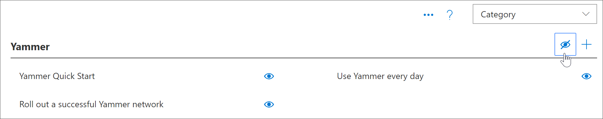

# Nascondere e visualizzare le sottocategorieHide and show Subcategories

Con l'amministrazione di apprendimento personalizzata, è possibile nascondere e visualizzare le sottocategorie.With Custom Learning Administration, you can hide and show subcategories. Ad esempio, le aziende che non eseguono l'implementazione di Yammer possono nascondere la sottocategoria Yammer, in modo che il contenuto di Yammer non sia disponibile per gli utenti.For example, companies that don’t roll out Yammer can hide the Yammer subcategory, so Yammer content won't be available to users. In questo modo si evitano le chiamate di supporto indesiderate provenienti da utenti che potrebbero altrimenti visualizzare informazioni relative ai servizi che non sono disponibili nell'organizzazione.This prevents unwanted support calls from users who might otherwise see information related to services that aren't available in your organization.

## Nascondere una sottocategoriaHide a subcategory 

1. Dalla Home page di apprendimento personalizzato, fare clic sul riquadro di **formazione di Office 365** .From the Custom Learning Home page, click the **Office 365 training** tile.
2. Dalla web part apprendimento personalizzato, selezionare il menu sistema, quindi selezionare **amministra playlist**.From the Custom Learning Web part, select the System menu, then select **Administer Playlist**. È ora necessario aprire due schede: una con la pagina di **gestione dell'apprendimento personalizzata** e una con la pagina di **formazione di Office 365** .You should now have two tabs open: One with the **Custom Learning Administration** page, and one with the **Office 365 training** page. 
3. Nella sezione **categoria**della pagina **amministrazione apprendimento personalizzato** selezionare una sottocategoria e quindi selezionare il bulbo oculare della sottocategoria per nasconderlo.From the **Custom Learning Administration** page, under **Category**, select a subcategory, and then select the eyeball for the subcategory to hide it. Per questo esempio, nascondere la sottocategoria **Yammer** .For this example, hide the **Yammer** subcategory.  

### Verificare che la sottocategoria sia nascostaVerify the subcategory is hidden
- Per verificare che la sottocategoria sia nascosta, selezionare la scheda Esplorazione con la pagina inizia **con Office 365** caricata e quindi aggiornare la pagina.To verify the subcategory is hidden, select the browser tab with the **Get Started with Office 365** page loaded, and then refresh the page. È ora necessario visualizzare la sottocategoria Yammer nascosta nella categoria prodotti.You should now see the Yammer subcategory hidden in the Products category. 

## Scopri una sottocategoriaUnhide a subcategory 

- Nella sezione **categoria**della pagina **amministrazione apprendimento personalizzato** selezionare una sottocategoria e quindi selezionare il bulbo oculare della sottocategoria nascosta per scoprirlo.From the **Custom Learning Administration** page, under **Category**, select a subcategory, and then select the eyeball for the hidden subcategory to unhide it. Per questo esempio, visualizzare la sottocategoria Yammer.For this example, unhide the Yammer subcategory.