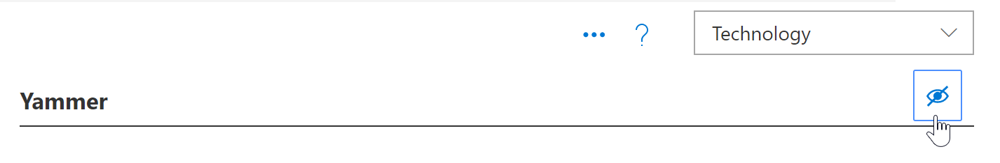
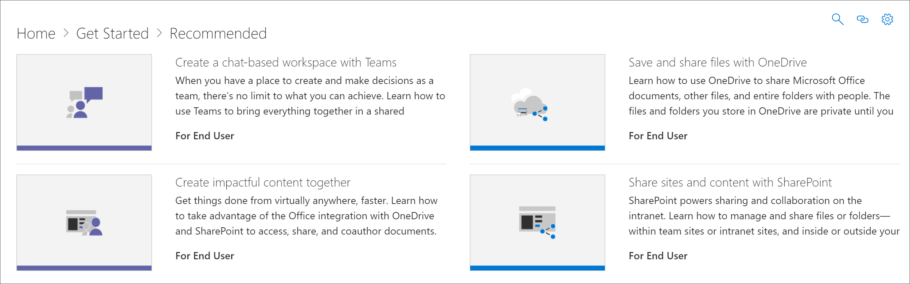

# Nascondere e visualizzare la tecnologiaHide and show Technology

In alcuni casi, è necessario nascondere il contenuto per una tecnologia non supportata nell'organizzazione.In some cases, you’ll want to hide content for a technology that’s not supported in your organization. La funzionalità Nascondi tecnologia è progettata per impedire che la tecnologia venga visualizzata in tutta la Web part.The Hide Technology feature is designed to prevent technology from appearing throughout the Web part. In questo modo, è possibile nascondere e visualizzare il contenuto piuttosto che nasconderlo per sottocategoria o playlist.It offers a broader way to hide and show content than hiding it by subcategory or playlist. Ad esempio, è possibile nascondere una sottocategoria Yammer, ma Yammer potrebbe ancora essere visualizzato in alcune playlist dello scenario, come "Connect your organization with Yammer".For example, you can hide a Yammer subcategory, but Yammer may still show up in certain scenario playlists such as "Connect your organization with Yammer". Per garantire che una tecnologia specifica non venga esposta agli utenti finali, è possibile nasconderla tramite la tecnologia.To ensure a specific technology is not exposed to end users, you can hide it by Technology. 

## Nascondere una tecnologiaHide a Technology

1. Nella **Home** page di Microsoft 365 Learning pathways fare clic sul riquadro **liste di riproduzione consigliate** .From the Microsoft 365 learning pathways **Home** page, click the **Recommended playlists** tile.
2. Dalla web part apprendimento personalizzato, selezionare il menu **sistema** , quindi selezionare **amministra playlist**.From the Custom Learning Web part, select the **System** menu, then select **Administer Playlist**. A questo punto è necessario aprire due schede.You should now have two tabs open. Una con la pagina **liste di riproduzione consigliate** e una con la pagina di **amministrazione dell'apprendimento personalizzata** .One with the **Recommended playlists** page, and one with the **Custom Learning Administration** page. 
3. Dalla pagina **amministrazione apprendimento personalizzato** , fare clic su una **tecnologia**e quindi selezionare il bulbo oculare per la tecnologia per nasconderla.From the **Custom Learning Administration** page, click a **Technology**, and then select the eyeball for the technology to hide it. Per questo esempio, fare clic sulla tecnologia **Yammer** e quindi nasconderla.For this example, click the **Yammer** technology, and then hide it.  

### Verificare che la playlist sia nascostaVerify the playlist is hidden
- Per verificare che la tecnologia **Yammer** sia nascosta, selezionare la scheda Esplorazione con la pagina **liste di riproduzione consigliate** caricata e quindi aggiornare la pagina.To verify **Yammer** technology is hidden, select the browser tab with the **Recommended playlists** page loaded, and then refresh the page. Si noterà che l'organizzazione Connect your organization with Yammer playlist è nascosta.You'll notice that the Connect your organization with Yammer playlist is hidden. 

## Scoprire una tecnologiaUnhide a Technology

- Dalla pagina **amministrazione apprendimento personalizzato** , in **tecnologia**, selezionare una tecnologia, quindi selezionare il bulbo oculare per la tecnologia nascosta per scoprirlo.From the **Custom Learning Administration** page, under **Technology**, select a technology, then select the eyeball for the hidden technology to unhide it. Per questo esempio, Scopri la tecnologia **Yammer** .For this example, unhide the **Yammer** technology. 