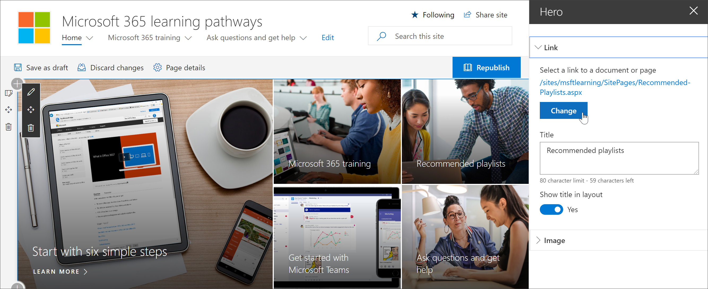
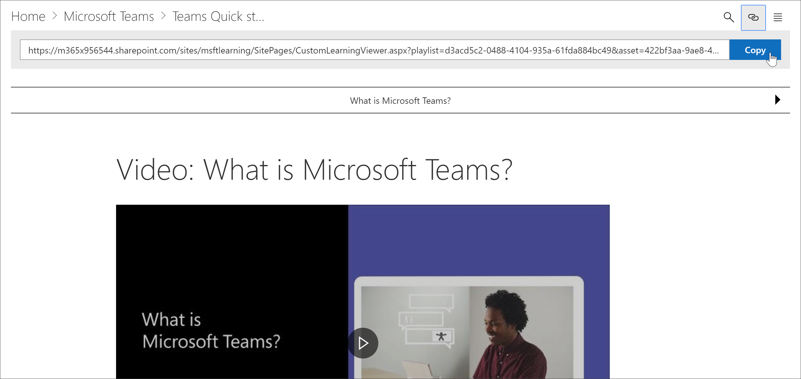
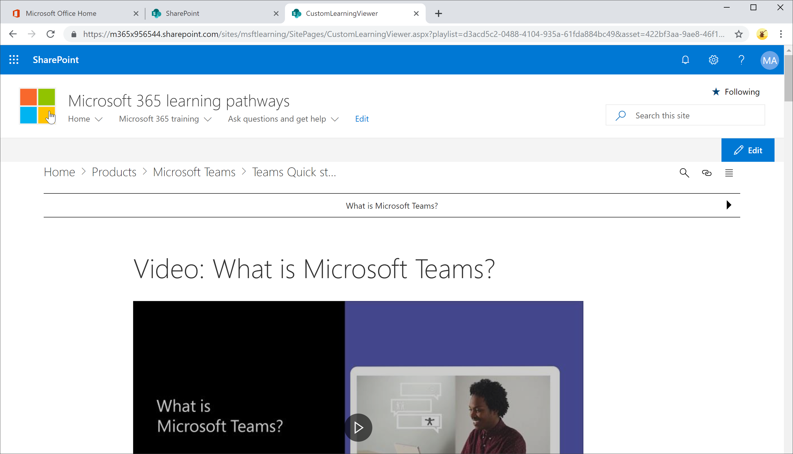

# Creare un collegamento ai contenuti dei percorsi di apprendimento

Con i percorsi di apprendimento, esistono due modi per collegarsi al contenuto:

- Collegamento alla pagina che ospita la web part filtrata per il contenuto che si desidera visualizzare 
- Collegamento diretto a un'istanza della web part

## Collegamento a una pagina

Se sono state create nuove pagine ed esperienze di apprendimento con la web part percorsi di apprendimento di Microsoft 365, è possibile creare un collegamento alla pagina con la web part configurata per visualizzare il contenuto che si desidera visualizzare. Nella sezione precedente è stato illustrato come visualizzare Excel playlist in una pagina. A questo punto è possibile modificare la home page per collegarsi alla pagina. 

1. Nella home page fare clic su **Modifica.**
2. Fare **clic su Modifica** dettagli in uno dei riquadri della home page. In questo esempio vengono modificati i **riquadri Playlist consigliate.**
3. In **Collegamento** fare clic su **Cambia.**

4. Fare **clic su** Sito, quindi **su** Pagine del sito, sulla pagina a cui si desidera creare il collegamento e quindi su **Apri.** In questo esempio viene creato un collegamento alla **pagina Create-your-own-experience.aspx** illustrata nella sezione precedente.
5. Chiudere il riquadro delle proprietà di Hero, fare **clic su Pubblica** e quindi testare il collegamento. 

## Collegamento alla web part Microsoft 365 percorsi di apprendimento
I percorsi di apprendimento consente all'utente, all'amministratore o all'utente finale di collegarsi a un'istanza della web part indipendentemente dalla pagina che contiene la web part. È possibile condividere il collegamento copiato o il collegamento ad esso da altre pagine. Il collegamento copiato, quando si fa clic, mostra l'istanza Microsoft 365 web part percorsi di apprendimento nella pagina CustomLLearningViewer.aspx. Vediamo un esempio. 

1. Nella home page fare clic su **Formazione su Microsoft365.**
2. Fare **clic Microsoft Teams** e quindi su Intro per **Microsoft Teams**.
3. Fare clic **sull'icona** Copia.

4. Scegliere Home dal menu Microsoft 365 del sito percorsi di apprendimento.
5. Incollare l'URL copiato nella barra degli indirizzi del browser e premere INVIO. 

Come illustrato nella figura seguente, il collegamento passa alla pagina CustomLearningViewer.aspx e visualizza il contenuto in base ai parametri nel collegamento copiato. 

