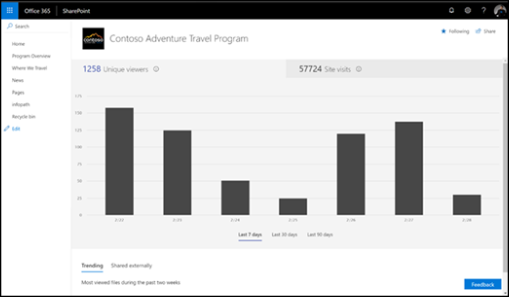

# Misurazione dell'impatto dei percorsi di apprendimento di Microsoft 365Measuring impact of Microsoft 365 learning pathways

Gli amministratori devono sfruttare le funzionalità di Reporting di utilizzo del sito predefinite di SharePoint per misurare l'impatto organizzativo dei percorsi di apprendimento di Microsoft 365.Administrators should leverage SharePoint’s built-in site usage reporting capabilities to measure organizational impact of the Microsoft 365 learning pathways. Esistono due scenari principali per la misurazione dell'impatto:There are two primary scenarios for measuring impact: 
- Impatto a livello di sito-visualizzare i dati di utilizzo per il sito specifico per l'apprendimento personalizzato per Office 365Site level impact – view usage data for the Custom Learning for Office 365 specific site 
- Impatto a livello di organizzazione: informazioni sull'apprendimento dei clienti per l'utilizzo di Office 365 rispetto a tutti gli altri siti all'interno dell'organizzazioneOrganization level impact – understand Customer Learning for Office 365 usage with respect to all other sites within your organization

## Impatto a livello di sitoSite-level impact

Come proprietario di un sito di SharePoint Online, è possibile visualizzare le informazioni che illustrano in che modo gli utenti interagiscono con il sito.As a SharePoint Online site owner, you can view information that shows you how users are interacting with your site. Ad esempio, è possibile visualizzare il numero di persone che hanno visitato il sito, quante volte la gente ha visitato il sito e un elenco di file che hanno ricevuto la maggior parte delle visualizzazioni.For example, you can see the number of people who have visited the site, how many times people have visited the site, and a list of files that have received the most views. Vedere [i dettagli del report](https://support.office.com/article/view-usage-data-for-your-sharepoint-site-2fa8ddc2-c4b3-4268-8d26-a772dc55779e).See [Report Details](https://support.office.com/article/view-usage-data-for-your-sharepoint-site-2fa8ddc2-c4b3-4268-8d26-a772dc55779e). 

## Impatto a livello di organizzazioneOrganization-level impact
Il report sull'utilizzo del sito di SharePoint per l'interfaccia di amministrazione di Office 365 consente agli amministratori di ottenere una visualizzazione ad alto livello del valore ottenuto dal sito di apprendimento personalizzato per Office 365 rispetto a tutti gli altri siti di SharePoint.The Office 365 Admin Center SharePoint site usage report enables Administrators to get a high level view of the value you are getting from the Custom Learning for Office 365 site relative to all other SharePoint sites. Vedere [i dettagli del report](https://docs.microsoft.com/office365/admin/activity-reports/sharepoint-site-usage?view=o365-worldwide).See [Report Details](https://docs.microsoft.com/office365/admin/activity-reports/sharepoint-site-usage?view=o365-worldwide).
 
Seguire l'articolo a cui si fa riferimento per:Follow the referenced article to: 
1. Informazioni su come accedere al report sull'utilizzo del sito di SharePointLearn how to get to the SharePoint site usage report 
2. Interpretazione dei dettagli del report sull'utilizzo del sito di SharePoint.Interpreting the SharePoint site usage report details. Ordinare il campo URL sito per identificare più facilmente il sito Microsoft 365 Learning pathways.Sort on the Site URL field to more easily identify your Microsoft 365 learning pathways site. 
3. Sfruttare la funzionalità di esportazione dei report per un'analisi dei dati più avanzata o se l'organizzazione ha più di 2.000 siti.Leverage the report Export functionality for more advanced data analysis or if your organization has greater than 2,000 sites. 

## Commenti e suggerimentiFeedback

A questo punto, la creazione di report è limitata al livello di sito di SharePoint.As of today, reporting is limited to the SharePoint site level. Presta il tuo voto al forum vocale del nostro [utente](https://microsoftteams.uservoice.com/forums/913429-learning-solutions) per semplificare la priorità alle richieste di funzionalità di creazione di report avanzate.Lend your vote to our [User Voice](https://microsoftteams.uservoice.com/forums/913429-learning-solutions) forum to help prioritize enhanced reporting functionality requests.   

