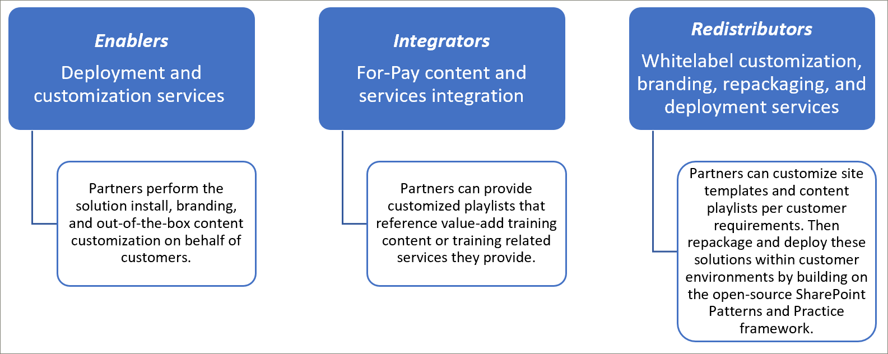
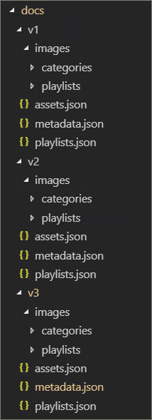
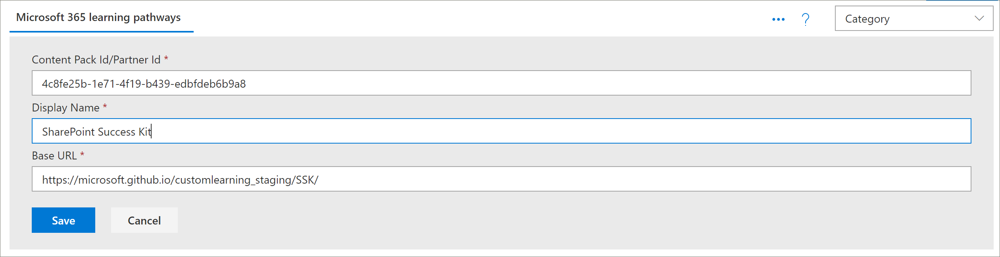
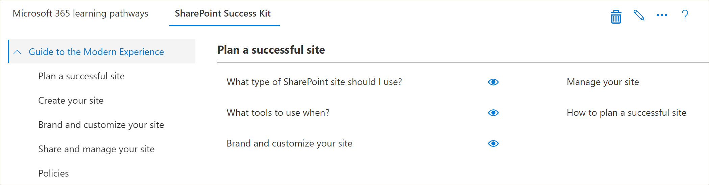
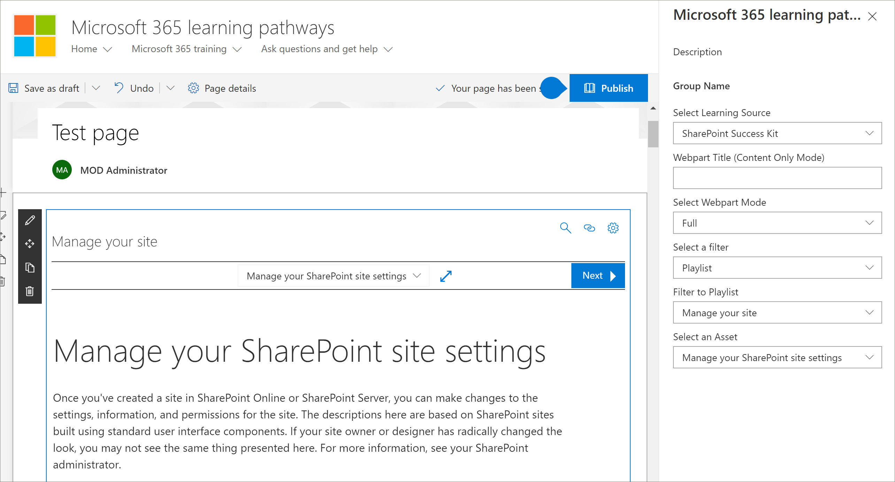

# Modelli di integrazione dei partnerPartner integration models
Sebbene non sia possibile integrare il contenuto dei percorsi di apprendimento di Microsoft 365 direttamente "out of the box" dal servizio di provisioning online di SharePoint, esistono diversi modelli di integrazione che i partner possono sfruttare per creare offerte di servizi a valore aggiunto allineate.While it’s not possible to supplement the Microsoft 365 learning pathways content directly ‘out of the box’ from the SharePoint Online Provisioning service, there are several integration models that partners can leverage to create aligned value-add service offerings. I modelli di integrazione dei partner precedenti sono presentati in ordine di complessità crescente e livelli di investimento.The partner integration models above are presented in order of ascending complexity and levels of investment. Di conseguenza, la nostra guida è di sviluppare le tue competenze e i tuoi laureati a livelli più avanzati in base ai tuoi modelli di business.Hence our guidance is to build your expertise and graduate to more advanced levels based on your business models.

## Come iniziare?How should I get started? 
Per iniziare, ecco alcune procedure consigliate da seguire.To get started, here are some best practices to follow.     

### 1. Iniziare con la creazione di competenze come abilitazione.1. Begin with building expertise as an Enabler. 
Puoi aiutare subito una percentuale della tua base di clienti abilitando il portale di formazione sui percorsi di apprendimento ed eseguendo una cura mirata dei contenuti Microsoft.You can help a percentage of your customer base right away by enabling their learning pathways training portal and performing targeted Microsoft content curation. Per istruzioni sul provisioning dei percorsi di apprendimento, vedere [Provisioning di una nuova soluzione di percorsi di apprendimento.](/office365/customlearning/custom_provision)For instructions on provisioning learning pathways, see [Provision a new learning pathways solution](/office365/customlearning/custom_provision).  

### 2. Estendere quindi i servizi come integratore2. Then extend your services as an Integrator
Eseguire un'analisi del ritorno sull'investimento per l'automazione, a seconda della quantità di contenuti e/o esigenze di integrazione dei servizi.Perform an automation return on investment analysis - depending on the quantity of your content and/or services integration needs. Ad esempio, potrebbe non avere senso prendere in conto i costi di sviluppo e operativi rispetto alle linee guida per l'integrazione dei contenuti se puoi creare rapidamente manualmente una playlist personalizzata mirata che punti al contenuto a pagamento o fare riferimento ai tuoi servizi.For example, it may not make sense to take on the development and operational costs with respect to our content integration guidelines if you can quickly manually create a targeted custom playlist(s) pointing to your for-pay content or reference your services.

### 3. Quando il ritorno sull'investimento è sensato, prendere in considerazione la ridistribuzione3. When the return on investment makes sense – consider Redistribution 
Quando il ritorno sull'investimento ha senso, prendi in considerazione la ridistribuzione (o l'utilizzo di partner correlati ai percorsi di apprendimento) per creare soluzioni riconfezionate.When the return on investment makes sense – consider Redistribution (or working with related learning pathways partners) to build repackaged solutions. Si basano sul framework di SharePoint Patterns and Practice che fornisce soluzioni per estrarre siti personalizzati e quindi distribuirlo negli ambienti dei clientiThese are based on the SharePoint Patterns and Practice framework which provides solutions to extract customized sites and then deploy into customer environments 

## Linee guida per l'integrazione del contenuto fornite dai partnerPartner-provided content integration guidelines
Il contenuto Microsoft 365 percorsi di apprendimento è guidato da un set di file JSON che agiscono come manifesti di contenuto per il pacchetto di apprendimento.Content for Microsoft 365 learning pathways is driven by a set of JSON files that act as content manifests for your learning package. Sono disponibili tre file: metadata.js, playlists.jse assets.jssu.There are three files: metadata.json, playlists.json, and assets.json. Questi file devono essere strutturati in modo da corrispondere ai modelli che la web part riconosce e quindi ospitati da una rete di recapito del contenuto (rete CDN) per consentire alla web part di caricarli.These files need to be structured to match the models the web part recognizes and then hosted from a content delivery network (CDN) to allow the web part to load them. Microsoft fornirà modelli di avvio di questi file per iniziare.Microsoft will provide starter templates of these files to get you started.  

**Dichiarazione di non responsabilità:** la struttura del file JSON è soggetta a modifiche in base al lavoro della soluzione imminente.**Disclaimer:** the JSON file structure is subject to change based on upcoming solution work. I Microsoft 365 di apprendimento del partner Early Adopter Program (EAP) saranno informati di eventuali cambiamenti imminenti di questa natura.The Microsoft 365 learning pathways partner Early Adopter Program (EAP) will be informed of any impending changes of this nature. Insieme a qualsiasi guida alla compatibilità con le versioni precedenti e/o alla transizione dei clienti.Along with any customer backwards compatibility and/or transition guidance. 

### Scaricare la soluzione Microsoft 365 percorsi di apprendimentoDownload the Microsoft 365 learning pathways solution
Puoi scaricare la soluzione Microsoft 365 percorsi di apprendimento, insieme ai file JSON, dal repository GitHub: https://github.com/pnp/custom-learning-office-365 .You can download the Microsoft 365 learning pathways solution, along with the JSON files, from the GitHub repository: https://github.com/pnp/custom-learning-office-365. Si noti che al momento, Microsoft non sta GitHub richiesta pull sulla soluzione.Note that at this time, Microsoft is not taking GitHub pull request on the solution. È tuttavia possibile usare i GitHub come punto di partenza per la creazione di un pacchetto di contenuto personalizzato.But you can use the GitHub files as a starting point for creating your own custom content pack. 

### Metadata.jssulla strutturaMetadata.json Structure
Puoi pensare a questo file come al cervello dei menu e della struttura.You can think of this file as the brains of the menus and structure. Contiene tutta la struttura di spostamento e gli elenchi di selezione per i dati negli altri due file.It contains all the navigation structure as well as pick lists for data in the other two files. 

|              NomeName        |                     DescrizioneDescription                                                               | 
|:-----------------------------|-------------------------------------------------------------------------------------------|
|**Tecnologie****Technologies**              |Il contenuto è contrassegnato con tag e può essere nascosto in base alla tecnologia assegnata.Content is tagged and can be hidden based on the Technology it’s assigned.                 |  
|&nbsp;&nbsp;ID&nbsp;&nbsp;Id                |GUID che rappresenta la tecnologiaGUID representing the technology                                                           |  
|&nbsp;&nbsp;Nome&nbsp;&nbsp;Name              |Nome visualizzato della tecnologiaDisplay name of the technology                                                             |
|&nbsp;&nbsp;*Soggetti[ ]*&nbsp;&nbsp;*Subjects[ ]*     |Matrice di argomenti che sono un sottoinsieme della tecnologiaAn array of subjects that are a subset of the technology                                   | 
|&nbsp;&nbsp;&nbsp;&nbsp;ID&nbsp;&nbsp;&nbsp;&nbsp;Id    |GUID che rappresenta l'oggettoGUID representing the subject                                                              |
|&nbsp;&nbsp;&nbsp;&nbsp;Nome&nbsp;&nbsp;&nbsp;&nbsp;Name  |Nome visualizzato dell'oggettoDisplay name of the subject                                                                |
|**Categorie [ ]****Categories [ ]**             |Le categorie informano lo spostamento della web part.Categories inform the navigation of the webpart. Ogni categoria rappresenta un livello superiore della struttura di spostamentoEach category represents a top level of the navigation                                                                                                                 |
|&nbsp;&nbsp;ID&nbsp;&nbsp;Id                |GUID che rappresenta la categoria/sottocategoriaGUID representing the category/subcategory                                                 |
|&nbsp;&nbsp;Nome&nbsp;&nbsp;Name              |Nome visualizzato per la categoria/sottocategoriaDisplay name for the category/subcategory                                                  |
|&nbsp;&nbsp;Immagine&nbsp;&nbsp;Image             |URL dell'immagine che deve essere visualizzata nell'esperienza utente (rispetto alla rete CDN base)URL for the image that should be displayed in the UX (relative to the CDN base)            |
|&nbsp;&nbsp;TechnologyId&nbsp;&nbsp;TechnologyId      |GUID della tecnologia a cui è correlato questo contenuto (facoltativo - stringa vuota)The GUID of the Technology this content is related to (optional – empty string)            |
|&nbsp;&nbsp;SubjectId&nbsp;&nbsp;SubjectId         |GUID dell'oggetto a cui è correlato il contenuto (facoltativo - stringa vuota)The GUID of the Subject this content is related to (optional – empty string)               |
|&nbsp;&nbsp;Source&nbsp;&nbsp;Source            |From Source array, not specifically used in UX other than custom data added by the user is marked as "Tenant" and the UX admin area does not allow editing of anything not marked "Tenant".From Source array, not specifically used in UX other than custom data added by the user is marked as “Tenant” and the UX admin area does not allow editing of anything not marked “Tenant”.                           |
|&nbsp;&nbsp;*Sottocategorie[ ]*&nbsp;&nbsp;*Subcategories[ ]*|Sub-Categories sono fondamentalmente il livello di spostamento dal livello 2 verso il basso.Sub-Categories are basically the nav level from level 2 down. La struttura è la stessa di un oggetto Category appena annidato.The structure is the same as a Category just nested.          |
|**Gruppi di destinatari [ ]****Audiences [ ]**             |Quando alle playlist associate a una categoria/sottocategoria sono associati diversi gruppi di destinatari, sarà disponibile un selettore per visualizzare i gruppi di destinatari disponibili.When playlists associated with a category/subcategory are various audiences tagged, a selector will be available to show the available audiences. |         
|&nbsp;&nbsp;ID&nbsp;&nbsp;Id                |GUID del gruppo di destinatariGUID of the audience                                                                       |  
|&nbsp;&nbsp;Nome&nbsp;&nbsp;Name              |Nome visualizzato del gruppo di destinatariDisplay name of the audience                                                               |       
|**Origini [ ]****Sources [ ]**               |Matrice di stringhe che contrassegna il contenuto con la relativa origine, non specificatamente utilizzata nell'esperienza utente oltre ai dati personalizzati aggiunti dall'utente è contrassegnata come "Tenant" e l'area di amministrazione dell'esperienza utente non consente la modifica di elementi non contrassegnati come "Tenant".Array of strings that tag content with its source, not specifically used in UX other than custom data added by the user is marked as “Tenant” and the UX admin area does not allow editing of anything not marked “Tenant”.                                                   |  
|**Livelli [ ]****Levels  [ ]**               |Quando alle playlist associate a una categoria/sottocategoria sono associati diversi livelli, sarà disponibile un selettore per visualizzare i livelli disponibili.When playlists associated with a category/subcategory are various levels tagged, a selector will be available to show the available levels.             |  
|&nbsp;&nbsp;ID&nbsp;&nbsp;Id                |GUID del livelloGUID of the Level                                                                          |  
|&nbsp;&nbsp;Nome&nbsp;&nbsp;Name              |Nome visualizzato del livelloDisplay name of the Level                                                                  | 
|**StatusTag [ ]****StatusTag  [ ]**           |Il tag di stato consente di identificare il contenuto con vari stati che verranno esposti nell'esperienza utente.Status tag is to identify content with various status that will be exposed in the UX. Alcuni di questi flag verranno visualizzati all'utente e altri solo all'amministratore.Some of these flags will be show to the consumer and some only to the admin.                                                   |  
|&nbsp;&nbsp;ID&nbsp;&nbsp;Id                |GUID di StatugTagGUID of the StatugTag                                                                      |  
|&nbsp;&nbsp;Nome&nbsp;&nbsp;Name              |Nome visualizzato dell'oggetto StatusTagDisplay name of the StatusTag                                                              | 
|**Telemetria [ ]****Telemetry  [ ]**            |                                                                                           |  
|&nbsp;&nbsp;AppInsightsKey&nbsp;&nbsp;AppInsightsKey    |GUID della chiave di analisi delle app che hai configurato per tenere traccia del caricamento della web part visualizzatore.GUID of the app insights key that you have set up to track the loading of the viewer web part. La verifica può essere disattivata da un amministratore per l'intero tenant, ma le informazioni inviate sono un utente anonimizzato con l'ID tenant. Per ulteriori informazioni, vedere questa sezione https://github.com/pnp/custom-learning-office-365#disabling-telemetry-collectionTracking can be turned off by an administrator for the entire tenant, but the information sent is anonymized user with the tenant id. Please see this section for more information https://github.com/pnp/custom-learning-office-365#disabling-telemetry-collection               |  
|**Versione****Version**                   |Le informazioni sulla versione vengono utilizzate dalla soluzione per indicare agli amministratori che la web part è stata aggiornata e consentono inoltre alla web part di aggiornare automaticamente il contenuto personalizzato alla versione più recente del manifesto se sono state apportate modifiche significative.Version information is used by the solution to indicate to administrators that the webpart has updated and also allow the webpart to self-update custom content to the latest version of the manifest if significant changes have been made.         | 
|&nbsp;&nbsp;Manifesto&nbsp;&nbsp;Manifest          |Versione del manifestoThe version of the manifest                                               |
|&nbsp;&nbsp;ManifestMinWebPart&nbsp;&nbsp;ManifestMinWebPart|Versione minima della web part che funziona con la versione del manifestoThe minimum version of the webpart that works with the version of the manifest             |
|&nbsp;&nbsp;CurrentWebPart&nbsp;&nbsp;CurrentWebPart    |URL dell'immagine che deve essere visualizzata nell'esperienza utente (rispetto alla rete CDN base)URL for the image that should be displayed in the UX (relative to the CDN base)            |
|&nbsp;&nbsp;RepoURL&nbsp;&nbsp;RepoURL           |URL del repository in cui si trova la web part di aggiornamento.The url of the repository where the updating web part instructions are.                    |
|**Pacchetti di contenuto****Content Packs**             |Al momento i pacchetti di contenuto per rete CDN non sono supportati.At this time content packs for additional CDN’s is not supported. I pacchetti di contenuto consentono a Microsoft di suggerire altre soluzioni create da Microsoft di cui è possibile eseguire il provisioning tramite il servizio di provisioning che sfruttano M365LP per distribuire contenuto e si trovano in reti CDN personalizzate.Content packs allow Microsoft to suggest other Microsoft created solutions that can be provisioned via the Provisioning service that leverage M365LP to deliver content and are in and of themselves custom CDNs.       | 
|&nbsp;&nbsp;ID&nbsp;&nbsp;Id                |GUID del pacchetto/rete CDNGUID of the content pack/CDN                                                              |
|&nbsp;&nbsp;Nome&nbsp;&nbsp;Name              |Nome visualizzato dell'rete CDNDisplay name of the CDN                                                                   |
|&nbsp;&nbsp;Descrizione&nbsp;&nbsp;Description       |Descrizione da visualizzare nell'interfaccia utente per l'aggiunta di un pacchetto di contenutoDescription to be displayed in UI for adding a content pack                               |
|&nbsp;&nbsp;Immagine&nbsp;&nbsp;Image             |Immagine da visualizzare nell'interfaccia utente per l'aggiunta di un pacchetto di contenutoImage to be displayed in UI for adding a content pack                                     |
|&nbsp;&nbsp;ProvisionURL&nbsp;&nbsp;ProvisionURL      |URL del pacchetto del servizio di provisioning per creare la raccolta siti del pacchetto di contenutoThe URL to the provisioning service package to create the content pack’s site collection  |
|&nbsp;&nbsp;CDNbase&nbsp;&nbsp;CDNbase           |URL di base per i manifesti per il pacchetto di contenutoThe Base URL for the manifests for the content pack                                       |
|AssetOriginsAssetOrigins                  |Matrice di origini URL utilizzata nel file assets.jsdescritto più avanti.An array of URL origin’s utilized in the assets.json file described later. Se l'URL di origine lo supporta, verrà inviato un messaggio post help_getClientHeight.If the origin URL supports it, a post message will be sent to help_getClientHeight. Una risposta nella proprietà data di: "help_getClientHeight={height of content}" (ad esempio "help_getClientHeight=5769") consentirà all'iFrame di essere ridimensionato all'altezza appropriata del contenuto con frame.A response in the data property of: "help_getClientHeight={height of content}" (for example "help_getClientHeight=5769") will allow the iFrame to be resized to the appropriate height of the framed content.         |

### Playlists.jssulla strutturaPlaylists.json Structure
playlists.jsattivo: il manifesto delle playlist è una matrice di oggetti che descrivono i metadati relativi a una playlist e gli asset inclusi nella playlist.playlists.json – The playlists manifest is an array of objects that describe the metadata about a playlist and the assets that are included in the playlist.

|              NomeName        |                     DescrizioneDescription                                                               | 
|:-----------------------------|-------------------------------------------------------------------------------------------|
|IdId                            |GUID che rappresenta la playlistGUID representing the playlist                                                             |  
|TitoloTitle                         |Nome visualizzato della playlistDisplay name of the playlist                                                               |
|ImmagineImage                         |URL relativo (da rete CDN) a un'immagine per visualizzare la playlistRelative URL (from CDN) to an image to visualize the playlist                              |                      
|LevelIdLevelId                       |Livello associatoAssociated level                                                                           |
|AudienceIdAudienceId                   |Gruppo di destinatari associatoAssociated audience                                                                        |
|TechnologyIdTechnologyId                 |Tecnologia associataAssociated technology                                                                      |
|SubjectIdSubjectId                    |Nome visualizzato per la categoria/sottocategoriaDisplay name for the category/subcategory                                                  |
|OrigineSource                        |Dalla matrice di origine, non specificatamente utilizzata nell'esperienza utente oltre ai dati personalizzati aggiunti dall'utente, viene contrassegnata come "Tenant" e l'area di amministrazione dell'esperienza utente non consente la modifica di elementi non contrassegnati come "Tenant".From the source array, not specifically used in UX other than custom data added by the user is marked as “Tenant” and the UX admin area does not allow editing of anything not marked “Tenant”.                                              |
|CatIdCatId                         |L'ID categoria o sottocategoria che rappresenta il contenitore in cui deve essere visualizzata la playlist.The Category or SubCategory ID that represents the container the playlist should be shown in. Attualmente il manifesto non supporta la selezione di una categoria o di una sottocategoria come contenitore se ha anche figli SubCategory.Currently the manifest does not support selecting a Category or SubCategory as the container if it also has SubCategory children.        |
|DescrizioneDescription                   |Una descrizione mostrata per ogni playlist nell'esperienza utenteA description showed for each playlist in the UX                                           |
|StatusTagIdStatusTagId                   |Tag di stato associatoAssociated status tag                                                                      |
|StatusNoteStatusNote                    |Note sul contenuto visualizzato agli amministratoriNotes about content displayed to administrators                                            |
|*Assets[]**Assets[]*                        |Matrice di GUID per gli asset che fanno parte di questa playlist, in ordine di visualizzazione.An array of GUID’s for the assets that are part of this playlist, in display order.        |         

### Asset.jssulla strutturaAsset.json Structure
playlists.jsattivo: il manifesto delle playlist è una matrice di oggetti che descrivono i metadati relativi a una playlist e gli asset inclusi nella playlist.playlists.json – The playlists manifest is an array of objects that describe the metadata about a playlist and the assets that are included in the playlist.

|              NomeName        |                     DescrizioneDescription                                                               | 
|:-----------------------------|-------------------------------------------------------------------------------------------|
|IdId                            |GUID che rappresenta la playlistGUID representing the playlist                                                             |  
|TitoloTitle                         |Nome visualizzato della playlistDisplay name of the playlist                                                               |
|DescrizioneDescription                   |---                                                                                           |                      
|URLURL                           |URL di origine dell'asset da applicare all'iFrameThe source url for the asset, to be applied to the iFrame                                  |
|TechnologyIdTechnologyId                  |Tecnologia associataAssociated technology                                                                      |
|SubjectIdSubjectId                     |Oggetto associatoAssociated subject                                                                         |
|OrigineSource                        |Nome visualizzato per la categoria/sottocategoriaDisplay name for the category/subcategory                                                  |
|StatusTagIdStatusTagId                   |Tag di stato associatoAssociated status tag                                                                      |
|StatusNoteStatusNote                    |Note sul contenuto visualizzato agli amministratori.Notes about content displayed to administrators.                                           |

### CachingCaching
La versione corrente della web part visualizzatore utilizza una versione memorizzata nella cache dei file manifesto per 24 ore.The current version of the viewer web part utilizes a cached version of the manifest files for 24 hours. Dopo 24 ore, il primo utente che ha raggiunto la web part utilizza l'hit delle prestazioni per aggiornare la cache scaricando i manifesti dal rete CDN di origine e unendo le informazioni con le tecnologie e le playlist nascoste, nonché l'unione in sottocategorie, playlist e asset personalizzati.After 24 hours, the first user that hit’s the webpart takes the performance hit to refresh the cache by downloading the manifests from the source CDN and merge that information with hidden technologies and playlists as well as merging in custom sub-categories, playlists, and assets. In alternativa, la web part di amministrazione scarica sempre il contenuto dai manifesti e li unisce e aggiorna la cache.Alternately the admin web part always downloads the content from the manifests and merges them in and updates the cache.  Pertanto, in altre parole, l'amministratore può forzare un aggiornamento della cache in qualsiasi momento caricando la web part di amministrazione, aka andando alla pagina Amministrazione.So, in other words, the administrator can force a cache update at any time by loading the admin web part, aka going to the Administration page.

## Linee guida per i pacchetto di contenutoContent Pack Guidelines
La funzionalità Pacchetto di contenuto consente di sbloccare gli scenari seguenti:The Content Pack feature unlocks the following scenarios:
- Possibilità per i partner di ridistribuire contenuti di apprendimento personalizzati a valore aggiunto personalizzati personalizzati per l'ambiente dei clientiThe ability for partners to redistribute value-added custom learning content custom tailored to customers’ environment
- Possibilità per le organizzazioni con un team di formazione e supporto IT di creare contenuti di apprendimento personalizzati indirizzati ai propri sistemi interni e alla governanceThe ability for organizations with a strong training team and IT support to build custom learning content directed at their own internal systems and governance
- La possibilità per Microsoft di offrire ulteriori percorsi di apprendimento in futuro a cui i clienti possono acconsentire esplicitamenteThe ability for Microsoft to deliver additional learning pathways in the future that customers can opt into

Questo set di documentazione corrente è intenzionalmente destinato ai partner a causa della complessità della funzionalità.This current documentation set is intentionally targeted for Partners due to the feature’s complexity. Il team del servizio sta lavorando attivamente per supportare e abilitare meglio gli scenari #2, in futuro.The service team is actively working to better support and enable scenario #2, in the future. 

### Funzionamento dei pacchetti di contenutoHow Content Packs work
Microsoft utilizza le GitHub come origine rete per la distribuzione di contenuti (rete CDN) per i relativi file manifesto e immagini.Microsoft utilizes GitHub pages as a Content Delivery Network (CDN) source for its manifest files and images. Abbiamo una cartella documenti nella radice del repository GitHub che include sottocartelle per ogni versione dei file manifesto.We have a docs folder at the root of our GitHub repository that includes sub folders for each version of the manifest files. All'interno di ogni cartella sono presenti tre file manifesto, oltre a una cartella immagini per archiviare tutte le immagini di categoria, sottocategoria e playlist.Inside each folder there are three manifest files, plus an images folder to store all the category, subcategory, and playlist images. 

È importante mantenere la stessa struttura di controllo delle versioni di Microsoft se si sceglie di estendere la soluzione dei percorsi di apprendimento con il proprio pacchetto di contenuto.It is important that you maintain the same versioning structure that Microsoft does should you choose to extend the learning pathways solution with your own content pack. L'endpoint rete CDN non deve includere la cartella della versione, poiché la versione del manifesto supportata dalla web part viene aggiunta automaticamente all'URL rete CDN.Your CDN endpoint should not include the version folder, as the manifest version the web part supports is baked into it and is automatically appended to the CDN url. Ti daremo ovviamente il tempo di creare nuove istanze dei file manifesto ogni volta che li revisioniamo.We will obviously give you time to create new instances of your manifest files any time we revision it.

 

Per ulteriori informazioni sull'utilizzo GitHub pagine come origine rete CDN, vedere la documentazione della Guida seguente: [https://help.github.com/en/articles/configuring-a-publishing-source-for-github-pages](https://help.github.com/en/articles/configuring-a-publishing-source-for-github-pages) .For more information about utilizing GitHub pages as your CDN source please see the following help documentation: [https://help.github.com/en/articles/configuring-a-publishing-source-for-github-pages](https://help.github.com/en/articles/configuring-a-publishing-source-for-github-pages).

La soluzione di Microsoft rende aperte al pubblico le informazioni sugli asset, in quanto non esiste alcuna sicurezza per chi ha accesso a questi file.Microsoft’s solution makes the information about the assets open to the public as there is no security around who has access to these files. Riteniamo che dovrebbe essere disponibile un livello gratuito di contenuto per un utente, ovvero se si ha la necessità di una parete di pagamento per alcuni o tutti i contenuti, sarà necessario implementare questo in modo diverso entro le limitazioni tecniche della soluzione e l'utilizzo delle pagine di GitHub non è affatto un requisito.We believe that there should be a free layer of content for a consumer, that said if you have a need for pay wall for some or all of your content you will need to implement this differently within the technical limitations of the solution and using GitHub pages is by no means a requirement. Qualsiasi rete CDN provider che si desidera utilizzare è valido se si mantiene la struttura di numerazione delle versioni descritta.Any CDN provider you would like to use is fine if you maintain the version numbering structure we’ve outlined. Come indicato in precedenza, la versione della struttura del manifesto supportata dalla web part viene aggiunta automaticamente all'URL rete CDN manifesto.As stated previously, the version of the manifest structure the web part supports is baked into the code and is automatically appended to the CDN URL. 

### Linee guida per l'integrazione dei pacchetto di contenutoContent Pack Integration Guidance 
Le web part di amministrazione e visualizzatore sono state estese per consentire all'utente di configurare ulteriori endpoint rete CDN nel tenant, in modo da consentire alla web part visualizzatore di selezionare quale rete CDN deve essere l'origine dei dati visualizzati.The admin and viewer web parts have been extended to allow the consumer to configure additional CDN endpoints in their tenant which will then allow the viewer web part to select which CDN they should source the data they display. 

Inquadratura chiave da tenere presente per questa funzionalità:Key framing to keep in mind for this feature: 
- Ciò è applicabile in modo primario per gli scenari di ridistribuzione dei partner, in cui la configurazione manuale delle playlist è troppo complicataThis is primary applicable for partner redistribution scenarios – where manual playlist configuration is too cumbersome 
- I pacchetti di contenuto personalizzati sono una funzionalità avanzata e devono essere utilizzati solo dai partner con esperienza di amministrazione del contenuto Web.Custom Content Packs are an advanced feature and should only be used by Partners with experience administrating web content. Le origini di contenuto non attendibili possono introdurre contenuto non sicuro nel sito.Untrustworthy content sources may introduce unsafe content into your site. È consigliabile aggiungere solo origini attendibili.You should only add sources that you trust.

> **IMPORTANTE** Prima di aggiungere un pacchetto di contenuto personalizzato, è necessario aver effettuato il provisioning Microsoft 365 percorsi di apprendimento 3.0 o versioni successive.**IMPORTANT** Before adding a Custom Content Pack, you must have provisioned Microsoft 365 learning pathways 3.0 or later. Per informazioni sul provisioning Microsoft 365 percorsi di apprendimento, vedere [Provisioning Microsoft 365 percorsi di apprendimento.](./custom_provision.md)For informataion about provisioning Microsoft 365 learning pathways, see [Provision Microsoft 365 learning pathways](./custom_provision.md).

### Whitelisting del contenutoContent Whitelisting
In quanto partner, è responsabilità dell'utente assistere gli utenti nell'assicurarsi che il contenuto sia nella whitelist nel proprio ambiente.As a partner it’s your responsibility to assist your consumers in making sure your content is whitelisted in their environment. Ti consigliamo di creare uno scenario di test nel loro ambiente per verificare che il contenuto possa essere iFrame in una pagina SharePoint all'interno del firewall.We suggest you create a test scenario in their environment to validate that your content can be iFrame’d into a SharePoint page inside of their firewall. Segui le [istruzioni Create SharePoint pages for Custom Playlists](./custom_createnewpage.md) per verificare che questo sia il caso.Follow the [Create SharePoint pages for Custom Playlists](./custom_createnewpage.md) instructions to confirm this is the case.

### Aggiungere un pacchetto di contenuto ai percorsi di apprendimentoAdd a Content Pack to Learning Pathways
Dopo aver creato json modificato e definito il rete CDN, puoi aggiungere il Contact Pack ai percorsi di apprendimento.Once you've created modified the JSON and defined your CDN, you can add the Contact Pack to learning pathways. 

1. Nella home page del sito percorsi **di** apprendimento scegliere **Home** e quindi fare clic su Amministrazione percorsi **di apprendimento.**From the learning pathways site **Home** page, point to **Home** and then click **Learning pathways administration**. 
2. Nella pagina **Amministrazione** fare clic sul **pulsante ... Aggiungere il pacchetto di** contenuto nell'angolo superiore destro della pagina.From the **Administration** page, click the **... Add Content Pack** in the upper-right corner of the page.
3. Fare clic su Pacchetto di contenuto personalizzato, quindi immettere un nome del pacchetto di contenuto e quindi specificare il rete CDN in cui si trovano i file JSON.Click Custom Content Pack, and then enter a name of the Content Pack and then specify the CDN where the JSON files are located.

   

4. Fare clic su **Salva**.Click **Save**. Il contenuto del pacchetto di contenuto personalizzato dovrebbe ora essere visualizzato nella pagina Amministrazione.The content from your Custom Content Pack should now appear in the Administration page. Ecco un esempio.Here is an example. 

   

### Filtrare in base al pacchetto di contenuto nella web partFilter to the Content Pack in the web part
Con i percorsi di apprendimento, è possibile aggiungere la web part percorsi di apprendimento a una pagina, filtrare la web part in modo che punti all'origine Pacchetto di contenuto personalizzato e quindi filtrare la web part in base alla categoria, alla sottocategoria, alla playlist e all'asset desiderati.With learning pathways, you can add the learning pathways web part to a page, filter the web part to point to the Custom Content Pack source, and then filter the web part to the category, subcategory, playlist, and asset that you want. 

1. Nel sito percorsi di apprendimento fare clic su **Nuovo** e quindi **su Pagina.**From the learning pathways site, click **New**, and then **Page**.
2. Fare **clic su** Vuoto e quindi su Crea **pagina.**Click **Blank**, and then **Create Page**.
3. Assegna un nome alla pagina.Give the page a name. 
4. Fai clic su + **Aggiungi una nuova** sezione sul lato sinistro della pagina.Click **+ Add a new section** on the left side of the page.
5. Fare clic nella parte superiore centrale della nuova sezione e quindi aggiungere la web part percorsi Microsoft 365 **+** di apprendimento. Click **+** in the top-middle of the new section, and then add the **Microsoft 365 learning pathways** web part.
6. Fare clic sulla web part e quindi **sull'icona** Modifica.Click the Web part, and then click the **Edit** icon.
7. Nella casella **Selezionare l'origine di** apprendimento selezionare il pacchetto di contenuto personalizzato e quindi filtrare la web part in base al contenuto desiderato.In the **Select the Learning Source** box, select your Custom Content Pack, and and then filter the web part to the content you want. Di seguito viene fornito un esempio della web part filtrata in una playlist da un pacchetto di contenuto personalizzato.The following provides an example of the Web part filtered to a playlist from a Custom Content Pack.

   