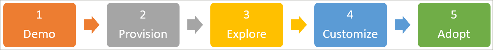

# Guida onboarding per i partner
Iniziare a utilizzare i percorsi di apprendimento seguendo i tre passaggi riportati di seguito. Con i tre passaggi, è possibile creare una demo avvincente che è possibile utilizzare per coinvolgere le presentazioni con i clienti. 

## 1. creare un ambiente di dimostrazione di Microsoft 365
È possibile utilizzare demos.microsoft.com per creare un ambiente demo in cui è possibile eseguire il provisioning del servizio, convalidarlo e utilizzarlo per presentare percorsi di apprendimento ai clienti. Tutti i partner hanno accesso https://demos.microsoft.com a tali scopi. È possibile utilizzare la **Guida introduttiva** di Demos.Microsoft.com se si è nuovi nell'ambiente demo.

## 2. provisioning di Microsoft 365 Learning pathways
È possibile eseguire il provisioning dei percorsi di apprendimento con il servizio di provisioning di SharePoint Online.
- Per eseguire il provisioning dei percorsi di apprendimento, passare alla pagina [Microsoft 365 Learning pathways](https://provisioning.sharepointpnp.com/details/3df8bd55-b872-4c9d-88e3-6b2f05344239) Solution. Esaminare le [Opzioni di configurazione dei percorsi di apprendimento](https://docs.microsoft.com/en-us/office365/customlearning/custom_setupoptions). 
- Esaminare i [prerequisiti della soluzione](https://docs.microsoft.com/en-us/office365/customlearning/custom_provision) , in quanto questi sono ostacoli comuni per il nuovo cliente a SharePoint che potrebbero non disporre di tutte le autorizzazioni corrette o la configurazione dell'ambiente necessario sul posto, ad esempio un catalogo app tenant.
- Provare a distribuire la soluzione tramite un ruolo non amministratore, per acquisire familiarità con la gestione degli errori del servizio di provisioning e il servizio di posta elettronica.

## 3. esplorare il nuovo sito di apprendimento di cui è stato effettuato il provisioning per acquisire familiarità con le proprie funzionalità
[Esplorare il sito dei percorsi di apprendimento appena provisionati](https://docs.microsoft.com/en-us/office365/customlearning/custom_exploresite) per acquisire familiarità con le proprie funzionalità. Esaminare l'interfaccia di [Amministrazione](https://docs.microsoft.com/en-us/office365/customlearning/custom_successcenter) per informazioni sul contenuto e sugli aggiornamenti delle funzionalità, nonché sulla pianificazione, la personalizzazione, l'adozione e la misurazione di linee guida sull'impatto.

## 4. personalizzare l'esperienza di apprendimento
[Personalizzare l'esperienza dei percorsi di apprendimento](https://docs.microsoft.com/en-us/office365/customlearning/custom_overview) tramite le seguenti aree funzionali:
- [Nasconde e Mostra sottocategorie](https://docs.microsoft.com/en-us/office365/customlearning/custom_hideshowsub), [playlist](https://docs.microsoft.com/en-us/office365/customlearning/custom_hideshowplaylists)e [tecnologie](https://docs.microsoft.com/en-us/office365/customlearning/custom_hideshowtech).
- [Copia di una playlist](https://docs.microsoft.com/en-us/office365/customlearning/custom_copyplaylist)
- [Creare una playlist personalizzata](https://docs.microsoft.com/en-us/office365/customlearning/custom_createnewplaylist) : a partire [dalle pagine di SharePoint](https://docs.microsoft.com/en-us/office365/customlearning/custom_createnewpage), dalla creazione di [playlist](https://docs.microsoft.com/en-us/office365/customlearning/custom_createnewplaylist), dall' [aggiunta di risorse](https://docs.microsoft.com/en-us/office365/customlearning/custom_addassets)e dalla [creazione di sottocategorie](https://docs.microsoft.com/en-us/office365/customlearning/custom_createnewcat).

## 5. creare una campagna di comunicazione per i percorsi di apprendimento di esempio
Creare una campagna di comunicazione per i percorsi di apprendimento di esempio basata sul [Kit di adozione scaricabile](https://teamworktools.azurewebsites.net/m365lp/m365lpadoptionkit.zip) ed evidenziare il contenuto personalizzato creato nel passaggio 4. È possibile utilizzare questa opzione quando si esegue la dimostrazione dell'esperienza completa del cliente. 

