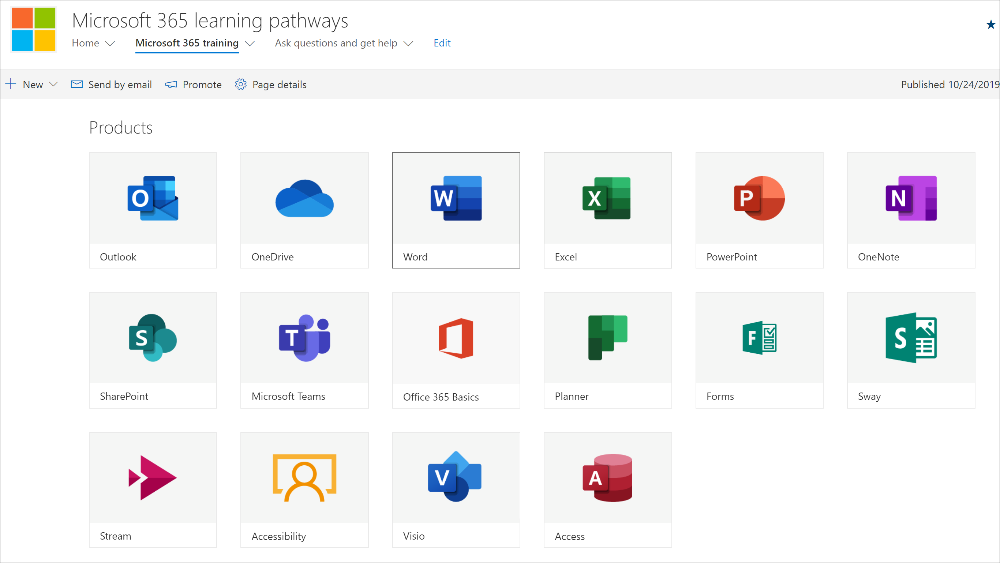
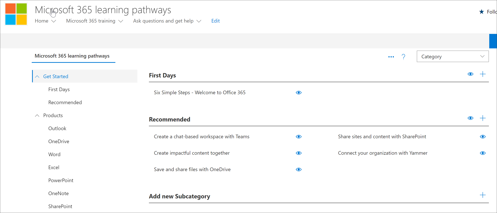

# Pianificare il contenuto dei percorsi di apprendimento
Prima di tuffarsi nell'implementazione dei percorsi di apprendimento di Microsoft 365, è consigliabile richiedere del tempo per esaminare il contenuto, gli strumenti e le funzionalità disponibili per l'utente. L'obiettivo è quello di aiutare gli utenti dell'organizzazione a velocizzare e produrre, nel modo più rapido ed efficiente possibile. Quando si tratta di pianificare percorsi di apprendimento, è consigliabile eseguire un processo in tre fasi:

1. **Esaminare le risorse disponibili** – sia le risorse fornite tramite percorsi di apprendimento che le risorse disponibili nell'organizzazione. I piani di apprendimento migliori combinano risorse e risorse Microsoft dall'organizzazione.
2. **Per conoscere le funzionalità dello strumento percorsi di apprendimento** , è possibile fare una breve panoramica. 
3. **Creare un piano di contenuto** -esaminare le guide di adozione disponibili per facilitare la creazione di un piano generale.

## Esaminare le risorse disponibili
Prima di creare un piano di contenuto per i percorsi di apprendimento di Microsoft 365, prendere un po' di tempo per scoprire tutte le risorse disponibili.  

### Esaminare il sito di SharePoint dei percorsi di apprendimento
La soluzione Microsoft 365 Learning pathways fornisce un sito di comunicazione di SharePoint con una Web part connessa a un catalogo online. Il sito di SharePoint è completamente personalizzabile, inclusi il nome del sito, il logo, le pagine, le voci di menu, i temi e i riquadri. Richiedere un certo tempo per fare clic sulle sezioni e sulle voci di menu per scoprire cosa è disponibile con il sito percorsi di apprendimento.

### Esaminare il contenuto del catalogo online con la Web part
Per impostazione predefinita, la Web part viene aggiunta a una serie di pagine del sito di comunicazione di SharePoint. Il set completo di contenuto è disponibile nella pagina Microsoft 365 training. La pagina Microsoft 365 Training ospita la Web part percorsi di apprendimento configurata per visualizzare tutti i corsi di formazione disponibili per i percorsi di apprendimento. 

**Per visualizzare la pagina di formazione di Microsoft 365**
1. Fare clic sulla voce di menu Microsoft 365 training. 
1. Scorrere verso il basso la pagina per visualizzare tutte le categorie e le sottocategorie.
2. Calciare un po' le gomme. Fare clic su alcune sottocategorie, quindi fare clic su alcune playlist per ottenere un'idea del modo in cui il contenuto dei percorsi di apprendimento è organizzato. 

### Visualizzare la pagina di amministrazione
La pagina di amministrazione fornisce un elenco dei contenuti disponibili. È qui che è possibile nascondere contenuto, creare nuove playlist e aggiungere, modificare e rimuovere playlist. Fare clic nelle varie categorie e playlist per visualizzare l'intero contenuto disponibile. 

**Per visualizzare la pagina di amministrazione.**
1. Dal sito percorsi di apprendimento scegliere la freccia a discesa del menu Home, quindi fare clic su Learning pathways Administration.  
2. Quindi fare clic su tra le varie categorie, sottocategorie e playlist per ottenere un'idea del soffio di contenuto a vostra disposizione. 

### Conoscere le funzionalità dei percorsi di apprendimento di Microsoft 365
Con i percorsi di apprendimento di Microsoft 365, è possibile disporre di contenuti forniti da Microsoft mixati con contenuti creati per assegnare criteri e procedure specifici per l'organizzazione. Come procedura consigliata, provare a sfruttare al massimo i contenuti forniti da Microsoft. Microsoft aggiorna regolarmente le singole risorse e aggiorna l'inventario completo del contenuto su base trimestrale. In genere un'organizzazione creerà 10-20% di contenuto univoco, quindi lascerà il restante 80% a Microsoft per mantenere aggiornato. Negli elenchi riportati di seguito viene descritto il modo in cui vengono organizzati i percorsi di apprendimento, oltre alle linee guida per il contenuto che è possibile modificare o creare. Le linee guida per la personalizzazione del contenuto vengono fornite nella sezione Customizing Learning pathways del centro di successo di amministratore.

- **Categorie** : sono contenitori per sottocategorie. Le categorie sono fornite da Microsoft e non possono essere create o modificate.
- **Subcategories** -sono contenitori per playlist. Microsoft fornisce sottocategorie che non è possibile modificare, ma è possibile creare sottocategorie personalizzate. 
- **Playlist** : sono contenitori per le risorse. Microsoft fornisce playlist che non è possibile modificare, ma è possibile creare playlist personalizzate.  
- **Asset** : sono le pagine di apprendimento all'interno di playlist. Microsoft fornisce risorse nelle playlist che non è possibile modificare, ma è possibile creare risorse personali e aggiungerle alle playlist. est

### Rivedere risorse aggiuntive da Microsoft
Microsoft fornisce le risorse di supporto e formazione che è possibile utilizzare quando si pianificano i contenuti per i percorsi di apprendimento.  

-  [Guida e formazione per Office](https://support.office.com)
-  [Area risorse di Office 365](https://support.office.com/office-training-center)

### Esaminare le risorse di apprendimento nell'organizzazione
Fare un bilancio dei contenuti di apprendimento già disponibili nella propria organizzazione.
Ad esempio, è possibile che l'organizzazione disponga già di guide di avvio rapido personalizzate, fogli di cheat o pagine di SharePoint dedicate a Microsoft 365 prontezza, HelpDesk, onboarding o formazione. Le risorse di SharePoint esistenti possono essere integrate nelle playlist del portale Microsoft 365 e o in combinazione con il contenuto Microsoft in una playlist per creare una playlist di destinazione per l'organizzazione. Per ulteriori informazioni su come combinare i contenuti dell'organizzazione con il contenuto di Microsoft, vedere la pagina relativa alla [personalizzazione dei percorsi di apprendimento](custom_overview.md). Sezione di personalizzazione dei percorsi di apprendimento del centro di successo dell'amministratore.

### Sfruttare le risorse di adozione
Si noti che è possibile iniziare a usare i percorsi di apprendimento in pochi giorni, ma è preferibile fare alcuni piani di pianificazione prima di eseguire una strategia di apprendimento della campagna per l'onboarding di una nuova tecnologia o un insieme di servizi. Lo sviluppo di un piano di contenuto e l'utilizzo di percorsi di apprendimento fanno davvero parte di uno sforzo più esteso nella pianificazione di una strategia di gestione delle modifiche complessiva, quindi forniamo materiali di adozione che è possibile utilizzare per pianificare la strategia complessiva. Come parte dello sforzo di pianificazione, consultare [risorse di adozione](https://resources.techcommunity.microsoft.com/adoption/).

### Creare un piano di apprendimento ed eseguire un'iterazione 
Molte aziende che hanno implementato con successo i percorsi di apprendimento hanno adottato campagne di apprendimento incentrate su scenari o tecnologie specifici. Ad esempio, "essere più collaborativi con teams" o "essere più mobili con Outlook Mobile". È possibile visualizzare esempi di potenziali campagne di apprendimento tramite il [Kit di adozione scaricabile](https://teamworktools.azurewebsites.net/m365lp/m365lpadoptionkit.zip).

 
