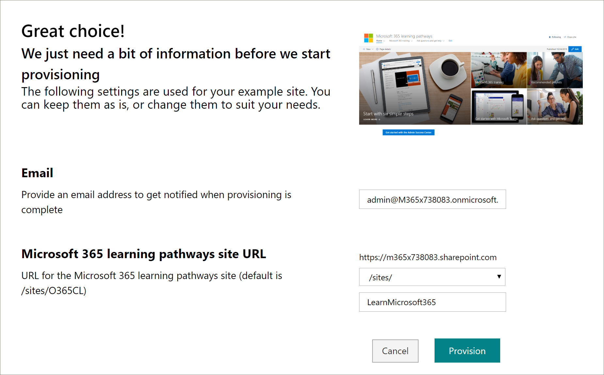

# Provisioning di percorsi di apprendimento Microsoft 365Provision Microsoft 365 learning pathways

Con il servizio di provisioning di SharePoint Online, un amministratore del tenant di Office 365 può avviare il processo di provisioning con alcuni semplici clic.With the SharePoint Online Provisioning Service, an Office 365 Tenant Administrator can start the provisioning process with a few simple clicks. Il servizio di provisioning è il modo consigliato per eseguire il provisioning dei percorsi di apprendimento.The Provisioning Service is the recommended way to provision learning pathways. È veloce, semplice e richiede solo alcuni minuti per iniziare il processo.It's fast, easy, and takes only a few minutes to start the process. Prima di iniziare a usare il servizio di provisioning, accertarsi di aver soddisfatto i prerequisiti per il provisioning.Before getting started with the Provisioning Service, however, make sure you've met the prerequisites for provisioning.

> [!IMPORTANT]
> A 5/21/2019, Microsoft 365 Learning pathways è il nuovo nome della soluzione precedentemente noto come Custom learning per Office 365.As of 5/21/2019, Microsoft 365 learning pathways is the new name for the solution formerly known as Custom Learning for Office 365. Se è già stato effettuato il provisioning di apprendimento personalizzato per Office 365 o una versione precedente di percorsi di apprendimento di Microsoft 365 nell'organizzazione e si desidera aggiornare la soluzione, seguire le istruzioni per l'aggiornamento della soluzione nei [percorsi di apprendimento di microsoft 365 File Leggimi](https://github.com/pnp/custom-learning-office-365).If you have already provisioned Custom Learning for Office 365 or a earlier version of Microsoft 365 learning pathways in your organization, and want to update the solution, follow the “Updating the solution” instructions in the [Microsoft 365 learning pathways ReadMe](https://github.com/pnp/custom-learning-office-365). Se si desidera eseguire il provisioning dei percorsi di apprendimento di Microsoft 365 per la prima volta, vedere [provision microsoft 365 Learning pathways instructions]( https://docs.microsoft.com/en-us/office365/customlearning/custom_provision) nella documentazione relativa ai percorsi di apprendimento di Microsoft 365.If you are provisioning Microsoft 365 learning pathways for the first time, see [Provision Microsoft 365 learning pathways instructions]( https://docs.microsoft.com/en-us/office365/customlearning/custom_provision) in the Microsoft 365 learning pathways documentation.  

## PrerequisitiPrerequisites
 
Per configurare correttamente i percorsi di apprendimento di Microsoft 365 con il servizio di provisioning, la persona che effettua il provisioning deve soddisfare i requisiti seguenti:To successfully set up Microsoft 365 learning pathways with the Provisioning Service, the person doing the provisioning must meet the following pre-requisites: 
 
- I percorsi di apprendimento per il provisioning delle persone devono essere un amministratore tenant del tenant in cui verrà eseguito il provisioning dei percorsi di apprendimento.The person provisioning learning pathways must be a Tenant Administrator of the tenant where learning pathways will be provisioned.  
- Un catalogo app tenant deve essere disponibile all'interno dell'opzione Apps dell'interfaccia di amministrazione di SharePoint.A tenant App Catalog must be available within the Apps option of the SharePoint Admin Center. Se nell'organizzazione non è presente un catalogo delle app di SharePoint tenant, fare riferimento alla [documentazione di SharePoint Online](https://docs.microsoft.com/en-us/sharepoint/use-app-catalog) per crearne uno.If your organization does not have an SharePoint tenant App catalog, refer to the [SharePoint Online documentation](https://docs.microsoft.com/en-us/sharepoint/use-app-catalog) to create one.  
- I percorsi di apprendimento per il provisioning delle persone devono essere proprietari di una raccolta siti del catalogo app tenant.The person provisioning learning pathways must be a Site Collection Owner of the Tenant App Catalog. Se il provisioning dei percorsi di apprendimento della persona non è un proprietario della raccolta siti del catalogo app, [completare queste istruzioni](addappadmin.md) e continuare.If the person provisioning learning pathways is not a Site Collection Owner of the App Catalog [complete these instructions](addappadmin.md) and continue. 

### Per eseguire il provisioning di percorsi di apprendimentoTo provision learning pathways

1. Passare alla [pagina Microsoft 365 Learning pathways Solution](https://provisioning.sharepointpnp.com/details/3df8bd55-b872-4c9d-88e3-6b2f05344239).Go to the [Microsoft 365 learning pathways solution page](https://provisioning.sharepointpnp.com/details/3df8bd55-b872-4c9d-88e3-6b2f05344239).
2. Fare clic su **Aggiungi al tenant**.Click **Add to your tenant**. Se l'utente non ha eseguito l'accesso al tenant, il servizio di provisioning richiederà le credenziali di amministratore tenant.If you are not signed into to your tenant, the Provisioning Service will ask for your Tenant Admin credentials. 
3. Nella finestra di dialogo autorizzazioni richieste selezionare **consenso per conto dell'organizzazione** e quindi selezionare **accetta**.From the Permissions requested dialog box, select **Consent on behalf of your organization** and then select **Accept**.

Il servizio di provisioning richiede queste autorizzazioni per creare il catalogo app tenant, installare l'applicazione nel catalogo app tenant e provisionare il modello di sito.The provisioning service requires these permissions to create the tenant app catalog, install the application into the tenant app catalog and provision the site template. Non vi è alcun impatto generale sul tenant e queste autorizzazioni vengono utilizzate in modo esplicito per l'installazione della soluzione.There is no overall impact on your tenant and these permissions are explicitly used for the purpose of the solution installation. È necessario accettare queste autorizzazioni per procedere con l'installazione.You must accept these permissions to proceed with the installation.

4. Completare i campi nella pagina informazioni di provisioning in base alle proprie esigenze per l'installazione.Complete the fields on the provisioning information page as appropriate for your installation. Immettere almeno l'indirizzo di posta elettronica in cui si desidera ottenere le notifiche relative al processo di provisioning e all'URL di destinazione del sito di cui eseguire il provisioning.At a minimum enter the email address where you wish to get notifications about the provisioning process and the destination URL for your site to be provisioned to.  
> [!NOTE]
> Rendere l'URL di destinazione per il sito una cosa semplice per i dipendenti, ad esempio "/sites/MyTraining" o "/teams/LearnMicrosoft365".Make the destination URL for your site something friendly to your employees such as "/sites/MyTraining" or "/teams/LearnMicrosoft365".

6. Fare clic su **provisioning** quando si è pronti per installare percorsi di apprendimento nell'ambiente tenant.Click **Provision** when ready to install learning pathways into your tenant environment.  Il processo di provisioning richiederà fino a 15 minuti.The provisioning process will take up to 15 minutes. L'utente riceverà una notifica tramite posta elettronica (all'indirizzo di posta elettronica di notifica immesso nella pagina di provisioning) quando il sito è pronto per l'accesso.You will be notified via email (to the notification email address you entered on the Provisioning page) when the site is ready for access. 

> [!IMPORTANT]
> L'amministratore tenant che accantona il sito percorsi di apprendimento deve passare al sito e quindi aprire **CustomLearningAdmin. aspx** per inizializzare le proprietà di amministratore di percorsi di apprendimento.The Tenant Admin who provisions the learning pathways site must go to the site, and then open **CustomLearningAdmin.aspx** to initialize learning pathways Admin properties. A questo punto, l'amministratore del tenant deve anche assegnare i proprietari al sito.At this time, the Tenant Admin should also assign Owners to the site. 

## Convalidare il provisioning di esito positivo e inizializzare l'elenco CustomConfigValidate Provisioning Success and Initialize the CustomConfig List

Al termine del provisioning, l'amministratore del tenant che ha eseguito il provisioning del sito riceve un messaggio di posta elettronica dal servizio di provisioning PnP.When provisioning is complete, the Tenant Admin who provisioned the site, receives an email from the PnP Provisioning Service. Il messaggio di posta elettronica contiene un collegamento al sito.The email contains a link to the site. A questo punto, l'amministratore del tenant deve passare al sito utilizzando il collegamento fornito nel messaggio di posta elettronica e configurare il sito per il primo utilizzo:At this point, the Tenant Admin should go to the site using the link provided in the email and set up the site for first use:

- Passare a `<YOUR-SITE-COLLECTION-URL>sites/<YOUR-SITE-NAME>/SitePages/CustomLearningAdmin.aspx`.Go to `<YOUR-SITE-COLLECTION-URL>sites/<YOUR-SITE-NAME>/SitePages/CustomLearningAdmin.aspx`. L'apertura di **CustomLearningAdmin. aspx** consente di inizializzare l'elemento di elenco **CustomConfig** che consente di configurare i percorsi di apprendimento per il primo utilizzo.Opening **CustomLearningAdmin.aspx** initializes the **CustomConfig** list item that sets up learning pathways for first use. Dovrebbe essere visualizzata una pagina simile alla seguente:You should see a page that looks like this:

## Aggiungere proprietari al sitoAdd Owners to Site
Come amministratore del tenant, è improbabile che tu sia la persona che Personalizza il sito, quindi dovrai assegnare alcuni proprietari al sito.As the Tenant Admin, it's unlikely you'll be the person customizing the site, so you'll need to assign a few owners to the site. I proprietari dispongono di privilegi amministrativi per il sito in modo che possano modificare le pagine del sito e rimarcare il sito.Owners have administrative privileges on the site so they can modify site pages and rebrand the site. Sono inoltre in grado di nascondere e visualizzare i contenuti forniti tramite la Web part percorsi di apprendimento.They also have the ability to hide and show content delivered through the learning pathways Web part. Inoltre, avranno la possibilità di creare playlist personalizzate e assegnarle a sottocategorie personalizzate.In addition, they'll have the ability to build custom playlist and assign them to custom subcategories.  

1. Scegliere **autorizzazioni sito**dal menu **Impostazioni** di SharePoint.From the SharePoint **Settings** menu, click **Site Permissions**.
2. Fare clic su **Impostazioni avanzate di autorizzazione**.Click **Advanced Permission Settings**.
3. Fare clic su **Microsoft 365 Learning pathways owners**.Click **Microsoft 365 learning pathways Owners**.
4. Fare clic su **nuovo** > **Aggiungi utenti a questo gruppo**e quindi aggiungere le persone che si desidera siano proprietari.Click **New** > **Add Users to this group**, and then add the people you want to be Owners. 
5. Aggiungere un collegamento per [esplorare il sito](custom_exploresite.md) nel messaggio di condivisione e quindi fare clic su **Condividi**.Add a link to [Explore the Site](custom_exploresite.md) in the Share message, and then click **Share**.

### Operazioni successiveNext Steps
- Esaminare il [contenuto predefinito](custom_exploresite.md) fornito nel sito e nella web part.Explore the [default content](custom_exploresite.md) provided in the site and web part.
