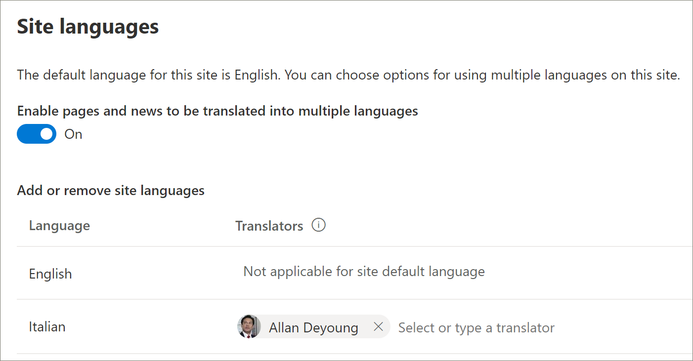

# Provisioning di una nuova soluzione di percorsi di apprendimentoProvision a new learning pathways solution 
Le organizzazioni che non dispongono di percorsi di apprendimento provisioning nel tenant possono utilizzare il servizio di ricerca di SharePoint per aggiungere la soluzione per i percorsi di apprendimento multilingue.Organizations that that don’t have learning pathways provisioned in their tenant can use the SharePoint look book service to add the multilingual learning pathways solution. Con questa opzione, il modello di percorsi di apprendimento di SharePoint viene convertito in nove lingue e può essere utilizzato con una modifica minima.With this option, the learning pathways SharePoint template is translated into nine languages and can be used with a minimum of modification.

> [!IMPORTANT]
> Se è già stato effettuato il provisioning dei percorsi di apprendimento nel tenant, è consigliabile [aggiornare](custom_update.md) i percorsi di apprendimento.If you already have learning pathways provisioned in your tenant, it's recommended that you [update](custom_update.md) learning pathways. Se si installa una nuova istanza di percorsi di apprendimento, sarà necessario trasferire manualmente eventuali personalizzazioni dal sito esistente al nuovo sito.If you install a new instance of learning pathways, you will need to manually transfer any customizations from the existing site to the new site. 

## Prerequisiti per il supporto multilinguePrerequisites for multilingual support
 
Per configurare correttamente i percorsi di apprendimento di Microsoft 365 con il servizio di ricerca, la persona che effettua il provisioning deve soddisfare i requisiti seguenti:To successfully set up Microsoft 365 learning pathways with the look book service, the person doing the provisioning must meet the following pre-requisites: 
 
- I percorsi di apprendimento per il provisioning delle persone devono essere un amministratore tenant del tenant in cui verrà eseguito il provisioning dei percorsi di apprendimento.The person provisioning learning pathways must be a Tenant Administrator of the tenant where learning pathways will be provisioned.  
- Un catalogo app tenant deve essere disponibile all'interno dell'opzione Apps dell'interfaccia di amministrazione di SharePoint.A tenant App Catalog must be available within the Apps option of the SharePoint Admin Center. Se nell'organizzazione non è presente un catalogo delle app di SharePoint tenant, fare riferimento alla [documentazione di SharePoint Online](https://docs.microsoft.com/sharepoint/use-app-catalog) per crearne uno.If your organization doesn't have an SharePoint tenant App Catalog, refer to the [SharePoint Online documentation](https://docs.microsoft.com/sharepoint/use-app-catalog) to create one. Prima di eseguire il provisioning dei percorsi di apprendimento, è necessario attendere almeno due ore dopo aver creato il catalogo app.You must wait at least two hours after creating the App Catalog before provisioning learning pathways.  
- I percorsi di apprendimento per il provisioning delle persone devono essere proprietari di una raccolta siti del catalogo app tenant.The person provisioning learning pathways must be a Site Collection Owner of the Tenant App Catalog. Se il provisioning dei percorsi di apprendimento della persona non è un proprietario della raccolta siti del catalogo app, [completare queste istruzioni](addappadmin.md) e continuare.If the person provisioning learning pathways is not a Site Collection Owner of the App Catalog, [complete these instructions](addappadmin.md) and continue. 

## Assicurarsi che l'account amministratore tenant non disponga di una lingua selezionataEnsure the Tenant Admin account doesn't have a language selected
Prima di eseguire il provisioning dei percorsi di apprendimento, assicurarsi che l'account di amministratore per il tenant non disponga di una lingua selezionata.Before you provision learning pathways, ensure that the Admin Account for the tenant doesn't have a language selected. Ecco come verificare se l'account amministratore non dispone di una lingua selezionata.Here’s how to verify if the Admin account doesn't have a language selected. 
1.  Con il profilo di amministratore del server perimetrale, passare a office.com.With your Edge Admin profile, go to office.com.
2.  Immettere le credenziali utente (se necessario).Enter the user credentials (if necessary).
3.  In Microsoft 365, fare clic su **tutte le app** > approfondire.In Microsoft 365, click **All Apps** > Delve. 
4.  Fare clic su **me**  >  **Update profile**.Click **Me** > **Update Profile**.
5.  Scorrere verso il basso la pagina e fare clic su **come è possibile modificare le impostazioni internazionali e della lingua**.Scroll down the page and click **How can I change language and regional settings**.
6.  Fare clic **qui**e quindi fare clic sui puntini di ellisse **.**Click **here**, and then click the ellipses **...**.
7.  In **My Display languages**, non è necessario visualizzare le **lingue selezionate**.Under **My Display Languages**, you should see **No languages selected**. Se è selezionata una lingua, deselezionarla.If a language is selected, unselect it.

### Per eseguire il provisioning di percorsi di apprendimentoTo provision learning pathways

1. Passare alla [pagina Microsoft 365 Learning pathways Solution](https://lookbook.microsoft.com/details/3df8bd55-b872-4c9d-88e3-6b2f05344239).Go to the [Microsoft 365 learning pathways solution page](https://lookbook.microsoft.com/details/3df8bd55-b872-4c9d-88e3-6b2f05344239).
2. Fare clic su **Aggiungi al tenant**.Click **Add to your tenant**. Se non è stato eseguito l'accesso al tenant, il servizio di provisioning richiederà le credenziali di amministratore tenant.If you aren't signed into to your tenant, the Provisioning Service will ask for your Tenant Admin credentials. 
3. Nella finestra di dialogo autorizzazioni richieste selezionare **consenso per conto dell'organizzazione** e quindi selezionare **accetta**.From the Permissions requested dialog box, select **Consent on behalf of your organization** and then select **Accept**.

Il servizio di ricerca richiede queste autorizzazioni per creare il catalogo app tenant, installare l'applicazione nel catalogo app tenant e provisionare il modello di sito.The look book service requires these permissions to create the tenant App Catalog, install the application into the tenant App Catalog and provision the site template. Non è previsto alcun impatto generale sul tenant.There's no overall impact on your tenant. Queste autorizzazioni vengono utilizzate in modo esplicito per l'installazione della soluzione.These permissions are explicitly used for the purpose of the solution installation. È necessario accettare queste autorizzazioni per continuare con l'installazione.You must accept these permissions to continue with the installation.

4. Completare i campi nella pagina informazioni di provisioning in base alle proprie esigenze per l'installazione.Complete the fields on the provisioning information page as appropriate for your installation. Immettere almeno l'indirizzo di posta elettronica in cui si desidera ottenere le notifiche relative al processo di provisioning e l'URL di destinazione per il sito di cui eseguire il provisioning.At a minimum, enter the email address where you wish to get notifications about the provisioning process and the destination URL for your site to be provisioned to.  
> [!NOTE]
> Rendere l'URL di destinazione per il sito una cosa semplice per i dipendenti, ad esempio "/sites/MyTraining" o "/teams/LearnMicrosoft365".Make the destination URL for your site something friendly to your employees such as "/sites/MyTraining" or "/teams/LearnMicrosoft365".

6. Fare clic su **provisioning** quando si è pronti per installare percorsi di apprendimento nell'ambiente tenant.Click **Provision** when ready to install learning pathways into your tenant environment.  Il processo di provisioning può richiedere fino a 15 minuti.The provisioning process can take up to 15 minutes. L'utente riceverà una notifica tramite posta elettronica quando il sito sarà pronto.You will be notified via email when the site is ready. 

> [!IMPORTANT]
> L'amministratore tenant che accantona il sito percorsi di apprendimento deve passare al sito e quindi aprire **CustomLearningAdmin. aspx** per inizializzare le proprietà di amministratore di percorsi di apprendimento.The Tenant Admin who provisions the learning pathways site must go to the site, and then open **CustomLearningAdmin.aspx** to initialize learning pathways Admin properties. A questo punto, l'amministratore del tenant deve anche assegnare i proprietari al sito.At this time, the Tenant Admin should also assign Owners to the site. 

## Convalidare il provisioning di esito positivo e inizializzare l'elenco CustomConfigValidate Provisioning Success and Initialize the CustomConfig List

Al termine del provisioning, l'amministratore del tenant che ha eseguito il provisioning del sito riceve un messaggio di posta elettronica dal servizio di ricerca.When provisioning is complete, the Tenant Admin who provisioned the site receives an email from the look book service. Il messaggio di posta elettronica contiene un collegamento al sito.The email contains a link to the site. A questo punto, l'amministratore del tenant deve passare al sito utilizzando il collegamento fornito nel messaggio di posta elettronica e configurare il sito per il primo utilizzo:At this point, the Tenant Admin should go to the site using the link provided in the email and set up the site for first use:

- Passare a `<YOUR-SITE-COLLECTION-URL>sites/<YOUR-SITE-NAME>/SitePages/CustomLearningAdmin.aspx`.Go to `<YOUR-SITE-COLLECTION-URL>sites/<YOUR-SITE-NAME>/SitePages/CustomLearningAdmin.aspx`. L'apertura di **CustomLearningAdmin. aspx** consente di inizializzare l'elemento di elenco **CustomConfig** che consente di configurare i percorsi di apprendimento per il primo utilizzo.Opening **CustomLearningAdmin.aspx** initializes the **CustomConfig** list item that sets up learning pathways for first use. Dovrebbe essere visualizzata una pagina simile alla seguente:You should see a page that looks like this:

## Aggiungere proprietari al sitoAdd Owners to Site
Come amministratore del tenant, è improbabile che tu sia la persona che Personalizza il sito, quindi dovrai assegnare alcuni proprietari al sito.As the Tenant Admin, it's unlikely you'll be the person customizing the site, so you'll need to assign a few owners to the site. I proprietari dispongono di privilegi amministrativi per il sito in modo che possano modificare le pagine del sito e rimarcare il sito.Owners have administrative privileges on the site so they can modify site pages and rebrand the site. Sono inoltre in grado di nascondere e visualizzare contenuto e creare playlist e sottocategorie personalizzate.They also have the ability to hide and show content and build custom playlist and subcategories.  

1. Scegliere **autorizzazioni sito**dal menu **Impostazioni** di SharePoint.From the SharePoint **Settings** menu, click **Site Permissions**.
2. Fare clic su **Impostazioni avanzate di autorizzazione**.Click **Advanced Permission Settings**.
3. Fare clic su **Microsoft 365 Learning pathways owners**.Click **Microsoft 365 learning pathways Owners**.
4. Fare clic su **nuovo**  >  **Aggiungi utenti a questo gruppo**e quindi aggiungere le persone che si desidera siano proprietari.Click **New** > **Add Users to this group**, and then add the people you want to be Owners. 
5. Aggiungere un collegamento per [esplorare il sito](custom_exploresite.md) nel messaggio di condivisione e quindi fare clic su **Condividi**.Add a link to [Explore the Site](custom_exploresite.md) in the Share message, and then click **Share**.

## Aggiungere i traduttori al sitoAdd translators to the site
Se si utilizzeranno i traduttori per il sito, è possibile assegnargli le autorizzazioni.If you will be using translators for the site, you can assign them permissions. I traduttori richiedono autorizzazioni per i membri o superiori.Translators require Member permissions or higher. 

## Scegliere le opzioni per l'utilizzo di più lingue nel sitoChoose options for using multiple languages on the site
Il servizio di ricerca di SharePoint consente di creare il sito percorsi di apprendimento in nove lingue.The SharePoint look book service creates the Learning Pathways site in nine languages. Vengono applicati i seguenti suggerimenti:The following recommendations apply:
- Disattivare le lingue che non si desidera supportareTurn off the languages you don’t want to support
- Se non si supporta un sito in più lingue, disattivare la funzionalità multilingue.If you are not supporting a multilingual site, turn off the multi-lingual feature. Vedere la sezione relativa alla disattivazione del supporto multilingue più avanti in questo argomento.See the "Turn off multilingual support" section later in this topic.

### Rimuovere le lingue che non si desidera supportareRemove languages you don’t want to support
Per le organizzazioni che scelgono di supportare una sola lingua, oltre alla lingua inglese predefinita, è consigliabile rimuovere le lingue che non sono supportate.For organizations that choose to support only one language, in addition to the default English language, we recommend removing languages that aren’t supported. 
1. Dal sito percorsi di apprendimento selezionare **Impostazioni** dall'alto a destra della pagina e quindi selezionare **informazioni sito**.From the Learning Pathways site, select **Settings** from the top-right of the page, and then select **Site information**.
2. Nella parte inferiore del riquadro delle informazioni del sito selezionare **Visualizza tutte le impostazioni del sito**.At the bottom of the site information pane, select **View all site settings**.
3. In **Amministrazione sito**selezionare **Impostazioni lingua**.Under **Site Administration**, select **Language settings**.
4. In **attiva pagine e notizie da tradurre in più lingue**, scorrere l'interruttore **su**attivato.Under **Enable pages and news to be translated into multiple languages**, slide the toggle to **On**. Dovrebbe essere attiva per impostazione predefinita.It should be On by default.
5. In Aggiungi o Rimuovi lingue sito fare clic su **Rimuovi** per rimuovere le lingue che non sono necessarie per il sito.Under Add or remove site languages, click **Remove** to remove the languages you don't need for the site. Di seguito è riportato un esempio della pagina Impostazioni lingua per mostrare l'italiano supportato per il sito, oltre alla lingua inglese predefinita.The following shows an example of the Language Settings page to show Italian supported for the site, in addition to the default English language.

> [!NOTE]
> Quando si rimuovono le lingue, non è possibile rimuovere la lingua inglese predefinita.When removing languages you cannot remove the default English language. 

### Assegnare i traduttoriAssign translators
Se si intende tradurre le pagine, facoltativamente assegnare uno o più traduttori per ogni lingua (eccetto la lingua predefinita del sito).If you're going to translate pages, optionally assign one or more translators for each language (except the site default language). 
- Nella colonna **Translator** , iniziare a digitare il nome di una persona che si desidera essere un traduttore, quindi selezionare il nome nell'elenco.In the **Translator** column, start typing the name of a person you want to be a translator, and then select the name from the list. 

> [!NOTE]
> Tutti gli utenti di Active Directory dell'organizzazione possono essere assegnati come traduttori.Anyone in your organization's Active Directory can be assigned as a translator. Alle persone assegnate come traduttori non verranno automaticamente concesse le autorizzazioni appropriate.People assigned as translators will not automatically be given appropriate permissions. Quando un utente che non dispone di autorizzazioni di modifica per un sito tenta di accedere al sito, verrà indirizzato a una pagina Web in cui è possibile richiedere l'accesso.When someone without edit permissions to a site tries to access the site, they will be directed to a web page where they can request access.

## Disattiva supporto multilingueTurn off multilingual support
Se non si desidera un sito multilingue, ad esempio si desidera un sito solo in lingua inglese, è consigliabile disattivare la funzionalità multilingue.If you don’t want a multilingual site, for example, you want an English-only site, it’s recommended that you turn off the multilingual feature. 

1. Dal sito percorsi di apprendimento selezionare **Impostazioni** dall'alto a destra della pagina e quindi selezionare **informazioni sito**.From the Learning Pathways site, select **Settings** from the top-right of the page, and then select **Site information**.
2. Nella parte inferiore del riquadro delle informazioni del sito selezionare **Visualizza tutte le impostazioni del sito**.At the bottom of the site information pane, select **View all site settings**.
3. In **Amministrazione sito**selezionare **Impostazioni lingua**.Under **Site Administration**, select **Language settings**.
4. In **attiva pagine e notizie da tradurre in più lingue**, scorrere l'interruttore **su**attivato.Under **Enable pages and news to be translated into multiple languages**, slide the toggle to **On**. Dovrebbe essere attiva per impostazione predefinita.It should be On by default.
- In **attiva pagine e notizie da tradurre**, selezionare **disattivata**.Under **Enable pages and news to be translated**, select **Off**. 

### Aggiungere le lingueAdd languages
I percorsi di apprendimento supportano 9 lingue, ma è consigliabile aggiungere solo le lingue necessarie per il supporto per il sito percorsi di apprendimento.Learning pathways supports 9 languages, but it’s recommended that you add only the languages you need to support for the learning pathways site. È possibile aggiungere lingue in qualsiasi momento.You can add langauges at any time. 
- In **Aggiungi o Rimuovi lingue sito**, iniziare a digitare un nome di lingua in **Seleziona o digitare una**lingua oppure scegliere una lingua dall'elenco a discesa.Under **Add or remove site languages**, start typing a language name in **Select or type a language**, or choose a language from the dropdown. È possibile ripetere questo passaggio per aggiungere più lingue.You can repeat this step to add multiple languages. È possibile aggiungere o rimuovere le lingue dal sito in qualsiasi momento tornando alla pagina.You can add or remove languages from your site at any time by going back to this page.
