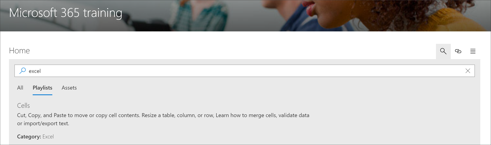

# Ricerca di contenuto dei percorsi di apprendimento di Microsoft 365

I percorsi di apprendimento Microsoft 365 offrono la possibilità di cercare contenuto per sottocategorie, playlist o asset. 

> [!TIP]
> Microsoft 365 Learning pathways Search ha come ambito il contenuto dei percorsi di apprendimento, incluso il contenuto fornito da Microsoft e qualsiasi contenuto aggiunto a playlist o sottocategorie personalizzate. Le pagine di SharePoint che non rientrano nei percorsi di apprendimento non sono incluse nei risultati della ricerca.     

- Fare clic sull'icona di **ricerca** e digitare una frase di ricerca. 

