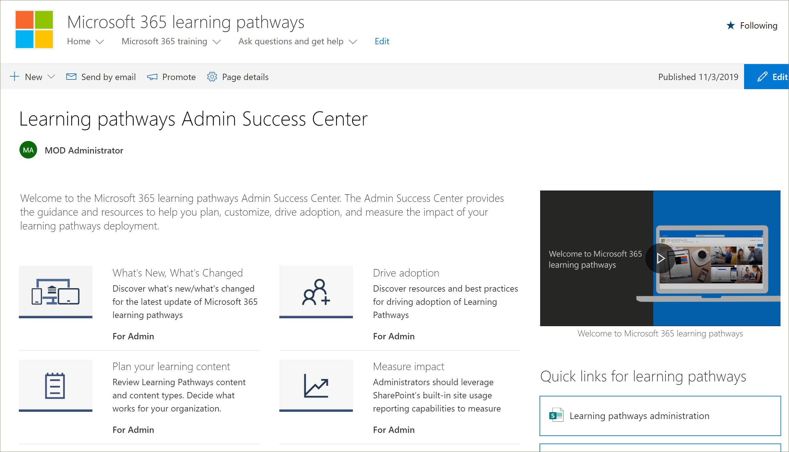

# Learning percorsi admin success center

Benvenuti nella pagina Microsoft 365 percorsi di apprendimento admin success center. L'interfaccia di amministrazione offre le linee guida e le risorse per pianificare, personalizzare, guidare l'adozione e misurare l'impatto della distribuzione dei percorsi di apprendimento.

## . 

1.  Aprire il web browser e passare a office.com o alla posizione di accesso dell'organizzazione. 
2.  Eseguire l'accesso con il nome utente e la password.
3.  Passare al percorso del sito utilizzando l'URL fornito dall'amministratore tenant o selezionare SharePoint nella pagina Office 365 Home e quindi selezionare il sito. 

### Introduzione all'interfaccia di amministrazione

L'interfaccia di amministrazione offre le linee guida e le risorse per pianificare, personalizzare, guidare l'adozione e misurare l'impatto della distribuzione dei percorsi di apprendimento. 

- Nella home page Microsoft 365 percorsi **di** apprendimento fai clic su Introduzione **all'interfaccia di amministrazione.**

Learning percorsi di amministrazione fornisce indicazioni all'interno dell'Interfaccia di amministrazione riuscita nella soluzione. La documentazione per Admin Success Center è disponibile anche in questo set di documentazione: 

- [Pianificare i contenuti di apprendimento](custom_plancontent.md)
- [Personalizzare i percorsi di apprendimento](custom_overview.md)
- [Adozione delle unità](driveadoption.md)
- [Misurare l'impatto](custom_measureimpact.md)

