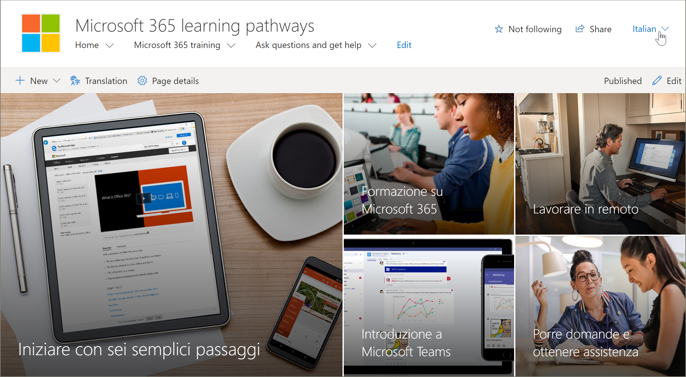
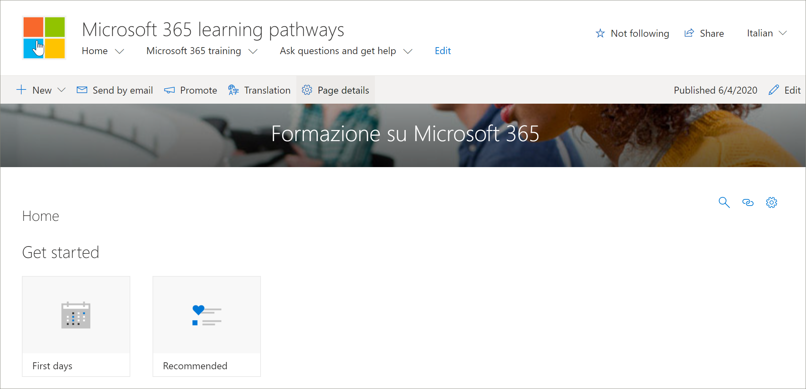

# Tradurre pagine del sito
Prima di iniziare a tradurre il sito dei percorsi di apprendimento, è importante comprendere alcuni concetti chiave di come funziona la funzionalità multilingue con i percorsi di apprendimento. 
- Informazioni sul sito: la struttura di spostamento, logo e nome del sito richiede che il sito venga visualizzato nel profilo della lingua dell'utente.  
- La Web part percorsi di apprendimento deve essere visualizzata con il profilo della lingua dell'utente in modo che venga visualizzata in una lingua non inglese. La Web part e il contenuto fornito da Microsoft sono già stati tradotti per l'utente.
- Il metodo utilizzato per eseguire il provisioning dei percorsi di apprendimento determina se sono già state tradotte pagine disponibili o se è necessario tradurre manualmente le pagine. 

## Utilizzo di un nuovo sito di cui è stato effettuato il provisioning
Se si esegue il provisioning di un nuovo sito di percorsi di apprendimento dal servizio di provisioning di SharePoint, le pagine tradotte sono già disponibili. Per impostazione predefinita, il sito contiene le pagine seguenti:

- Home. aspx
- Start-with-Six-Simple-Steps. aspx
- Get-started-with-Microsoft-365. aspx
- Get-started-with-Microsoft-Teams. aspx
- Get-started-with-SharePoint. aspx
- Get-started-with-OneDriive. aspx
- Ask-questions-and-Get-Help. aspx
- Training Events Calendar. aspx
- Become-a-Champion. aspx
- Recommended-Playlists. aspx
- Percorsi di apprendimento centro di successo dell'amministratore

## Visualizzazione delle pagine tradotte dal sito di cui è stato effettuato il provisioning
Per acquisire familiarità con il sito dei percorsi di apprendimento tradotti, è necessario esaminare alcune pagine tradotte.

### Visualizzare la Home page tradotta
Nella Home page dei percorsi di apprendimento selezionare una lingua dall'elenco a discesa della lingua, come illustrato nell'esempio seguente. Nell'esempio viene visualizzato l'italiano selezionato nell'angolo in alto a destra.

### Visualizzare la pagina di formazione di Microsoft 365 tradotta
Per illustrare alcuni concetti importanti, vedere la pagina Microsoft 365 training. 

1. Nella **Home** page del sito percorsi di apprendimento fare clic su **Microsoft 365 Training**.
2. Nell'angolo in alto a destra della pagina selezionare una lingua. In questo esempio viene selezionato italiano.

Quali traduzioni sono visibili quando viene selezionata la lingua?
- La pagina di SharePoint viene convertita come mostrato nell'immagine precedente. Si noti che il testo del banner della pagina è ora in italiano.

Le traduzioni non sono visibili?
- Il nome del sito è in inglese
- La struttura di spostamento del sito è in lingua inglese
- La Web part percorsi di apprendimento è in lingua inglese

## Visualizzazione del sito completamente tradotto 
Per visualizzare un sito completamente convertito in una lingua specifica, incluse le pagine del sito, la struttura di spostamento e la Web part, è necessario impostare la lingua personale dell'utente e le impostazioni internazionali per tale lingua. Per ulteriori informazioni sull'impostazione della lingua e delle impostazioni internazionali, vedere [Change Your Personal Language and Regional Settings](https://support.microsoft.com/en-us/office/change-your-personal-language-and-region-settings-caa1fccc-bcdb-42f3-9e5b-45957647ffd7). Si noti che è preferibile utilizzare un account separato o avere un altro utente con le impostazioni della lingua diverse per visualizzare le pagine tradotte. 

## Utilizzo di un sito di percorsi di apprendimento aggiornato o installato manualmente
Se è stato aggiornato un sito di percorsi di apprendimento esistente o è stata installata manualmente la Web part in un sito esistente, sarà necessario tradurre manualmente le pagine del sito. La Web part percorsi di apprendimento e il contenuto sono già tradotti e verranno visualizzati nella lingua preferita dell'utente. Per tradurre le pagine, vedere le istruzioni riportate di seguito "creare pagine per le lingue desiderate". 

## Creare pagine per le lingue desiderate
Dopo aver abilitato il sito per le funzionalità multilingue e aver scelto le lingue che si desidera rendere disponibili, è possibile creare le pagine di traduzione desiderate. 

1. Passare alla pagina lingua predefinita che si desidera rendere disponibile in un'altra lingua.
2. Nella barra superiore selezionare traduzione.
3. Selezionare Crea per le lingue desiderate.

> [!IMPORTANT]
> Dopo aver creato le pagine di traduzione, è necessario pubblicare (o ripubblicare) la pagina lingua predefinita per garantire che:
>- Le pagine di traduzione vengono visualizzate nel sito della lingua corrispondente
>- Le pagine di traduzione vengono visualizzate correttamente nella web part notizie e nelle web part di contenuto evidenziate
>- L'elenco a discesa della lingua nella parte superiore del sito include tutte le lingue abilitate
>- I traduttori ricevono una notifica della richiesta di conversione.

Dopo la creazione delle pagine, lo stato della pagina (bozza salvata, pubblicazione e così via) viene visualizzato nel riquadro di conversione accanto a ogni lingua. Inoltre, i traduttori assegnati saranno informati nella posta elettronica che viene richiesta una traduzione.

### Visualizzazione del sito completamente tradotto in una lingua specifica
Per visualizzare un sito completamente convertito in una lingua specifica, incluse le pagine del sito, la struttura di spostamento e la Web part, è necessario impostare la lingua personale dell'utente e le impostazioni internazionali per tale lingua. Per ulteriori informazioni sull'impostazione della lingua e delle impostazioni internazionali, vedere [Change Your Personal Language and Regional Settings](https://support.microsoft.com/en-us/office/change-your-personal-language-and-region-settings-caa1fccc-bcdb-42f3-9e5b-45957647ffd7). Si noti che è preferibile utilizzare un account separato o avere un altro utente con le impostazioni della lingua diverse per visualizzare le pagine tradotte.

## Qual è il compito di un traduttore?
 Dopo che il sito è stato configurato in inglese, un utente con spagnolo, ad esempio, come lingua personale preferita, modifica e converte manualmente il contenuto del titolo, della struttura di spostamento e del piè di pagina in spagnolo. Un utente con il tedesco come lingua personale preferita fa lo stesso per il tedesco. Una volta che il contenuto viene convertito, verrà visualizzato per tutti gli utenti delle lingue preferite. La Web part preleva la lingua preferita dell'utente e visualizza il contenuto convertito in tale lingua. 

I traduttori traducono manualmente le copie della pagina della lingua predefinita nelle lingue specificate. Quando vengono create le copie delle pagine, i traduttori ricevono una notifica tramite posta elettronica. Il messaggio di posta elettronica include un collegamento alla pagina lingua predefinita e alla pagina di traduzione appena creata. Il traduttore eseguirà le operazioni seguenti:
1. Selezionare il pulsante **inizia la conversione** nel messaggio di posta elettronica.
2. Selezionare **modifica** nell'angolo in alto a destra della pagina e tradurre il contenuto.
3. Al termine, selezionare **Salva come bozza** (se non si è pronti per renderla visibile ai lettori) oppure, se la pagina è pronta per essere visibile a tutti gli utenti che utilizzano tale lingua nel sito, selezionare **pubblica** o **Invia notizie**.

Per ulteriori informazioni sul processo di traduzione, vedere [creare siti di comunicazione multilingue, pagine e notizie](https://support.office.com/en-us/article/2bb7d610-5453-41c6-a0e8-6f40b3ed750c). 

## Aggiornamento della pagina lingua predefinita
Quando la pagina di lingua predefinita viene aggiornata, la pagina deve essere ripubblicata. Successivamente, i Translator per le pagine di traduzione ricevono una notifica tramite posta elettronica che è stato eseguito un aggiornamento in modo che sia possibile effettuare gli aggiornamenti alle singole pagine di traduzione.

## Configurare un nome di sito multilingue, una struttura di spostamento e un piè di pagina
Per visualizzare il nome del sito, la struttura di spostamento e il piè di pagina del sito nelle diverse lingue che sono state rese disponibili, è necessario tradurle manualmente.

Si supponga, ad esempio, di aver creato un sito di comunicazione con una lingua inglese predefinita e di aver abilitato il sito per le lingue spagnole e tedesche. Quando si crea un sito, è necessario configurare il nome e la descrizione del sito nella lingua predefinita (in questo caso, in inglese). È inoltre possibile aggiornare il nome e la descrizione del sito dopo la creazione del sito. Successivamente, è possibile creare i nodi di spostamento e il contenuto del piè di pagina in inglese.

Dopo che il sito è stato configurato in inglese, un utente con spagnolo come lingua personale preferita modifica e converte manualmente il contenuto del titolo, della descrizione, della navigazione e del piè di pagina in spagnolo. Un utente con il tedesco come lingua personale preferita fa lo stesso per il tedesco. Una volta che il contenuto viene convertito, verrà visualizzato per tutti gli utenti delle lingue preferite. 

> [! Note
>- Gli utenti che traducono il contenuto del sito per le lingue preferite devono essere membri del gruppo Owners per il sito oppure disporre di autorizzazioni di sito equivalenti.
>- Se viene apportata una modifica al nome del sito, alla struttura di spostamento o al piè di pagina nella lingua predefinita, l'elemento convertito corrispondente in un'altra lingua non verrà aggiornato automaticamente, a meno che non si scelga di sovrascrivere le traduzioni dei siti esistenti. In tal caso, l'elemento convertito viene sostituito dall'aggiornamento nella lingua predefinita e dovrà essere riconvertito manualmente. Per sovrascrivere le traduzioni, passare alla pagina lingue del sito per la lingua predefinita e selezionare Mostra impostazioni avanzate. Fare quindi scorrere l'interruttore per sovrascrivere le traduzioni su attivato. Questa opzione non è applicabile al contenuto della pagina o delle notizie.

### Per visualizzare il sito completamente convertito in una lingua specifica
Per visualizzare un sito completamente convertito in una lingua specifica, incluse le pagine del sito, la struttura di spostamento e la Web part, è necessario impostare la lingua personale dell'utente e le impostazioni internazionali per tale lingua. Per ulteriori informazioni sull'impostazione della lingua e delle impostazioni internazionali, vedere [Change Your Personal Language and Regional Settings](https://support.microsoft.com/en-us/office/change-your-personal-language-and-region-settings-caa1fccc-bcdb-42f3-9e5b-45957647ffd7). Si noti che è preferibile utilizzare un account separato o avere un altro utente con le impostazioni della lingua diverse per visualizzare le pagine tradotte.

## Ulteriori informazioni
- Per ulteriori informazioni sulla traduzione delle pagine del sito di comunicazione di SharePoint, vedere [creare siti di comunicazione multilingue, pagine e notizie](https://support.office.com/en-us/article/2bb7d610-5453-41c6-a0e8-6f40b3ed750c).
- Per ulteriori informazioni sulla personalizzazione dei percorsi di apprendimento, vedere [Customize Learning pathways](custom_overview.md).  
