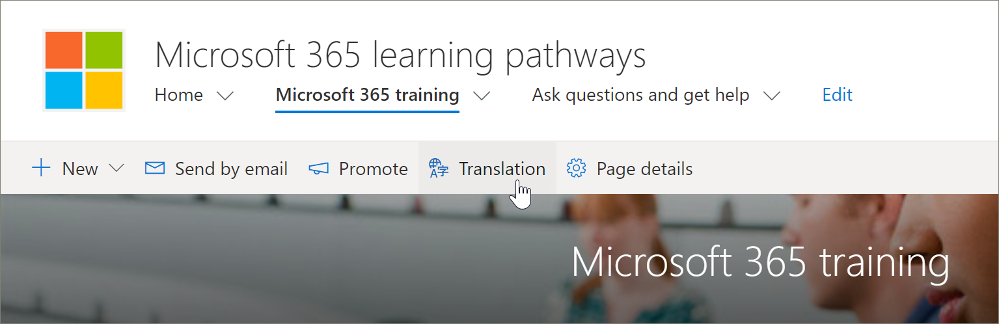
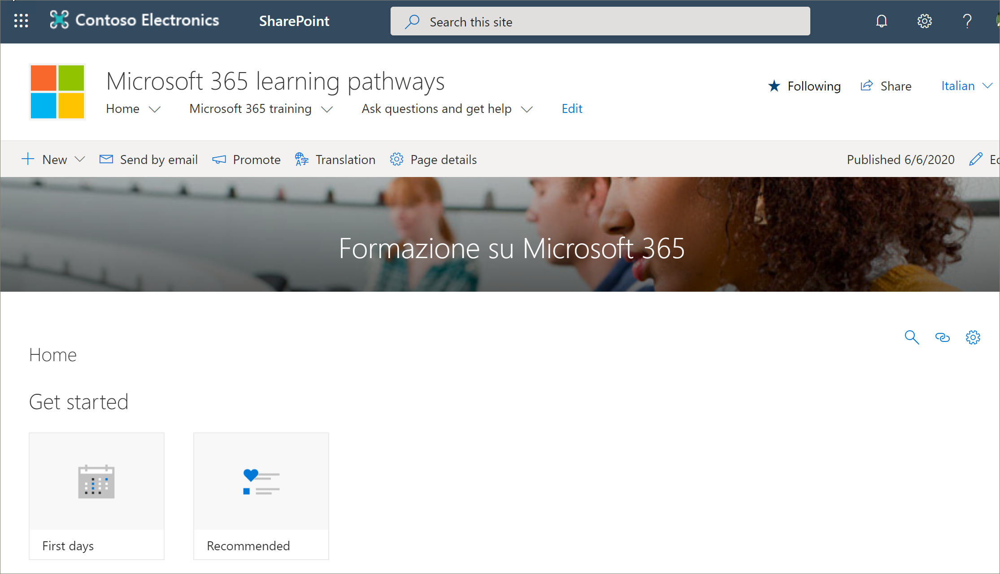

# Tradurre pagine del sito
Se è stata aggiornata una versione esistente dei percorsi di apprendimento alla versione 4,0 oppure è stato eseguito il provisioning di un nuovo sito, il processo di traduzione delle pagine del sito è lo stesso. Tuttavia, esistono alcuni aspetti da tenere presenti. 
- Quando si esegue il provisioning di una nuova versione multilingue di percorsi di apprendimento 4,0, le pagine del sito vengono convertite in 9 lingue. 
- Quando la soluzione Learning pathways viene aggiornata alla versione multilingue di 4,0, le pagine del sito di SharePoint rimangono invariate. Le traduzioni devono essere eseguite manualmente. 

Per impostazione predefinita, il sito percorsi di apprendimento fornisce le pagine seguenti:

- Home. aspx
- Start-with-Six-Simple-Steps. aspx
- Get-started-with-Microsoft-365. aspx
- Get-started-with-Microsoft-Teams. aspx
- Get-started-with-SharePoint. aspx
- Get-started-with-OneDriive. aspx
- Ask-questions-and-Get-Help. aspx
- Training Events Calendar. aspx
- Become-a-Champion. aspx
- Recommended-Playlists. aspx
- Percorsi di apprendimento centro di successo dell'amministratore

## Creare pagine per le lingue desiderate
Dopo aver abilitato il sito per le funzionalità multilingue e aver scelto le lingue che si desidera rendere disponibili, è possibile creare le pagine di traduzione desiderate. Per illustrare alcuni concetti importanti, è possibile utilizzare la pagina Microsoft 365 training come esempio. Per eseguire l'operazione:

1.  Nella **Home** page dei percorsi di apprendimento fare clic su **Microsoft 365 Training**.  
2.  Nella barra superiore selezionare **traduzione**.

3. Se si desidera creare una pagina per la traduzione in tutte le lingue disponibili per il sito, selezionare **Crea per tutte le lingue**. In caso contrario, selezionare **Crea** solo per le lingue desiderate. In questo esempio, viene selezionato italiano.
4.  Fare clic su **Visualizza**. La pagina è ora pronta per la traduzione. 

### Un concetto importante da conoscere
Si noti che nell'esempio seguente la pagina è stata convertita in italiano. Tuttavia, il titolo del sito, la struttura di spostamento e la Web part sono ancora visualizzati in inglese. 

 Dopo che il sito è stato configurato in inglese, un utente con spagnolo, ad esempio, come lingua personale preferita, modifica e converte manualmente il contenuto del titolo, della struttura di spostamento e del piè di pagina in spagnolo. Un utente con il tedesco come lingua personale preferita fa lo stesso per il tedesco. Una volta che il contenuto viene convertito, verrà visualizzato per tutti gli utenti delle lingue preferite. La Web part preleva la lingua preferita dell'utente e visualizza il contenuto convertito in tale lingua. 

> [!IMPORTANT]
> Importante: dopo aver creato le pagine di traduzione, è necessario pubblicare (o ripubblicare) la pagina in lingua inglese predefinita per garantire che:
- Le pagine di traduzione vengono visualizzate nel sito della lingua corrispondente
- Le pagine di traduzione vengono visualizzate correttamente nella web part notizie e nelle web part di contenuto evidenziate
- L'elenco a discesa della lingua nella parte superiore del sito include tutte le lingue abilitate
- I traduttori ricevono una notifica della richiesta di conversione.

## Qual è il compito di un traduttore?
I traduttori traducono manualmente le copie della pagina della lingua predefinita nelle lingue specificate. Quando vengono create le copie delle pagine, i traduttori ricevono una notifica tramite posta elettronica. Il messaggio di posta elettronica include un collegamento alla pagina lingua predefinita e alla pagina di traduzione appena creata. Il traduttore eseguirà le operazioni seguenti:
1. Selezionare il pulsante **inizia la conversione** nel messaggio di posta elettronica.
2. Selezionare **modifica** nell'angolo in alto a destra della pagina e tradurre il contenuto.
3. Al termine, selezionare **Salva come bozza** (se non si è pronti per renderla visibile ai lettori) oppure, se la pagina è pronta per essere visibile a tutti gli utenti che utilizzano tale lingua nel sito, selezionare **pubblica** o **Invia notizie**.

Per ulteriori informazioni sul processo di traduzione, vedere [creare siti di comunicazione multilingue, pagine e notizie](https://support.office.com/en-us/article/2bb7d610-5453-41c6-a0e8-6f40b3ed750c). 

## Aggiornamento della pagina lingua predefinita
Quando la pagina di lingua predefinita viene aggiornata, la pagina deve essere ripubblicata. Successivamente, i Translator per le pagine di traduzione ricevono una notifica tramite posta elettronica che è stato eseguito un aggiornamento in modo che sia possibile effettuare gli aggiornamenti alle singole pagine di traduzione.

## Operazioni successive
- [Tradurre playlist personalizzate](custom_translate_pl_ml.md)
- [Nascondere e visualizzare il contenuto di multiligual](custom_translate_pl_ml.md)
