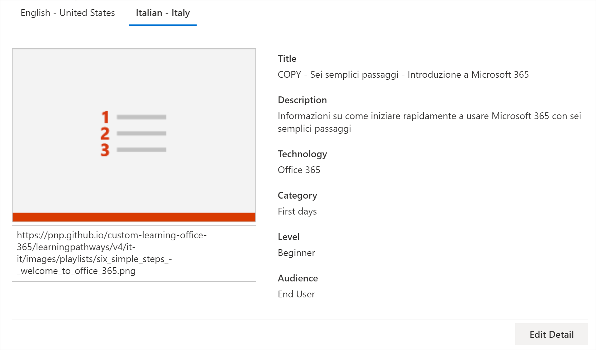
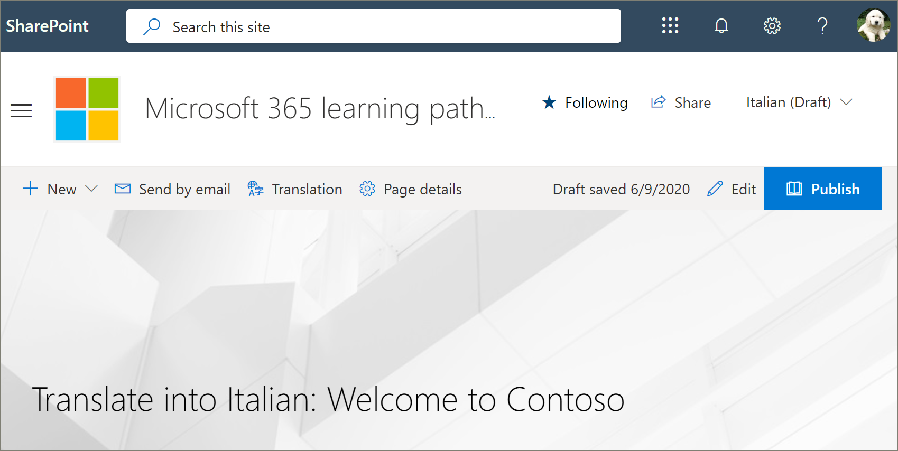
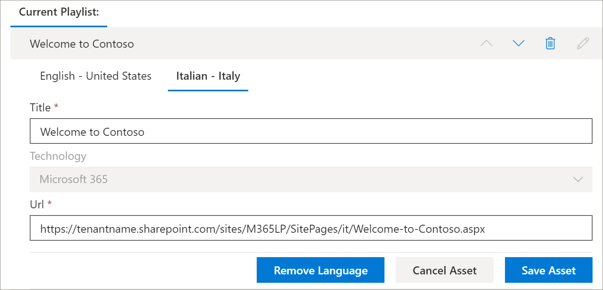

# Tradurre una playlist personalizzata per percorsi di apprendimentoTranslate a learning pathways custom playlist
Se sono stati creati percorsi di apprendimento per playlist personalizzate per il sito, è possibile tradurre le playlist nelle lingue abilitate per il sito.If you've created learning pathways custom playlists for your site, you can translate the playlists into the languages enabled for this site.

1.  Dal menu **Home** percorsi di apprendimento fare clic su **Amministrazione percorsi di apprendimento**.From the learning pathways **Home** menu, click **Learning pathways administration**. 
2.  Fare clic sulla playlist personalizzata.Click the custom playlist. In questo esempio, verranno utilizzati **cinque semplici passaggi: Welcome to Contoso**.In this example, we'll use **Five Simple Steps - Welcome to Contoso**. 
3.  Fare clic su **Modifica dettagli**, quindi nella casella **Aggiungi lingua** Selezionare una lingua.Click **Edit Detail**, then in the **Add language** box, select a language. In questo esempio si utilizzerà **Italiano – Italia**.In this example, we'll use **Italian – Italy**. 
5.  Fare clic su **Salva dettagli**.Click **Save Detail**. 

> [!IMPORTANT]
> Le notifiche di Translator non sono integrate in elenchi di riproduzione personalizzati.Translator notifications are not built into custom playlists. I traduttori dovranno essere informati manualmente.Translators will need to be notified manually. 

## Qual è il compito di un traduttore?What does a translator do?
I traduttori traducono manualmente le copie della pagina della lingua predefinita nelle lingue specificate.Translators manually translate the copies of the default language page into the language(s) specified. Sarà necessario informare il traduttore delle traduzioni necessarie per i dettagli della playlist.You will need to notify the translator of the translations required for playlist details. Si consiglia di terminare tutte le modifiche alla playlist, tra cui l'aggiunta, la modifica o l'eliminazione delle risorse della playlist, quindi notifica al traduttore le traduzioni necessarie.It's recommended that you finish all playlist changes,including adding, editing, or deleting playlist assets, then notify the translator of the required translations.

## Tradurre le risorse nell'elenco di riproduzione personalizzatoTranslate the assets in the custom playlist
Tutte le risorse di una playlist fornite da Microsoft non sono modificabili e non richiedono la traduzione.Any assets in a playlist that are supplied by Microsoft are not editable and do not require translation. Se sono state aggiunte risorse personalizzate dal sito di SharePoint del tenant, tali risorse richiederanno la traduzione.If you’ve added custom assets from your tenant's SharePoint site, those assets will require translation. Esaminiamo la modalità di conversione di una risorsa personalizzata in una playlist.Let's take a look at how to translate a custom asset in a playlist.

### Aggiungere una lingua per un cespite esistenteAdd a language for an existing asset
1. In **Asset**selezionare l'icona **modifica** accanto al cespite personalizzato.Under **Assets**, select the **Edit** icon next to the custom asset. 
2. Selezionare una lingua dalla casella **Aggiungi lingua** e quindi fare clic su **Salva risorsa**.Select a language from the **Add language** box, and then select **Save Asset**.

### Aggiungere una pagina di lingua per un cespite esistenteAdd a language page for an existing asset
1. Nell'elenco Asset fare clic sulla risorsa inglese, quindi fare clic su **Apri**.In the asset list, click the English asset, and then click **Open**.
2. Nella barra superiore selezionare **traduzione**.On the top bar, select **Translation**.
3. Nell'elenco a discesa lingua selezionare la lingua del cespite, quindi selezionare **Crea**e quindi **Visualizza**.From the language dropdown, select the language for the asset, select **Create**, and then **View**. La pagina dovrebbe avere un aspetto simile al seguente.Your page should now look something like this. 

4. Fare clic su **pubblica**e quindi copiare l'URL della pagina.Click **Publish**, and then copy the URL for the page. Dovrebbe avere un aspetto simile al seguente, con il codice della lingua nell'URL.It should look something like this, with the language code in the URL.
https://tenantname.sharepoint.com/sites/M365LP/SitePages/it/Welcome-to-Contoso.aspx.https://tenantname.sharepoint.com/sites/M365LP/SitePages/it/Welcome-to-Contoso.aspx.
5. Tornare alla pagina Amministrazione di SharePoint, aggiungere l'URL per la lingua del cespite e quindi fare clic su **Salva**.Return to the SharePoint Administration page, add the URL for the language for the asset, and then click **Save**. 

6.  Scorrere verso l'alto la pagina e fare clic su **Chiudi playlist**.Scroll up the page and click **Close Playlist**.

## Cosa fa il traduttore?What the translator does?
Il traduttore eseguirà le operazioni seguenti:The translator will:
- Tradurre i dettagli della playlist.Translate playlist details.
- Tradurre i dettagli delle attività.Translate asset details.
- Traduci aggiunte pagine di lingua per la risorsa.Translate added language pages for asset.
- Notificare al richiedente le traduzioni che le traduzioni sono pronte per la revisioneNotify the requestor of the translations that the translations are ready for review

### Tradurre i dettagli della playlistTranslate playlist details
Dal menu **Home** percorsi di apprendimento fare clic su **Amministrazione percorsi di apprendimento**.From the Learning Pathways **Home** menu, click **Learning pathways administration**. 
1. Fare clic sulla sequenza di brani personalizzata che richiede la traduzione, quindi fare clic su lingue.Click the custom playlist that requires translation, then click the languages. 
2. Fare clic su **Modifica dettagli**, creare le traduzioni per la playlist e quindi fare clic suClick **Edit Detail**, make the translations for the playlist, then click 
3. Fare clic su **Salva dettagli**.Click **Save Detail**. 
4. Notificare al richiedente la traduzione che la traduzione è stata completata.Notify the translation requestor that the translation is complete. 

### Tradurre i dettagli delle risorseTranslate asset details
Dal menu **Home** percorsi di apprendimento fare clic su **Amministrazione percorsi di apprendimento**.From the Learning Pathways **Home** menu, click **Learning pathways administration**. 
1. Fare clic sulla sequenza di brani personalizzata che richiede la traduzione.Click the custom playlist that requires translation. 
2. Scorrere verso il basso la pagina e quindi in Asset selezionare modifica per l'asset che si desidera modificare, quindi selezionare la lingua.Scroll down the page, then under Assets, select edit for the asset you want to edit, then select the language. 
3. Creare le traduzioni per il cespite e quindi fare clic su **Salva risorsa**.Make the translations for the asset, and then click **Save Asset**.  

## Tradurre la pagina di lingua aggiunta per il cespiteTranslate the added language page for the asset
Dal menu **Home** percorsi di apprendimento fare clic su **Amministrazione percorsi di apprendimento**.From the Learning Pathways **Home** menu, click **Learning pathways administration**. 
1. Fare clic sulla sequenza di brani personalizzata che richiede la traduzione.Click the custom playlist that requires translation. 
2. Scorrere verso il basso la pagina e quindi in Asset selezionare la risorsa, selezionare la lingua e quindi fare clic su Apri.Scroll down the page, then under Assets, select the asset, select the language, and then click Open. 
3. Creare le traduzioni per la pagina e quindi fare clic su **pubblica**.Make the translations for the page, and then click **Publish**.  

## Creare una nuova playlist di MultilangualCreate a new multilangual playlist
Per istruzioni su come creare una nuova playlist per un sito, vedere [creare un elenco di riproduzione personalizzato](custom_createnewplaylist.md).For instructions on how to create a new playlist for a site, see [Create a Custom Playlist](custom_createnewplaylist.md). Dopo aver creato la playlist e le risorse, fare riferimento a questa documentazione per istruzioni su come tradurre la playlist e le risorse.After you've created the playlist and assets, refer back to this documentation for instruction on how to translate the playlist and assets. 