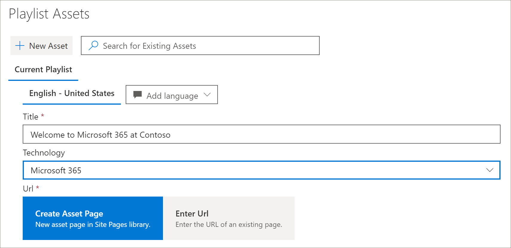
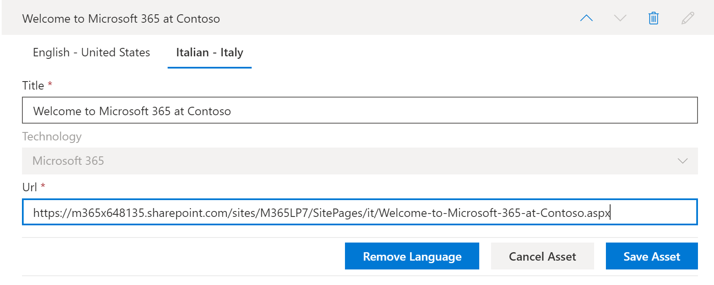
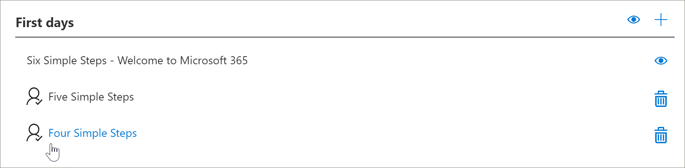
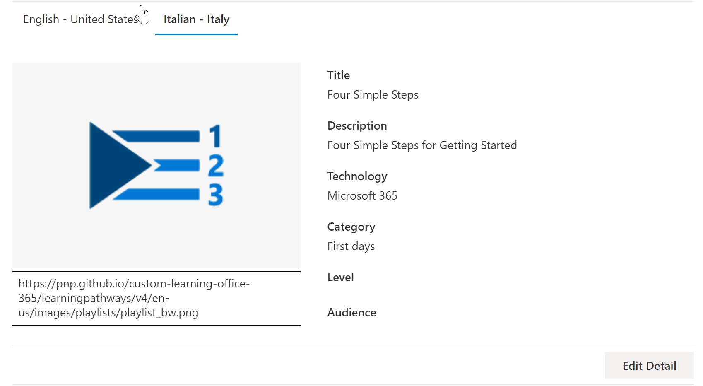

# Tradurre percorsi di apprendimento playlist personalizzate
Con i percorsi di apprendimento, il modo in cui si lavora con elenchi di riproduzione personalizzati dipende da come è stato eseguito il provisioning del sito percorsi di apprendimento. 

- Se si prevede di eseguire il provisioning di un nuovo sito multilingue di percorsi di apprendimento, è possibile copiare o creare una nuova playlist e tradurre la playlist nelle lingue supportate dal sito.
- Se è stato eseguito l'aggiornamento di un sito di percorsi di apprendimento esistente con playlist personalizzate preesistenti, è possibile tradurre le playlist esistenti nelle lingue supportate dal sito. È anche possibile copiare e creare nuove playlist. 

> [!IMPORTANT]
> - Gli elenchi di riproduzione forniti da Microsoft sono già tradotti e non possono essere modificati a meno che non venga creata una copia della playlist. 

## Creare o copiare una playlist e convertirla
Se è stato eseguito il provisioning di un nuovo sito di apprendimento in più lingue oppure è stato eseguito l'aggiornamento del sito con la Web part multilingue, è possibile copiare o creare una playlist personalizzata e tradurre le risorse della playlist e della playlist in quelle supportate dal sito. 

### Copiare una playlist e convertirla
Per illustrare come creare un nuovo elenco di riproduzione personalizzato e tradurlo, verrà utilizzata la caratteristica copia playlist dei percorsi di apprendimento.

1.  Dal menu **Home** percorsi di apprendimento fare clic su **Amministrazione percorsi di apprendimento**. 
2.  In **microsoft 365 Learning pathways**selezionare **First Days**, quindi fare clic **su sei semplici passaggi: Welcome to Microsoft 365**. 
3. Fare clic su **copia playlist**, scorrere verso il basso la pagina e fare clic su **Modifica dettagli**.   
4. Modificare il titolo della playlist. In questo esempio, viene modificato il titolo della playlist in **cinque semplici passaggi**. Si noti che le lingue disponibili dipendono dalle lingue supportate selezionate per il sito. Per aggiungere altre lingue, è necessario aggiungere altre lingue supportate al sito.   
5. Fare clic su **Salva dettagli**. 
6. Fare clic su una lingua a destra della lingua predefinita (in questo caso inglese) per visualizzare i dettagli della playlist copiata. I dettagli per la nuova lingua riflettono la playlist copiata originale e richiedono la traduzione.
7. Fare una nota per informare il traduttore dei dettagli della playlist da tradurre.  

> [!IMPORTANT]
> Le notifiche di Translator non sono integrate in elenchi di riproduzione personalizzati. I traduttori dovranno essere informati manualmente. I traduttori traducono manualmente le copie dei dettagli della lingua predefinita nelle lingue specificate. Sarà necessario informare il traduttore delle traduzioni necessarie per i dettagli della playlist. Si consiglia di terminare tutte le modifiche alla playlist, tra cui l'aggiunta, la modifica o l'eliminazione delle risorse della playlist, quindi notifica al traduttore le traduzioni richieste per i dettagli e le risorse della playlist.

## Creare risorse multilingue in una playlist personalizzata
Tutte le risorse di una playlist fornite da Microsoft non sono modificabili e non richiedono la traduzione. Le risorse fornite da Microsoft saranno disponibili nelle lingue supportate dal sito. Per le risorse personalizzate create o le risorse personalizzate esistenti, è possibile aggiungere le lingue supportate dal sito.  È possibile esaminare come aggiungere le lingue per le risorse personalizzate nuove ed esistenti in una playlist. 

### Creare una nuova risorsa multilingue per una playlist
Queste istruzioni presuppongono che si stia usando la scaletta di cinque semplici passaggi nell'esempio riportato in questo argomento. 

**Per creare il cespite**
1. Per la scaletta di cinque semplici passaggi, in **Asset**, selezionare **+ nuova risorsa** e quindi compilare i dettagli per il bene. 
- Per **titolo**, immettere "Welcome to Microsoft 365 at contoso". 
- Per la **tecnologia**, selezionare **Microsoft 365**.

2. Selezionare **create asset**e quindi **Save asset**.

**Per aprire il cespite**
1. Selezionare il cespite appena creato e quindi fare clic su **Apri**.  
2. Apportare le modifiche apportate alla pagina in base alle esigenze. Per il momento, è possibile modificare il titolo della pagina e aggiungere del testo alla pagina come illustrato nell'esempio seguente, quindi fare clic su **pubblica**. 
3. Fare clic su **traduzione**.
4. Selezionare **Crea** per le lingue desiderate. In questo esempio, viene selezionato italiano.
5. Seleziona **Visualizza**. A questo punto, è necessario visualizzare una pagina simile all'esempio seguente, a seconda delle lingue supportate.

6. Fare clic su **Pubblica**.
7. Per la pagina di traduzione creata, copiare l'URL dal browser e tornare alla pagina Amministrazione percorsi di apprendimento.

**Per aggiungere una lingua per l'asset di traduzione creato** 
1. Tornare alla pagina Amministrazione percorsi di apprendimento e selezionare l'icona di modifica (matita) per la risorsa "cinque semplici passaggi" che è stata aperta. 
2. Fare clic su **Aggiungi lingua**e quindi selezionare una lingua. In questo esempio, è stato selezionato italiano. 
3. Immettere l'URL della pagina tradotta creata. Dovrebbe essere visualizzata una pagina simile all'esempio seguente. 

4. Fare clic su **Salva risorsa**.

## Aggiungere lingue per playlist e risorse personalizzate esistenti
Se sono stati aggiornati percorsi di apprendimento per il supporto multilingue e sono presenti playlist e risorse personalizzate esistenti, è possibile aggiungere le lingue supportate per playlist e risorse. In queste istruzioni si presuppone che sia presente una playlist personalizzata a cui è possibile aggiungere le lingue. Se non si dispone di una playlist personalizzata, vedere la sezione "creare o copiare una playlist" più indietro in questo argomento. 

> [!IMPORTANT]
> - Gli elenchi di riproduzione forniti da Microsoft sono già tradotti e non possono essere modificati a meno che non venga creata una copia della playlist. È possibile aggiungere solo lingue per playlist personalizzate. 
> - Per aggiungere le lingue per playlist e risorse personalizzate, è necessario abilitare il supporto e le lingue multilingue. Per ulteriori informazioni sull'abilitazione delle opzioni e del supporto multilingue, vedere [impostare le impostazioni della lingua](https://docs.microsoft.com/office365/customlearning/custom_update_ml#set-language-settings). 

### Per aggiungere lingue per una playlist esistente
1.  Dal menu **Home** percorsi di apprendimento fare clic su **Amministrazione percorsi di apprendimento**. 
2.  Selezionare una playlist personalizzata. Un elenco di riproduzione personalizzato viene identificato dall'icona persone con il segno di spunta, come illustrato nell'esempio seguente.
 
3. Selezionare **Modifica dettagli**. Potrebbe essere necessario scorrere verso il basso per trovare il pulsante **Modifica dettagli** .   
4. Selezionare **Aggiungi lingua** e quindi selezionare una lingua. 
5. Selezionare **Salva dettaglio**.
 Si noti che le lingue disponibili dipendono dalle lingue supportate selezionate per il sito. Per aggiungere altre lingue, è necessario aggiungere altre lingue supportate al sito.   
5. Fare clic su una lingua a destra della lingua predefinita (in questo caso inglese) per visualizzare i dettagli della playlist copiata. I dettagli per la nuova lingua riflettono la playlist copiata originale e richiedono la traduzione.
 
7. Fare una nota per informare il traduttore dei dettagli della playlist da tradurre.  

**Per aprire il cespite**
1. Selezionare il cespite appena creato e quindi fare clic su **Apri**.  
2. Apportare le modifiche apportate alla pagina in base alle esigenze. Per il momento, è possibile modificare il titolo della pagina e aggiungere del testo alla pagina come illustrato nell'esempio seguente, quindi fare clic su **pubblica**. 
3. Fare clic su **traduzione**.
4. Selezionare **Crea** per le lingue desiderate. In questo esempio, viene selezionato italiano.
5. Seleziona **Visualizza**. A questo punto, è necessario visualizzare una pagina simile all'esempio seguente, a seconda delle lingue supportate.

6. Fare clic su **Pubblica**.
7. Per la pagina di traduzione creata, copiare l'URL dal browser e tornare alla pagina Amministrazione percorsi di apprendimento.

## Notifica al traduttore
Al termine della creazione delle risorse di traduzione, inviare una notifica al traduttore delle traduzioni necessarie. Il traduttore eseguirà le operazioni seguenti:
- Tradurre i dettagli della playlist.
- Tradurre i dettagli delle attività.
- Traduci aggiunte pagine di lingua per una risorsa.
- Notificare al richiedente le traduzioni che le traduzioni sono pronte per la revisione

## Aggiungere le lingue per un elenco di riproduzione personalizzato esistente
Se sono stati aggiornati percorsi di apprendimento per il supporto multilingue e sono presenti playlist e risorse personalizzate esistenti, è possibile aggiungere le lingue supportate per playlist e risorse. 

> [!IMPORTANT]
> - Gli elenchi di riproduzione forniti da Microsoft sono già tradotti e non possono essere modificati a meno che non venga creata una copia della playlist. È possibile aggiungere solo lingue per playlist personalizzate. 
> - Per aggiungere le lingue per playlist e risorse personalizzate, è necessario abilitare il supporto e le lingue multilingue. Per ulteriori informazioni sull'abilitazione delle opzioni e del supporto multilingue, vedere [impostare le impostazioni della lingua](https://docs.microsoft.com/office365/customlearning/custom_update_ml#set-language-settings). 

## Istruzioni per il traduttore

### Tradurre i dettagli della playlist
Dal menu **Home** percorsi di apprendimento fare clic su **Amministrazione percorsi di apprendimento**. 
1. Fare clic sulla sequenza di brani personalizzata che richiede la traduzione, quindi fare clic su lingue. 
2. Fare clic su **Modifica dettagli**, creare le traduzioni per la playlist e quindi fare clic su 
3. Fare clic su **Salva dettagli**. 
4. Notificare al richiedente la traduzione che la traduzione è stata completata. 

### Tradurre i dettagli delle risorse
Dal menu **Home** percorsi di apprendimento fare clic su **Amministrazione percorsi di apprendimento**. 
1. Fare clic sulla sequenza di brani personalizzata che richiede la traduzione. 
2. Scorrere verso il basso la pagina e quindi in Asset selezionare modifica per l'asset che si desidera modificare, quindi selezionare la lingua. 
3. Creare le traduzioni per il cespite e quindi fare clic su **Salva risorsa**.  

### Tradurre la pagina di lingua aggiunta per il cespite
Dal menu **Home** percorsi di apprendimento fare clic su **Amministrazione percorsi di apprendimento**. 
1. Fare clic sulla sequenza di brani personalizzata che richiede la traduzione. 
2. Scorrere verso il basso la pagina e quindi in Asset selezionare la risorsa, selezionare la lingua e quindi fare clic su Apri. 
3. Creare le traduzioni per la pagina e quindi fare clic su **pubblica**.   

