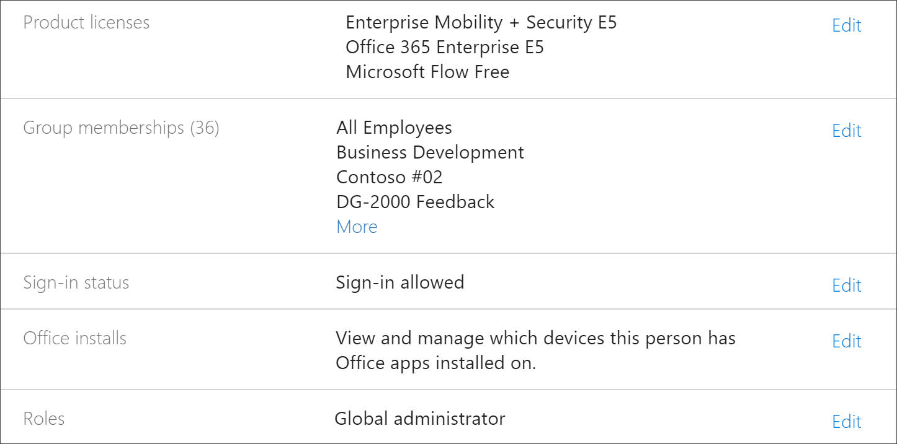
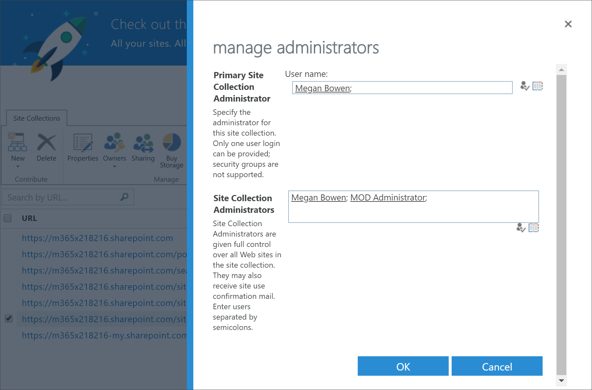
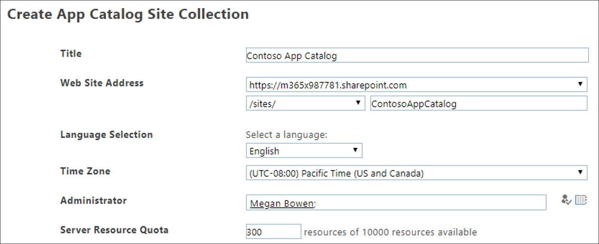

# Risolvere i problemi relativi ai percorsi di apprendimento di Microsoft 365

Ecco suggerimenti per la risoluzione dei problemi che possono verificarsi con i percorsi di apprendimento di Microsoft 365 o il servizio di provisioning di SharePoint Online.

## Come sapere se si dispone delle autorizzazioni di amministratore tenant

L'accesso al servizio di provisioning di SharePoint Online e il provisioning dell'apprendimento personalizzato richiedono autorizzazioni di amministratore tenant. Se si verificano problemi di accesso con il servizio di provisioning di SharePoint Online, assicurarsi che sia stato assegnato il ruolo amministratore globale. La soluzione di apprendimento personalizzato richiede autorizzazioni di amministratore tenant, altrimenti noto come ruolo amministratore globale di Office 365. Ecco come determinare se è stato assegnato il ruolo amministratore globale.

1.  Accedi a Office.com.
2.  Fare clic **su Amministratore**
3.  In **Utenti** selezionare **Utenti attivi**
4.  Cercare il proprio nome
5.  Fare clic sul proprio nome nei risultati della ricerca. Dovrebbe essere visualizzato Amministratore globale per il proprio ruolo.

### Se non si dispone del ruolo amministratore globale
- Trovare un amministratore globale nell'organizzazione e fare in modo che la persona a cui accede il servizio o che gli assegni il ruolo di amministratore globale.

## Risoluzione dei problemi del Catalogo app tenant
L'apprendimento personalizzato richiede il provisioning di un Catalogo app nel tenant di destinazione. La creazione di un catalogo app richiede autorizzazioni di amministratore globale. Ecco i passaggi per la risoluzione dei problemi comuni del Catalogo app:

### Come sapere se si dispone di un catalogo app tenant 
Per iniziare, assicurarsi di disporre delle autorizzazioni di amministratore globale. Vedi i passaggi per le autorizzazioni di amministratore tenant sopra riportate.

1. Da Office 365, fare clic su **Amministratore,** fare clic sulla freccia >, fare clic **su Mostra tutte le** centri di  >  **amministrazione** di  >  **SharePoint.**
2. Fare clic su Catalogo app **di SharePoint Center di** amministrazione  >    >  **classica.**
3. In **App** dovrebbe essere visualizzato un riquadro in **Distribuisci app per SharePoint.** Se viene visualizzato il riquadro, si dispone di un Catalogo app tenant. Vedi la sezione Come garantire che i tuoi siti siano una **colllezione del sito...** di seguito. Se non vedi il riquadro, dovrai creare un catalogo app tenant per il tenant. Vedi la **sezione Come creare un Catalogo app tenant di** seguito.

### Come assicurarsi di essere proprietari di una raccolta siti nel Catalogo app tenant 
Per eseguire il provisioning dei percorsi di apprendimento di Microsoft 365, è necessario essere proprietari di una raccolta siti nel Catalogo app tenant. Ecco come determinare se sei un proprietario.

1. Da Office 365, fare clic su **Amministratore,** fare clic sulla freccia >, fare clic **su Mostra tutte le** centri di  >  **amministrazione** di  >  **SharePoint.**
2. Fare **clic su Interfaccia di amministrazione classica di SharePoint** e quindi selezionare il catalogo **app.**
3. Selezionare **Proprietario** e quindi assicurarsi di essere un proprietario della raccolta siti. Dovrebbe essere simile al seguente.

### Come creare un Catalogo app tenant se non ne esiste uno 
1. Accedere a Office 365 con l'account di amministratore di SharePoint Online.
2. Fare clic su **Amministratore**.
3. In **Interfaccia di amministrazione** fare clic su **SharePoint.** 
4. Fare **clic su** Catalogo app app  >  **app**.
5. Fare **clic su Crea un nuovo sito catalogo app** e quindi su **OK.** 
6.  Immetti le informazioni per il Catalogo app. È possibile includere più di un amministratore. Di seguito viene illustrato un esempio.  

7.  Questo è tutto. Hai finito. Tuttavia, prima di passare al provisioning di Apprendimento personalizzato, devi attendere almeno 30 minuti per assicurarti che la creazione del Catalogo app sia completata. 

> [!IMPORTANT]
> Attendere almeno 30 minuti dopo aver creato il Catalogo app tenant prima di eseguire il provisioning di Apprendimento personalizzato. In questo modo si garantisce che il processo di provisioning del Catalogo app sia completo all'interno di SharePoint. 