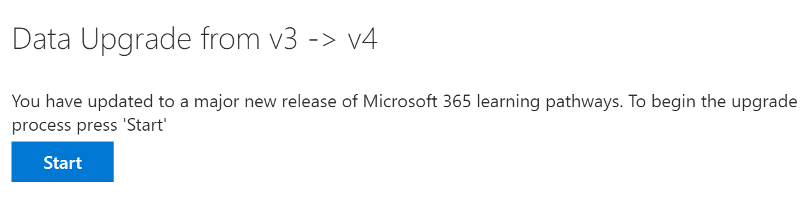

# Aggiornare i percorsi di apprendimento per il supporto multilingueUpdate learning pathways for multilingual support
Se si dispone di un sito di percorsi di apprendimento esistente, è possibile aggiornarlo per il supporto multilingue.If you have an existing Learning Pathways site, you can update it for multilingual support. Per aggiornare i percorsi di apprendimento alla versione multilingue di 4,0, caricare il pacchetto della web part, customlearning. sppkg, nel catalogo app tenant di SharePoint.To update learning pathways to the multilingual 4.0 version, you upload the web part package, customlearning.sppkg, to the SharePoint tenant App Catalog. Quando si aggiornano i percorsi di apprendimento:When you update learning pathways:  

- Tutte le playlist e le risorse personalizzate create in precedenza vengono mantenuteAny previously created custom playlists and assets are maintained
- Le impostazioni per nascondere o visualizzare il contenuto vengono mantenuteSettings to hide or show content are maintained
- Il modello di percorsi di apprendimento di SharePoint è rimasto invariatoThe learning pathways SharePoint template is left unchanged
- Le pagine del sito percorsi di apprendimento non vengono convertite.The learning pathways site pages aren't translated. Questo lavoro deve essere svolto manualmenteThis work must be done manually

## Leggere la panoramica dei percorsi di apprendimento multilingueRead the learning pathways multilingual overview
Per ulteriori informazioni sul funzionamento del supporto multilingue per i percorsi di apprendimento, leggere la [Panoramica dei percorsi di apprendimento multilingue](custom_overview_ml.md).To learn about how multilingual support works for learning pathways, read the [Learning pathways multilingual overview](custom_overview_ml.md)). 

## Prerequisiti per l'aggiornamentoPrerequisites to update
Prima di aggiornare i percorsi di apprendimento, è necessario soddisfare i prerequisiti seguenti:Before updating learning pathways, the following prerequisite must be met:
- La persona che aggiorna i percorsi di apprendimento deve essere il proprietario di una raccolta siti del catalogo app tenant.The person updating learning pathways must be a site collection owner of the tenant App Catalog. Se la persona che esegue il provisioning dei percorsi di apprendimento non è un proprietario della raccolta siti del catalogo app, [completare queste istruzioni](addappadmin.md) e continuare.If the person provisioning learning pathways isn't a site collection owner of the App Catalog, [complete these instructions](addappadmin.md) and continue. 

## Impostare le impostazioni della linguaSet language settings 
Prima di aggiornare i percorsi di apprendimento, impostare le impostazioni della lingua del sito.Before updating learning pathways, set the site language settings. Per abilitare il supporto multilingue per il sito percorsi di apprendimento, è possibile impostare le **pagine e le notizie da tradurre in più lingue** **su**attivato e quindi aggiungere le lingue che si desidera supportare per il sito.To enable multilingual support for the learning pathways site, you can set the **Enable pages and news to be translated into multiple languages** to **On**, and then add the languages you want to support for the site.
1.  Dal sito percorsi di apprendimento selezionare **Impostazioni** dall'alto a destra e quindi fare clic su **informazioni sito**.From the Learning Pathways site, select **Settings** from the top right, and then select **Site information**.
2.  Nella parte inferiore del riquadro delle informazioni del sito selezionare **Visualizza tutte le impostazioni del sito**.At the bottom of the site information pane, select **View all site settings**.
3.  In **Amministrazione sito**selezionare **Impostazioni lingua**.Under **Site Administration**, select **Language settings**.
4.  In **Enable Pages and News to be translated in multiple languages**, impostare l'interruttore toggle.Under **Enable pages and news to be translated into multiple languages**, set the toggle switch. 
- Per un sito di multiligual, scorrere l'interruttore **su**attivato e quindi passare alla sezione add languages.For a multiligual site, slide the toggle to **On**, and then proceed to the Add Languages section. 
- Per un sito solo in lingua inglese, fare scorrere l'interruttore su **disattivata**.For an English-only site, slide the toggle to **Off**.

### Aggiungere le lingueAdd languages
I percorsi di apprendimento supportano nove lingue, è consigliabile aggiungere solo le lingue necessarie.Learning pathways supports nine languages, you should add only the languages you need. Negli esempi utilizzati in questa documentazione verrà aggiunto italiano.In the examples used in this documentation, Italian will be added. 
- In **Aggiungi o Rimuovi lingue sito**, iniziare a digitare un nome di lingua in **Seleziona o digitare una**lingua oppure scegliere una lingua dall'elenco a discesa.Under **Add or remove site languages**, start typing a language name in **Select or type a language**, or choose a language from the dropdown. È possibile ripetere questo passaggio per aggiungere più lingue.You can repeat this step to add multiple languages. È possibile aggiungere o rimuovere le lingue dal sito in qualsiasi momento tornando alla pagina.You can add or remove languages from your site at any time by going back to this page.
 
### Assegnare i traduttoriAssign translators
Quando si definiscono le impostazioni della lingua per i percorsi di apprendimento, è possibile assegnare i traduttori.When defining Language settings for learning pathways, you can assign translators. I traduttori devono disporre di un profilo di lingua straniera configurato.Translators should have a foreign language profile set up. Per ulteriori informazioni sui profili di lingua straniera, vedere [creare siti di comunicazione multilingue, pagine e notizie](https://support.office.com/article/2bb7d610-5453-41c6-a0e8-6f40b3ed750c).For more information about foreign language profiles, see [Create multilingual communication sites, pages, and news](https://support.office.com/article/2bb7d610-5453-41c6-a0e8-6f40b3ed750c).  
- Per una lingua supportata, fare clic su **Seleziona o digitare un traduttore** e quindi selezionare un traduttore.For a supported language, click **Select or type a translator** and then select a translator. 

## Aggiornare il pacchetto Web part percorsi di apprendimentoUpdate the learning pathways web part package
In questo passaggio viene caricata la Web part percorsi di apprendimento 4,0 nel catalogo app di SharePoint e quindi si passa alla pagina Amministrazione percorsi di apprendimento per avviare il processo di aggiornamento.In this step, you upload the learning pathways 4.0 web part to the SharePoint App Catalog, and then navigate to the learning pathways Administration page to start the update process.

### Caricare il pacchetto della web partUpload the web part package
1.  Passare al percorso di condivisione multilingue in teams e scaricare **customlearning. sppkg** in un'unità locale del PC.Go to the multilingual share location in Teams and download **customlearning.sppkg** to a local drive on your PC. 
2.  Se non è già stato eseguito l'accesso, accedere al tenant con un account amministratore tenant o una raccolta siti.If you’re not already signed in, sign into your tenant with a Tenant Admin or Site Collection Admin account. 
3.  Fare clic su **amministratore**per  >  **visualizzare tutte le**  >  **SharePoint**  >  **funzionalità**di SharePoint.Click **Admin** > **Show All** > **SharePoint** > **More Features**. 
4.  In **app**fare clic su **Apri**.Under **Apps**, click **Open**. 
5.  Fare clic su **App Catalog**  >  **distribuire le app per SharePoint**.Click **App Catalog** > **Distribute Apps for SharePoint**. 
6.  Fare clic su **carica**  >  **scegliere file**.Click **Upload** > **Choose Files**. 
7.  Selezionare il file **customlearning. sppkg** scaricato, fare clic su **OK**  >  **deploy**.Select the **customlearning.sppkg** file you downloaded, click **OK** > **Deploy**. 

### Completare l'aggiornamentoComplete the update
1.  Dal sito percorsi di apprendimento selezionare **Amministrazione percorsi di apprendimento** dal menu **Home** .From the Learning Pathways site, select **Learning pathways administration** from the **Home** menu. 
2.  Verrà visualizzato un messaggio che richiede se si desidera eseguire l'aggiornamento.You’ll see a prompt asking if you want to update. 

3.  Fare clic su **Avvia**.Click **Start**. 
4. Al termine dell'aggiornamento, fare clic su **Chiudi**.When the update is complete, click **Close**. 

### Operazioni successiveNext Steps
- Esaminare il [contenuto predefinito](custom_exploresite.md) fornito nel sito e nella web part.Explore the [default content](custom_exploresite.md) provided in the site and web part.
- Per ulteriori informazioni sulla traduzione delle pagine del sito, vedere [translate site pages](custom_translate_page_ml.md).For more information about translating site pages, see [Translate site pages](custom_translate_page_ml.md). 

