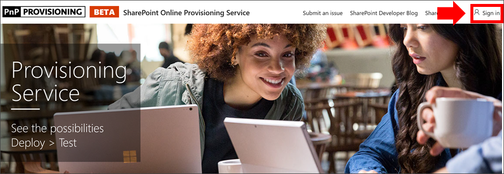

# Provisioning dell'apprendimento personalizzato

Con il servizio di provisioning di SharePoint Online, un amministratore del tenant di Office 365 può avviare il processo di provisioning con alcuni semplici clic. Il servizio di provisioning è il modo consigliato per eseguire il provisioning dell'apprendimento personalizzato. È veloce, semplice e richiede solo alcuni minuti per iniziare il processo. Prima di iniziare a usare il servizio di provisioning, accertarsi di aver soddisfatto i prerequisiti per il provisioning.

## Prerequisiti
 
Per configurare correttamente l'apprendimento personalizzato con il servizio di provisioning del servizio di provisioning di [SharePoint Online](https://provisioning.sharepointpnp.com), la persona che effettua il provisioning deve soddisfare i requisiti seguenti: 
 
- La persona che esegue il provisioning dell'apprendimento personalizzato deve essere un tenant Administratorof il tenant in cui verrà eseguito il provisioning dell'apprendimento personalizzato.  
- Un catalogo app tenant deve essere disponibile all'interno dell'opzione Apps dell'interfaccia di amministrazione di SharePoint. Se nell'organizzazione non è presente un catalogo delle app di SharePoint tenant, fare riferimento alla [documentazione di SharePoint Online](https://docs.microsoft.com/sharepoint/use-app-catalog) per crearne uno.  
- Il provisioning personalizzato dell'utente deve essere un proprietario della raccolta siti del catalogo app tenant. Se la persona che provisioning Custom Learning non è un proprietario della raccolta siti del catalogo app, [completare queste istruzioni](addappadmin.md) e continuare. 

### Per eseguire il provisioning dell'apprendimento personalizzato

1. Passare a http://provisioning.sharepointpnp.com e **accedere** dall'angolo in alto a destra della Home page.  Accedere con le credenziali del tenant di destinazione in cui si intende installare il modello di sito.

2. Cancellare il **consenso per conto dell'organizzazione** e selezionare **accetta**.

3. Selezionare **apprendimento personalizzato per Office 365** dalla raccolta soluzioni.

4. Nella Home page della soluzione selezionare **Aggiungi al tenant**

5. Completare i campi nella pagina delle informazioni sul provisioning, come opportuno per l'installazione. Immettere almeno l'indirizzo di posta elettronica in cui si desidera ottenere le notifiche relative al processo di provisioning e all'URL di destinazione del sito di cui eseguire il provisioning.  
> [!NOTE]
> Rendere l'URL di destinazione per il sito una cosa semplice per i dipendenti, ad esempio "/sites/MyTraining" o "/teams/LearnOffice365".

6. Selezionare **provisioning** quando si è pronti per installare l'apprendimento personalizzato nell'ambiente tenant.  Il processo di provisioning richiederà fino a 15 minuti. Quando il sito è pronto per l'accesso, si riceverà una notifica tramite posta elettronica (all'indirizzo di posta elettronica immesso nella pagina del provisioning).

> [!IMPORTANT]
> L'amministratore tenant che effettua il provisioning del sito di apprendimento personalizzato deve passare al sito e quindi aprire CustomLearningAdmin. aspx per inizializzare le proprietà di amministratore di apprendimento personalizzate. A questo punto, l'amministratore del tenant deve anche assegnare i proprietari al sito. 

## Convalidare il completamento del provisioning

Al termine del provisioning, l'amministratore del tenant riceve un messaggio di posta elettronica dal servizio di provisioning PnP. L'amministratore può copiare il collegamento al sito fornito nel messaggio di posta elettronica e quindi seguire le istruzioni per accedere al sito. In alternativa, l'amministratore del tenant è in grado di accedere a </SitePages/CustomLearningAdmin.aspx.-SITE-COLLECTION-URL> Questo consente di inizializzare l'elemento di elenco CustomConfig che configura l'apprendimento personalizzato per il primo utilizzo. La persona che apre per la prima volta questa pagina deve essere un amministratore del tenant, un amministratore della raccolta siti o un proprietario del sito. Dovrebbe essere visualizzata una pagina simile alla seguente: 

## Aggiungere proprietari al sito
Come amministratore del tenant, è improbabile che tu sia la persona che Personalizza il sito, quindi sarà necessario assegnare i proprietari al sito. I proprietari dispongono di privilegi amministrativi per il sito in modo che possano modificare le pagine del sito e rimarcare il sito. Sono inoltre in grado di nascondere e visualizzare i contenuti forniti tramite la Web part di apprendimento personalizzata. Avranno anche la possibilità di creare playlist personalizzate e assegnarle a sottocategorie personalizzate.  

1. Scegliere **autorizzazioni sito**dal menu **Impostazioni** di SharePoint.
2. Fare clic su **Impostazioni avanzate di autorizzazione**.
3. Fare clic su **apprendimento personalizzato per i proprietari di Office 365**.
4. Fare clic su **nuovo**  >  **Aggiungi utenti a questo gruppo**, aggiungere le persone che si desidera siano proprietari e quindi fare clic su **Condividi**.

8. Fare clic sull'opzione **seguente** nell'angolo in alto a destra della pagina per seguire il sito.  

### Operazioni successive
- Esaminare il [contenuto predefinito](sitecontent.md) incluso in WebPart.
