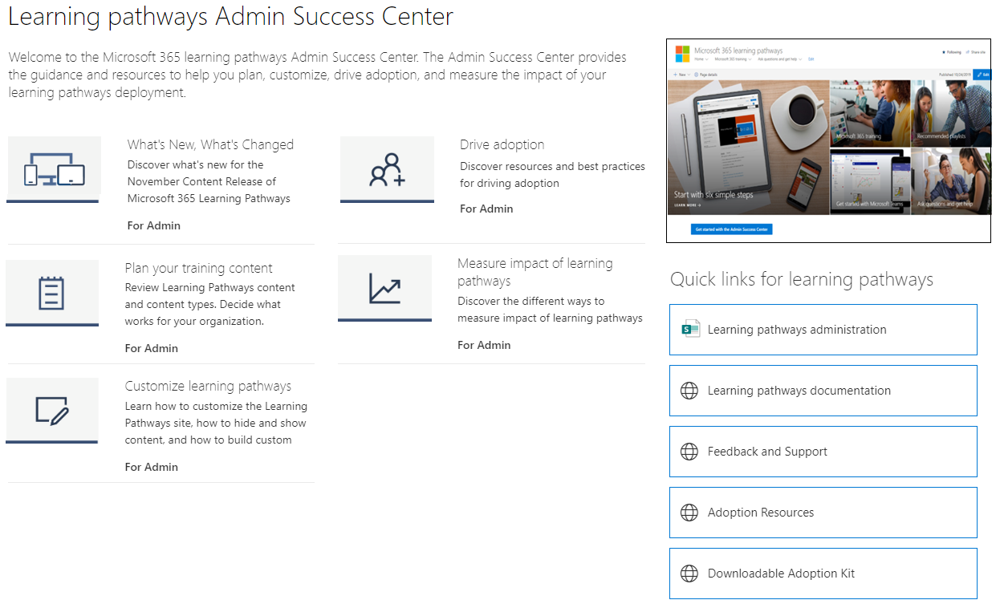

# Dove si trova la Web part dei percorsi di apprendimento di Microsoft 365?Where's the Microsoft 365 learning pathways web part? 

Quando viene eseguito il provisioning dei percorsi di apprendimento nell'organizzazione, il sito e la web part dei percorsi di apprendimento vengono aggiunti al tenant di SharePoint dell'organizzazione.When learning pathways is provisioned in your organization, the learning pathways site and web part are added to your organization’s SharePoint tenant. Come parte del provisioning, la web part di apprendimento di Microsoft 365 viene aggiunta alle pagine seguenti del sito percorsi di apprendimento di Microsoft 365:As part of the provisioning, the Microsoft 365 learning web part is added to the following pages of the Microsoft 365 learning pathways site:

- Start-with-Six-Simple-Steps.aspxStart-with-Six-Simple-Steps.aspx 
- Recommended-Playlists.aspxRecommended-Playlists.aspx
- Introduzione a Office 365.aspxGet-started with-Office 365.aspx
- Introduzione a Microsoft-Teams.aspxGet-started-with-Microsoft-Teams.aspx
- Introduzione a OneDrive.aspxGet-started-with-OneDrive.aspx
- Introduzione a SharePoint.aspxGet-started-with-SharePoint.aspx
- Percorsi di apprendimento Admin Success Center.aspxLearning pathways Admin Success Center.aspx

Per ogni pagina, la web part è configurata in modo diverso per visualizzare le categorie, le sottocategorie, le playlist o gli asset progettati per supportare lo scopo della pagina.For each page, the Web part is configured differently to show the categories, subcategories, playlists or asset designed to support the intent of the page. La web part percorsi di apprendimento, come illustrato nelle sezioni successive, può essere aggiunta a qualsiasi pagina di SharePoint e filtrata per visualizzare categorie, sottocategorie, playlist o solo asset specifici.The learning pathways web part, as we’ll show you in later sections, can be added to just about any SharePoint page and filtered to show specific categories, subcategories, playlists, or just assets. Diamo un'occhiata.Let's take a look. 

## Visualizzare le playlist di Microsoft TeamsView Microsoft Teams playlists

Ecco un esempio della pagina Introduzione a **Microsoft Teams** con la web part filtrata per mostrare le playlist di apprendimento per Teams.Here’s an example of the **Get Started with Microsoft Teams** page with the Web part filtered to show the learning playlists for Teams. 

- Nella home page dei percorsi di apprendimento seleziona **Introduzione a Microsoft Teams.**From the learning pathways Home page, select **Get started with Microsoft Teams**.

- Fare clic sul menu **Home** del menu del sito percorsi di apprendimento per tornare alla home page del sito.Click the **Home** menu on the learning pathways site menu to return to the site Home page.

## Visualizzare la playlist Sei semplici passaggiView the Six Simple Steps playlist

La web part nella **pagina Start-with-Six-Simple-Steps.aspx** è configurata per visualizzare il primo asset nella playlist Six Simple Steps.The web part on the **Start-with-Six-Simple-Steps.aspx** page is configured to show the first asset in the Six Simple Steps playlist. 

- Nella home page dei percorsi di apprendimento fai clic su **Inizia con sei semplici passaggi.**From the learning pathways Home page, click **Start with six simple steps**. 

## Visualizzare tutti i corsi di formazione su Microsoft 365View all Microsoft 365 training

La web part nella pagina di formazione di **Microsoft 365** è configurata per visualizzare tutte le categorie e le sottocategorie disponibili nel catalogo dei percorsi di apprendimento.The Web part on the **Microsoft 365 training** page is configured to show all the categories and subcategories available from the learning pathways catalog. Sono incluse le sottocategorie di Microsoft insieme a tutte le sottocategorie create dall'utente per l'organizzazione.This includes subcategories from Microsoft along with any subcategories that you create for your organization.

- Nella home page dei percorsi di apprendimento fai clic su **Formazione su Microsoft 365.**From the learning pathways Home page, click **Microsoft 365 training**. Verrà visualizzata la pagina con la web part configurata per visualizzare tutte le categorie e le sottocategorie disponibili nel catalogo di apprendimento personalizzato.The page appears appears with the Web part configured to show all the categories and subcategories available from the Custom Learning catalog.

- Fare clic sul menu **Home** del menu del sito percorsi di apprendimento per tornare alla home page del sito.Click the **Home** menu on the learning pathways site menu to return to the site Home page.

## Visualizzare la web part nella pagina Interfaccia di amministrazioneView the Web part on the Admin Success Center page

La web part nella pagina **Admin Success Center** è configurata per filtrare tutte le playlist disponibili per l'interfaccia di amministrazione.The Web part on the **Admin Success Center** page is configured to filter all the playlists available for the Admin Success Center. Come illustrato nell'esempio seguente, la web part viene aggiunta a una pagina che contiene anche collegamenti rapidi alle risorse di amministrazione.As shown in the following example, the Web part is added to a page that also contains Quick Links to Admin resources. 

- Nella home page dei percorsi di apprendimento fai clic su **Introduzione all'Interfaccia di amministrazione.**From the learning pathways Home page, click **Get started with the Admin Success Center**. pulsante.button. 

- Fare clic sul menu **Home** del menu del sito percorsi di apprendimento per tornare alla home page del sito.Click the **Home** menu on the learning pathways site menu to return to the site Home page.

