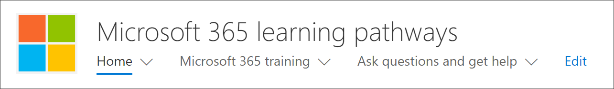
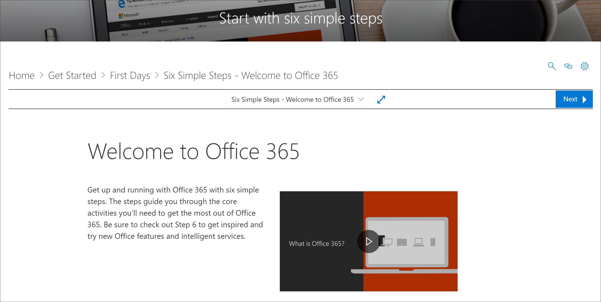

# Dove si trova la Web part Microsoft 365 Learning pathways?Where's the Microsoft 365 learning pathways web part?

Quando si esegue il provisioning dei percorsi di apprendimento nell'organizzazione, il sito e le web part di apprendimento vengono aggiunti al tenant di SharePoint dell'organizzazione.When learning pathways is provisioned in your organization, the learning pathways site and web part are added to your organization’s SharePoint tenant. Come parte del provisioning, la Web part Learning di Microsoft 365 viene aggiunta alle pagine seguenti del sito Microsoft 365 Learning pathways:As part of the provisioning, the Microsoft 365 learning web part is added to the following pages of the Microsoft 365 learning pathways site:

- Start-with-Six-Simple-Steps. aspxStart-with-Six-Simple-Steps.aspx 
- Recommended-Playlists. aspxRecommended-Playlists.aspx
- Get-Started with-Office 365. aspxGet-started with-Office 365.aspx
- Get-started-with-Microsoft-Teams. aspxGet-started-with-Microsoft-Teams.aspx
- Get-started-with-OneDrive. aspxGet-started-with-OneDrive.aspx
- Get-started-with-SPO. aspxGet-started-with-SPO.aspx

Per ogni pagina, la Web part è configurata in modo diverso per visualizzare le categorie, le sottocategorie, le playlist o l'asset disegnati per supportare lo scopo della pagina.For each page, the Web part is configured differently to show the categories, subcategories, playlists or asset designed to support the intent of the page. La Web part percorsi di apprendimento, come verrà mostrato nelle sezioni successive, può essere aggiunta a qualsiasi pagina di SharePoint e filtrata per mostrare specifiche tutte le categorie, o sottocategorie, playlist o solo asset.The learning pathways web part, as we’ll show you in later sections, can be added to just about any SharePoint page and filtered to show specific all categories, or subcategories, playlists, or just assets. Diamo un'occhiata.Let's take a look. 

## Visualizzare le playlist di Microsoft TeamsView Microsoft Teams playlists

Di seguito è riportato un esempio della pagina inizia **con Microsoft teams** con la Web part filtrata per visualizzare le playlist di apprendimento per i team.Here’s an example of the **Get Started with Microsoft Teams** page with the Web part filtered to show the learning playlists for Teams. 

- Nella Home page dei percorsi di apprendimento selezionare **Introduzione a Microsoft teams**.From the learning pathways Home page, select **Get started with Microsoft Teams**.

- Fare clic sul menu **Home** dal menu del sito percorsi di apprendimento per tornare alla Home page del sito.Click the **Home** menu on the learning pathways site menu to return to the site Home page.

## Visualizzare la playlist di sei semplici passaggiView the Six Simple Steps playlist

La Web part nella pagina **Start-with-Six-Simple-Steps. aspx** è configurata in modo da visualizzare il primo asset nella playlist di sei semplici passaggi.The web part on the **Start-with-Six-Simple-Steps.aspx** page is configured to show the first asset in the Six Simple Steps playlist. 

- Nella Home page dei percorsi di apprendimento fare clic su **Avvia con sei semplici passaggi**.From the learning pathways Home page,  click **Start with six simple steps**. 

## Visualizzare tutti gli allenamenti di Microsoft 365View all Microsoft 365 training

La Web part nella pagina **Microsoft 365 Training** è configurata in modo da visualizzare tutte le categorie e le sottocategorie disponibili nel catalogo percorsi di apprendimento.The Web part on the **Microsoft 365 training** page is configured to show all the categories and subcategories available from the learning pathways catalog. Sono incluse le sottocategorie di Microsoft insieme a tutte le sottocategorie create per l'organizzazione.This includes subcategories from Microsoft along with any subcategories that you create for your organization.

- Nella Home page dei percorsi di apprendimento fare clic su **Microsoft 365 Training**.From the learning pathways Home page, click **Microsoft 365 training**. La pagina viene visualizzata con la Web part configurata in modo da visualizzare tutte le categorie e le sottocategorie disponibili nel catalogo di apprendimento personalizzato.The page appears appears with the Web part configured to show all the categories and subcategories available from the Custom Learning catalog.

- Fare clic sul menu **Home** dal menu del sito percorsi di apprendimento per tornare alla Home page del sito.Click the **Home** menu on the learning pathways site menu to return to the site Home page.

