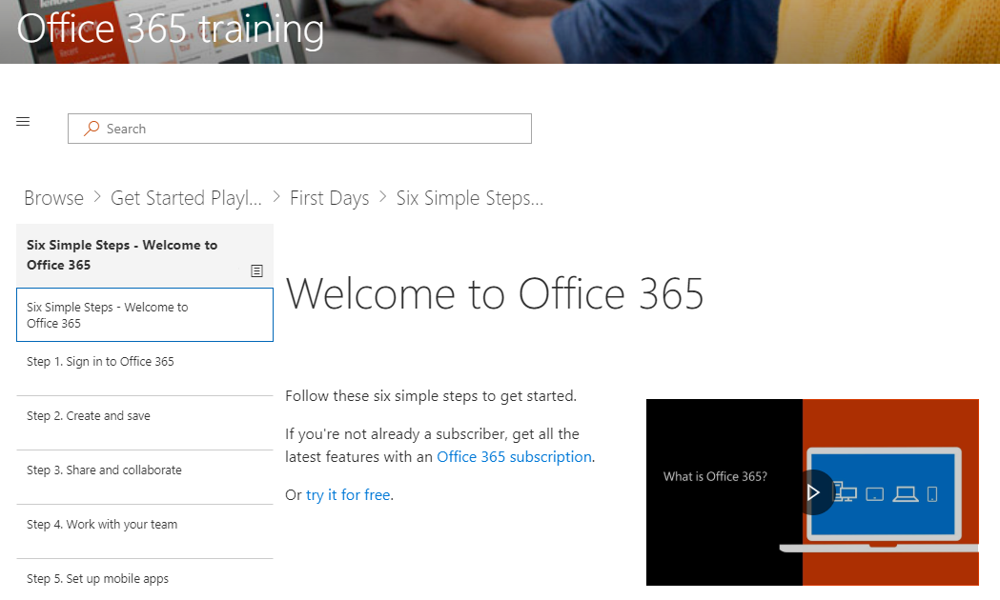

# Personalizzare l'esperienza di formazione

Per impostazione predefinita l'esperienza del sito e della Web part includere contenuto per tutti i servizi di Office 365.  Se solo alcune o tutte le questi servizi sono disponibili all'interno della società è possibile modificare il contenuto è disponibile per gli utenti.  

Innanzitutto è verrà personalizzare il contenuto disponibile nella Web part stesso.  Queste informazioni sono applicabili a un'installazione di Web part solo autonomo o tramite la Web part all'interno dell'esperienza di sito personalizzato Learning. 

## La personalizzazione del contenuto di formazione

Vai per iniziare con sei passaggi semplificati
- Nella Home page fare clic su Start con sei semplici passaggi. 
- Viene visualizzata la pagina di formazione su Office con la web part personalizzata apprendimento instradate all'inizio con sei de sélections semplici passaggi.  

