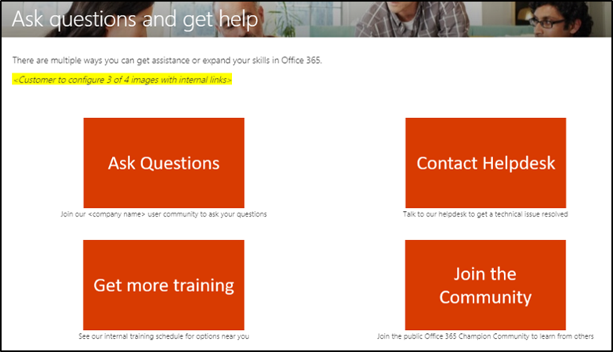
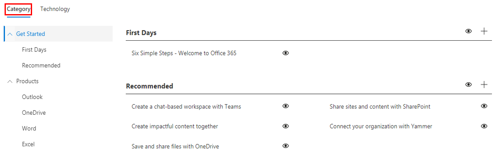

# Personalizzare l'esperienza di formazioneCustomize the training experience

Questo è un test quattro.This is a test four. Per impostazione predefinita, sia l'esperienza del sito che la web part includono contenuto per tutti i servizi di Office 365 e Windows 10.By default both the site experience and the webpart include content for all Office 365 and Windows 10 services.  Se nell'azienda sono disponibili solo tutti o alcuni di questi servizi, è possibile modificare il contenuto disponibile per gli utenti.If only all or some of these services are available in your company you can adjust what content is available to your users.  

Sono disponibili diversi tipi di personalizzazioni per i proprietari di questo sito.There are several kinds of customizations that are available to the owners of this site. 

- [Personalizzare le pagine WebCustomize web pages](#customizing-web-pages)
- [Personalizzare i servizi disponibiliCustomize available services](#customize-available-services)
- [Personalizzare e condividere playlistCustomize and share playlists](customplaylist.md)

Alcune o tutte queste personalizzazioni possono essere completate prima di avviare il sito nella community degli utenti.Some or all of these customizations can be completed before you launch the site to your user community.  

> [!TIP]
> Raccogliere commenti e suggerimenti dai dipendenti e completare periodicamente personalizzazioni aggiuntive.Gather feedback from your employees and periodically complete additional customizations.  Aggiungi playlist, pagine Web di destinazione a ruoli specifici o attiva nuovi contenuti di formazione all'avvio di nuovi servizi.Add playlists, target webpages to specific roles or turn on new training content when launching new services. 

## Personalizzazione delle pagine WebCustomizing web pages

È possibile personalizzare completamente il sito Web apprendimento personalizzato.You can fully customize the Custom Learning web site. Se non si ha familiarità con la creazione di pagine all'interno di siti di SharePoint Online moderni, è consigliabile consultare Personalizzare l'articolo personalizzare il sito di [SharePoint](https://support.office.com/article/customize-your-sharepoint-site-320b43e5-b047-4fda-8381-f61e8ac7f59b) in support.office.com.If you are not familiar with creating pages within modern SharePoint Online sites we suggest you review [Customize your SharePoint site](https://support.office.com/article/customize-your-sharepoint-site-320b43e5-b047-4fda-8381-f61e8ac7f59b) article on support.office.com. 

### Personalizzare la **pagina Porre domande e ottenere** assistenzaCustomize the **Ask Questions and Get Help** page

Come punto di partenza per personalizzare il sito, selezionare Porre domande e ottenere assistenza dalla barra dei menu, quindi fare clic sul pulsante Modifica di SharePoint e modificare le immagini e i collegamenti.As a starting point for customizing the site, select Ask questions and get help from the menu bar, then click the SharePoint Edit button and change the images and the links. 

## Personalizzare i servizi disponibiliCustomize available services

1.  Passare alla pagina Custom Learning Administration all'interno del sito Navigate to the Custom Learning Administration page within the website 
1. Selezionare **Tecnologia** per visualizzare l'elenco completo dei servizi inclusi nella soluzioneSelect **Technology** to see the full list of services that are included in the solution
1. Selezionare una tecnologia e fare **clic sul simbolo dell'occhio** per nascondere questo contenuto.Select a technology and **click the eye symbol** to hide this content.  Fai di nuovo clic sul simbolo dell'occhio per visualizzare il contenuto all'interno dell'esperienza.Click the eye symbol again to show the content within the experience. 

Lo stesso processo può essere ripetuto per categorie di playlist all'interno dell'esperienza.The same process can be repeated for categories of playlists within the experience.  Seleziona semplicemente l'opzione Categoria per mostrare/nascondere le playlist.Simply select the Category option to show/hide playlists. 

### Passaggi successiviNext steps

- [Personalizzare e condividere playlistCustomize and Share Playlists](customplaylist.md)
- [Guidare l'adozioneDrive Adoption](driveadoption.md) 
