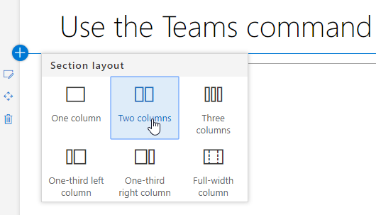
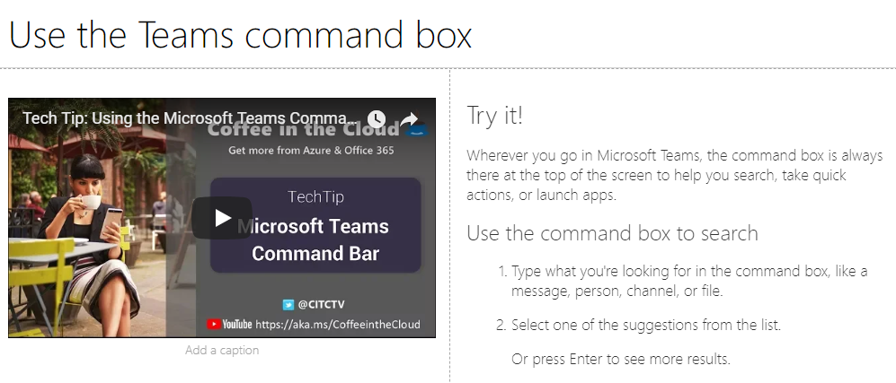
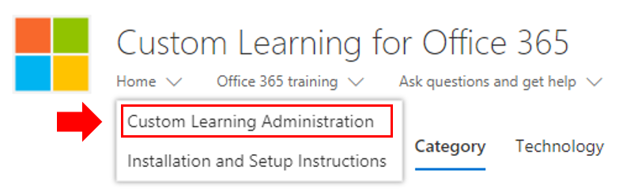
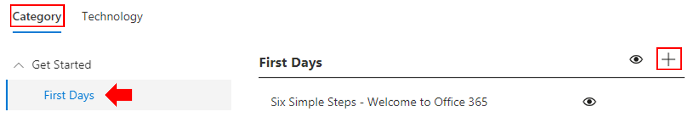
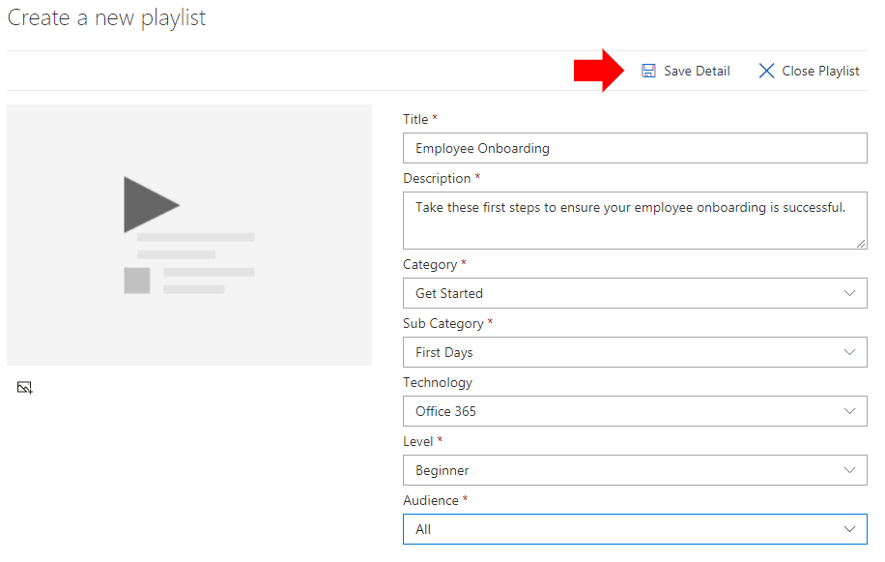
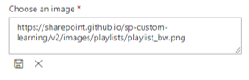
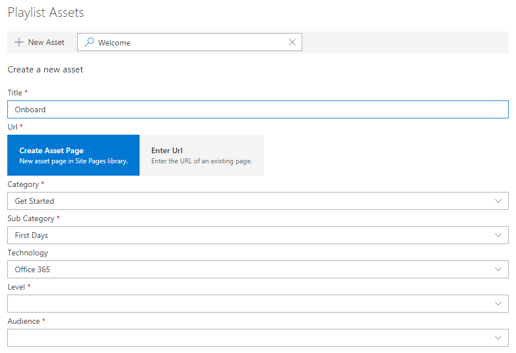

# Personalizzare e condividere playlist

## Creare una playlist

Una playlist è una compilazione di "asset". Un "asset" è una SharePoint o un elemento esistente del contenuto di formazione Microsoft. Quando crei una playlist, seleziona gli asset che vanno insieme per creare un percorso di apprendimento per l'utente.  

Il vantaggio di aggiungere SharePoint pagine è che puoi creare pagine SharePoint con video di YouTube o video ospitati nell'organizzazione. È inoltre possibile creare pagine con moduli o altro Office 365 contenuto.  

#### Passaggio 1: Creare una pagina SharePoint per la playlist
In questo esempio creeremo innanzitutto una pagina SharePoint da aggiungere alla playlist. Verrà creata una pagina con una web part video di YouTube e una web part Testo.  Queste istruzioni presuppongono che si utilizzi il servizio SharePoint Online. 

#### Creare una nuova pagina
1.  Selezionare il Impostazioni di > contenuto del sito > pagine del sito > Nuovo > Pagina sito.
2.  Nell'area del titolo digitare Use the Teams command box
3.  Selezionare la sezione Aggiungi nuovo e quindi selezionare Due colonne.

    

4.  Nella casella a sinistra selezionare Aggiungi una nuova web part e quindi incorporare. 
5.  In un Web browser passare a questo URL https://youtu.be/wYrRCRphrp0 e ottenere il codice di incorporamento per il video. 
6.  Nella SharePoint web part selezionare Aggiungi codice di incorporamento e quindi incollarlo nella casella Incorpora. 
7.  Nella casella a destra selezionare Aggiungi una nuova web part e quindi testo. 
8.  In un Web browser passare all'URL seguente: https://support.office.com/article/13c4e429-7324-4886-b377-5dbed539193b e copiare l'opzione Prova. Istruzioni della pagina e incollarle nella web part Testo. La pagina dovrebbe essere simile alla seguente. 
   
9.  Fare **clic su** Pubblica e quindi copiare l'URL della pagina e incollarlo Blocco note

#### Passaggio 2: Creare la playlist

1. Passare alla **pagina Amministrazione Learning** personalizzata nell'esperienza del sito.
   
1. Verificare che **l'opzione Categoria** sia selezionata 
1. Fai clic sulla categoria in cui vuoi che venga visualizzata la nuova playlist
1. Accanto al nome della categoria, fai clic sul simbolo più 

1. Inserire i valori come illustrato nell'esempio seguente e selezionare **Crea**. 
  
- **Title** - Nome visualizzato della playlist
- **Descrizione** - Informazioni su ciò che verrà appreso
- **Categoria** : preselezionata in base alla selezione iniziale
- **Sottocatego;** preselezionata in base alla selezione iniziale
- **Tecnologia** - Selezionare come applicabile
- **Livello** : principiante, intermedio o avanzato
- **Gruppo** di destinatari: in questo modo è possibile scegliere come destinazione il contenuto in base a un elenco predefinito di ruoli forniti da Microsoft.

6. Fare clic **su Salva dettagli**

> [!TIP]
> Puoi personalizzare l'immagine dell'icona per la playlist.  Fai clic sull'icona dell'immagine e inserisci un URL di un'immagine caricata in precedenza.  Verificare che l'immagine si trovi all'interno della raccolta siti Learning personalizzata o in un'altra posizione in cui tutti gli utenti avranno accesso al file.  

#### Passaggio 3: Aggiungere asset alla playlist
In questo passaggio verranno aggiunti asset esistenti da Microsoft e dalla pagina SharePoint creata alla playlist. 

1. Dopo aver salvato i dettagli per la playlist, puoi usare la ricerca di asset esistenti.
1. **Immettere un termine di ricerca** per visualizzare un elenco di risorse predefinite disponibili in altre playlist. **Fai clic sul nome** di una risorsa per includerla nella nuova playlist.

    

Puoi anche aggiungere la pagina SharePoint creata in precedenza o crearne una da zero nell'esperienza.

1. Fai clic **sull'opzione Nuovo asset** nella finestra di dialogo Asset playlist
1. Assegnare un titolo **all'asset.** Dopo l'immissione, opzioni aggiuntive 
1. Ora puoi creare una nuova pagina di asset in SharePoint Online o immettere l'URL di una pagina esistente per aggiungerla alla playlist personalizzata. 
1. **I** campi **Categoria, Categoria** secondaria **e** Tecnologia verranno pre-popolati in base alle selezioni precedenti per questa playlist.
1. Effettuare le selezioni appropriate per Livello e Gruppo di destinatari per questa singola risorsa.  
1. Fai **clic su Salva** risorsa per aggiungerlo alla playlist personalizzata
1. Ripeti questi passaggi, cercando o aggiungendo singole pagine, fino al completamento della playlist. 
1. Fare **clic su Chiudi playlist** per salvare

La playlist con questo contenuto sarà ora disponibile ovunque sia stata installata/incorporata la web part Learning personalizzata. 

> [!NOTE]
> Se commette un errore dopo aver chiuso la playlist, puoi eliminarla dalla categoria facendo clic sulla X accanto al nome della playlist.  

#### Aspetti da riflettere

Le playlist personalizzate possono essere usate per assistere gli utenti finali in un'ampia gamma di attività.  Hai un modulo di richiesta di tempo libero?  Un modulo per richiedere attrezzature hardware?  Tutte le risorse di formazione esistenti possono essere programmate nell'esperienza.  

## Condividere playlist

1. Passare a qualsiasi playlist all'interno della web part o dell'esperienza del sito
1. Nell'angolo in alto a sinistra verranno visualizzate tre icone
1. Fare clic sull'icona che rappresenta un collegamento
1. Copiare l'URL nella playlist

    direttamente a tale playlist. 

### Passaggi successivi - [Guidare l'adozione](driveadoption.md)
