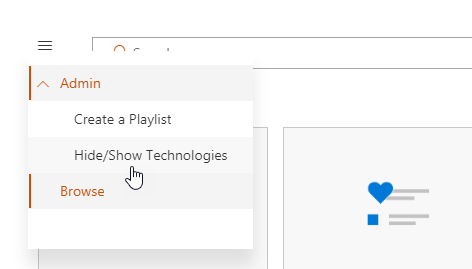
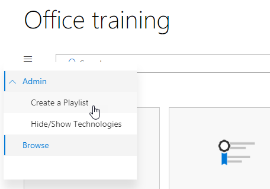
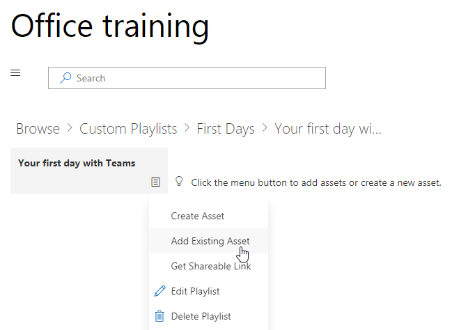
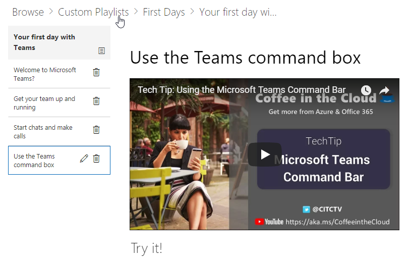

# Personalizzare i servizi e gli elenchi di riproduzioneCustomize the Services and Playlists

Per impostazione predefinita l'esperienza del sito e della Web part includere contenuto per tutti i servizi di Office 365.  Se solo alcune o tutte le questi servizi sono disponibili all'interno della società è possibile modificare il contenuto è disponibile per gli utenti.  In questo articolo è verrà personalizzare il contenuto di Web part.By default both the site experience and the webpart include content for all Office 365 services.  If only all or some of these services are available in your company you can adjust what content is available to your users.  In this article we will customize the webpart content.  

## La personalizzazione del contenuto Web partCustomizing the webpart content

La Web part personalizzata Learning offre due funzionalità chiave:The Custom Learning webpart provides two key features:
- Mostra/Nascondi tecnologieHide/Show Technologies
- Creare un elenco di riproduzioneCreate a Playlist

### Categorie di tecnologia Mostra o NascondiHide or Show Technology Categories

Per nascondere e visualizzare contenuto nella Web part:To hide and show content in the Web part: 
1.  Fare clic sul menu a discesa della Web part e quindi fare clic su Mostra/Nascondi tecnologieClick the dropdown menu on the webpart, then click Hide/Show Technologies

2. Selezionare un checkox per nascondere o visualizzare una tecnologia e selezionare **Applica**.Select a checkox to hide or show a technology and select **Apply**.

### Creare un elenco di riproduzioneCreate a Playlist

Un elenco di riproduzione è compliation delle "risorse". Una risorsa"" è una pagina di SharePoint o un elemento esistente del contenuto per la formazione Microsoft. Quando si crea un elenco di riproduzione si selezionano risorse correlate per creare un percorso di apprendimento per l'utente.A playlist is a compliation of "assets". An "asset" is a SharePoint page or existing item of Microsoft training content. When you create a playlist you select assets that go together to create a learning path for your user.  

I vantaggi dell'aggiunta di pagine di SharePoint sono che è possibile creare pagine di SharePoint con un YouTube video o video ospitati all'interno dell'organizzazione. È inoltre possibile creare pagine con moduli o altro contenuto di Office 365.The benefit of adding SharePoint pages is that you can create SharePoint pages with a YouTube videos or videos hosted in your organization. You can also create pages with Forms or other Office 365 content.  

#### Passaggio 1: Creare una pagina di SharePoint per l'elenco di riproduzioneStep 1: Create a SharePoint page for your playlist
In questo esempio, si creerà innanzitutto una pagina di SharePoint da aggiungere all'elenco di riproduzione. Verrà creata una pagina con una YouTube video web part e web part di testo.  Queste istruzioni si presuppone che si utilizza il servizio SharePoint Online.In this example, we’ll first create a SharePoint page to add to the playlist. We’ll create a page with a YouTube video web part and Text web part.  These instructions assume you are using the SharePoint Online service. 

#### Creare una nuova paginaCreate a new page
1.  Selezionare le impostazioni dal menu gt _ contenuto del sito gt _ pagine del sito gt _ nuovo gt _ Page del sito.Select the Settings menu > Site Contents > Site Pages > New > Site Page.
2.  Nell'area titolo digitare utilizzare la finestra di comando teamIn the title area, type Use the Teams command box
3.  Selezionare la sezione aggiungere una nuova e quindi selezionare due colonne.Select the Add a new section, and then select Two Columns.

4.  Nel riquadro sinistro, selezionare Aggiungi nuova web part e quindi selezionare Embed.In the left-hand box, select Add a new web part, and then select Embed. 
5.  In un Web browser, accedere a questo URL https://youtu.be/wYrRCRphrp0 e ottenere il codice di incorporamento del video.In a Web browser, go to this URL https://youtu.be/wYrRCRphrp0 and get the embed code for the video. 
6.  Nella Web part di SharePoint, selezionare Aggiungi incorporare codice e incollarlo nella casella Embed.In the SharePoint Web part, select Add Embed code and then paste it into the Embed box. 
7.  Nella casella a destra, selezionare Aggiungi nuova web part e quindi selezionare il testo.In the right-hand box, select Add a new web part, and then select Text. 
8.  In un Web browser, accedere a questo URL: https://support.office.com/en-us/article/13c4e429-7324-4886-b377-5dbed539193b e copiare il blocco Try viene! Le istruzioni nella pagina e incollarli in testo Web part. Nella pagina dovrebbe essere simile al seguente.In a Web browser, go to this URL: https://support.office.com/en-us/article/13c4e429-7324-4886-b377-5dbed539193b and copy the Try it! Instructions from the page and paste them into the Text Web part. Your page should look like the following. 

9.  Fare clic su pubblica, quindi copiare l'URL della pagina e incollarlo nel blocco noteClick Publish, and then copy the URL of the page and paste it in Notepad

#### Passaggio 2: Creare l'elenco di riproduzioneStep 2: Create the Playlist
1.  Passare a in cui è installata la Web part apprendimento personalizzato. L'esperienza completa del sito si trova nella pagina formazione di Office 365.Navigate to where you have installed the Custom Learning webpart. In the full site experience it is hosted on the Office 365 training page. 
2.  Nel menu a discesa selezionare Crea nuovo elenco di riproduzione.From the dropdown menu select Create New Playlist. 

3.  Immettere i valori come illustrato nell'esempio riportato di seguito e selezionare **Crea**.Fill in the values as shown in the example below and select **Create**. 

#### Passaggio 3: Aggiungere risorse all'elenco di riproduzioneStep 3: Add assets to the playlist
In questo passaggio si aggiungeranno risorse esistenti da Microsoft e la pagina di SharePoint creata per l'elenco di riproduzione.In this step, you’ll add existing assets from Microsoft and the SharePoint page you created to the playlist. 

1.  Fare clic sul pulsante menu, quindi fare clic su Aggiungi risorse esistenti.Click the menu button, then click Add Existing Asset.

2.  Filtrare formazione su Office 365 App gt _ team di MicrosoftFilter on Office 365 Apps > Microsoft Teams Training
3.  Aggiungere iniziale a Microsoft Teams, diventare il team operativi e avviare le chat ed effettuare chiamate.Add Welcome to Microsoft Teams, Get your team up and running, and Start chats and make calls.
4.  Selezionare Crea risorse gt _ pulsante menu.Select the menu button > Create Asset.
5.  Tipo di utilizzare la casella di comando team nella casella titolo delle risorse.Type Use the Teams command box in the Asset title box. 
6.  Incolla l'utilizzo di SharePoint Team comando casella URL della pagina sono stati copiati nel campo del contenuto delle risorse.Paste the SharePoint Use the Teams command box page URL you copied in the Asset content field. 
7.  Passare nuovamente al gt _ personalizzato gli elenchi di riproduzione di gt _ Home Page del primo giorni con gt _ team utilizzando la finestra di comando team. Nella pagina dovrebbe essere simile al seguente.Now navigate back to the Home Page > Custom Playlists > Your first days with Teams > Use the Teams command box. Your page should look like the following. 

Elenco di riproduzione con tale contenuto ora sarà disponibile via Internet sono installati / incorporati della Web part apprendimento personalizzato.Your playlist with this content will now be available anywhere you have installed / embedded the Custom Learning webpart. 

#### Aspetti da considerareThings to Think About

Consente di riproduzione personalizzati per aiutare gli utenti finali in un vareity delle attività.  Si dispone di un modulo di richiesta assente?  Un modulo per richiedere apparecchiature hardware?  È possibile programmare le risorse di formazione esistente nell'esperienza.Custom playlists can be used to assist your end users in a vareity of tasks.  Do you have a time off request form?  A form to request hardware equipment?  Any existing training assets can be programmed into the experience.  
