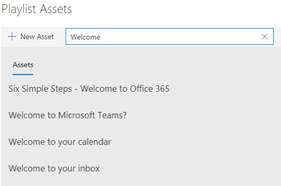

# Personalizzare e condividere playlistCustomize and share playlists

## Creare una playlistCreate a Playlist

Una playlist è una compilazione di "asset".A playlist is a compliation of "assets". Un "asset" è una pagina di SharePoint o un elemento esistente del contenuto di formazione Microsoft.An "asset" is a SharePoint page or existing item of Microsoft training content. Quando crei una playlist, seleziona gli asset che vanno insieme per creare un percorso di apprendimento per l'utente.When you create a playlist you select assets that go together to create a learning path for your user.  

Il vantaggio dell'aggiunta di pagine di SharePoint è che è possibile creare pagine di SharePoint con video di YouTube o video ospitati nell'organizzazione.The benefit of adding SharePoint pages is that you can create SharePoint pages with a YouTube videos or videos hosted in your organization. È inoltre possibile creare pagine con moduli o altro contenuto di Office 365.You can also create pages with Forms or other Office 365 content.  

#### Passaggio 1: Creare una pagina di SharePoint per la playlistStep 1: Create a SharePoint page for your playlist
In questo esempio verrà innanzitutto creata una pagina di SharePoint da aggiungere alla playlist.In this example, we’ll first create a SharePoint page to add to the playlist. Verrà creata una pagina con una web part video di YouTube e una web part Testo.We’ll create a page with a YouTube video web part and Text web part.  Queste istruzioni presuppongono che si utilizzi il servizio SharePoint Online.These instructions assume you are using the SharePoint Online service. 

#### Creare una nuova paginaCreate a new page
1.  Selezionare il menu Impostazioni > contenuto del sito > pagine del sito > Nuova > Pagina sito.Select the Settings menu > Site Contents > Site Pages > New > Site Page.
2.  Nell'area del titolo digitare Use the Teams command boxIn the title area, type Use the Teams command box
3.  Selezionare la sezione Aggiungi nuovo e quindi selezionare Due colonne.Select the Add a new section, and then select Two Columns.

4.  Nella casella a sinistra selezionare Aggiungi una nuova web part e quindi incorporare.In the left-hand box, select Add a new web part, and then select Embed. 
5.  In un Web browser passare a questo URL https://youtu.be/wYrRCRphrp0 e ottenere il codice di incorporamento per il video.In a Web browser, go to this URL https://youtu.be/wYrRCRphrp0 and get the embed code for the video. 
6.  Nella web part Di SharePoint selezionare Aggiungi codice di incorporamento e quindi incollarlo nella casella Incorpora.In the SharePoint Web part, select Add Embed code and then paste it into the Embed box. 
7.  Nella casella a destra selezionare Aggiungi una nuova web part e quindi testo.In the right-hand box, select Add a new web part, and then select Text. 
8.  In un Web browser passare all'URL seguente: https://support.office.com/article/13c4e429-7324-4886-b377-5dbed539193b e copiare l'opzione Prova.In a Web browser, go to this URL: https://support.office.com/article/13c4e429-7324-4886-b377-5dbed539193b and copy the Try it! Istruzioni della pagina e incollarle nella web part Testo.Instructions from the page and paste them into the Text Web part. La pagina dovrebbe essere simile alla seguente.Your page should look like the following. 

9.  Fare **clic su** Pubblica e quindi copiare l'URL della pagina e incollarlo nel Blocco noteClick **Publish**, and then copy the URL of the page and paste it in Notepad

#### Passaggio 2: Creare la playlistStep 2: Create the Playlist

1. Passare alla **pagina Amministrazione apprendimento personalizzata** nell'esperienza del sito.Navigate to the **Custom Learning Administration** page in your site experience.

1. Verificare che **l'opzione Categoria** sia selezionataMake sure **Category** is selected 
1. Fai clic sulla categoria in cui vuoi che venga visualizzata la nuova playlistClick on the category where you'd like your new playlist to appear
1. Accanto al nome della categoria, fai clic sul simbolo più Next to the category name, click on the plus symbol 

1. Inserire i valori come illustrato nell'esempio seguente e selezionare **Crea**.Fill in the values as shown in the example below and select **Create**. 

- **Title** - Nome visualizzato della playlist**Title** - Display name of the playlist
- **Descrizione** - Informazioni su ciò che verrà appreso**Description** - Information about what will be learned
- **Categoria** : preselezionata in base alla selezione iniziale**Category** - Preselected based on your initial selection
- **Sottocategozia** - Preselezionata in base alla selezione inziale**Sub Category** - Preselected based on your intial selection
- **Tecnologia** - Seleziona come applicabile**Technology** - Select as applicable
- **Livello** - Principiante, Intermidate o Avanzato**Level** - Beginner, Intermidate or Advanced
- **Gruppo** di destinatari: in questo modo è possibile scegliere come destinazione il contenuto in base a un elenco predefinito di ruoli forniti da Microsoft.**Audience** - This allows you to target content based on a pre-defined list of roles provided by Microsoft.

6. Fare clic **su Salva dettagli**Click **Save Detail**

> [!TIP]
> Puoi personalizzare l'immagine dell'icona per la playlist.You can customize the icon image for your playlist.  Fai clic sull'icona dell'immagine e inserisci un URL di un'immagine caricata in precedenza.Click the image icon and insert an URL of a previously uploaded image.  Verificare che l'immagine si trovi all'interno della raccolta siti di apprendimento personalizzato o in un'altra posizione in cui tutti gli utenti avranno accesso al file.Make sure the image is located within the Custom Learning site collection or in another location that all users will have access to the file.  

#### Passaggio 3: Aggiungere asset alla playlistStep 3: Add assets to the playlist
In questo passaggio verranno aggiunti asset esistenti da Microsoft e dalla pagina di SharePoint creata alla playlist.In this step, you’ll add existing assets from Microsoft and the SharePoint page you created to the playlist. 

1. Dopo aver salvato i dettagli per la playlist, puoi usare la ricerca di asset esistenti.Once you have saved the details for your Playlist you can use the Search for Existing Assets.
1. **Immettere un termine di ricerca** per visualizzare un elenco di risorse predefinite disponibili in altre playlist.**Enter in any search term** to see a list of predefined assets that are available from other playlists. **Fai clic sul nome** di una risorsa per includerla nella nuova playlist.**Click on the name** of an asset to include it in your new playlist. 

È inoltre possibile aggiungere la pagina di SharePoint creata in precedenza o crearne una da zero nell'esperienza.You can also add the SharePoint page you created earlier or create one from scratch in the experience.

1. Fai clic **sull'opzione Nuovo asset** nella finestra di dialogo Asset playlist.Click on the **New Asset** option in the Playlist Assets dialog.
1. Assegnare un titolo **all'asset.**Give your asset a **Title**. Dopo l'immissione, verranno visualizzate altre opzioni.Once entered, additional options will display.

1. È ora possibile creare una nuova pagina di asset in SharePoint Online o immettere l'URL di una pagina esistente per aggiungerla alla playlist personalizzata.You can now create a new asset page in SharePoint Online or enter in the URL of an existing page to add it to your custom playlist. 
1. **I** campi **Categoria, Categoria** secondaria **e** Tecnologia verranno pre-popolati in base alle selezioni precedenti per questa playlist.**Category**, **Sub Category** and **Technology** fields will be pre-populated based on your previous selections for this playlist.
1. Effettuare le selezioni appropriate per Livello e Gruppo di destinatari per questa singola risorsa.Make the appropriate selections for Level and Audience for this individual asset.  
1. Fai **clic su Salva** risorsa per aggiungerlo alla playlist personalizzataClick **Save Asset** to add it to the custom playlist
1. Ripeti questi passaggi, cercando o aggiungendo singole pagine, fino al completamento della playlist.Repeat these steps, either searching or adding individual pages, until your playlist is complete. 
1. Fare **clic su Chiudi playlist** per salvareClick **Close Playlist** to save

La playlist con questo contenuto sarà ora disponibile ovunque sia stata installata/incorporata la web part Apprendimento personalizzato.Your playlist with this content will now be available anywhere you have installed / embedded the Custom Learning webpart. 

> [!NOTE]
> Se commette un errore dopo aver chiuso la playlist, puoi eliminarla dalla categoria facendo clic sulla X accanto al nome della playlist.If you make a mistake once you have closed the playlist, you can delete it from the category by clicking the X next to the playlist name.  

#### Aspetti da riflettereThings to Think About

Le playlist personalizzate possono essere usate per assistere gli utenti finali in un'ampia gamma di attività.Custom playlists can be used to assist your end users in a variety of tasks.  Hai un modulo di richiesta di tempo libero?Do you have a time off request form?  Un modulo per richiedere attrezzature hardware?A form to request hardware equipment?  Tutte le risorse di formazione esistenti possono essere programmate nell'esperienza.Any existing training assets can be programmed into the experience.  

## Condividere playlistShare Playlists

1. Passare a qualsiasi playlist all'interno della web part o dell'esperienza del sitoNavigate to any playlist within the webpart or site experience
1. Nell'angolo in alto a sinistra verranno visualizzate tre iconeIn the upper left hand corner you will see three icons
1. Fare clic sull'icona che rappresenta un collegamentoClick on the icon representing a link
1. Copia l'URL nella schermata della playlist Copy the URL to the playlist 
Questo URL può ora essere inserito nella struttura di spostamento del sito o utilizzato in altre comunicazioni per portare i dipendenti direttamente a tale playlist.This URL can now be inserted in your site navigation or utilized in other communications to take your employees directly to that playlist. 

### Passaggi successivi - [Guidare l'adozione](driveadoption.md)Next Steps - [Drive Adoption](driveadoption.md)
