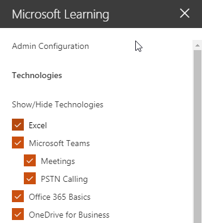

# Personalizzare i servizi e gli elenchi di riproduzione

Per impostazione predefinita l'esperienza del sito e della Web part includere contenuto per tutti i servizi di Office 365.  Se solo alcune o tutte le questi servizi sono disponibili all'interno della società è possibile modificare il contenuto è disponibile per gli utenti.  In questo articolo è verrà personalizzare il contenuto di Web part.  

## La personalizzazione del contenuto Web part

La Web part personalizzata Learning offre due funzionalità chiave:
- Mostra/Nascondi tecnologie
- Creare un elenco di riproduzione

### Categorie di tecnologia Mostra o Nascondi

Per nascondere e visualizzare contenuto nella Web part: 
1.  Fare clic sul menu a discesa della Web part e quindi fare clic su Mostra/Nascondi tecnologie

2. Selezionare un checkox per nascondere o visualizzare una tecnologia e selezionare **Applica**.

### Creare un elenco di riproduzione

Un elenco di riproduzione è compliation delle "risorse". Una risorsa"" è una pagina di SharePoint o un elemento esistente del contenuto per la formazione Microsoft. Quando si crea un elenco di riproduzione si selezionano risorse correlate per creare un percorso di apprendimento per l'utente.  

I vantaggi dell'aggiunta di pagine di SharePoint sono che è possibile creare pagine di SharePoint con un YouTube video o video ospitati all'interno dell'organizzazione. È inoltre possibile creare pagine con moduli o altro contenuto di Office 365.  

#### Passaggio 1: Creare una pagina di SharePoint per l'elenco di riproduzione
In questo esempio, si creerà innanzitutto una pagina di SharePoint da aggiungere all'elenco di riproduzione. Verrà creata una pagina con una YouTube video web part e web part di testo.  Queste istruzioni si presuppone che si utilizza il servizio SharePoint Online. 

#### Creare una nuova pagina
1.  Selezionare le impostazioni dal menu gt _ contenuto del sito gt _ pagine del sito gt _ nuovo gt _ Page del sito.
2.  Nell'area titolo digitare utilizzare la finestra di comando team
3.  Selezionare la sezione aggiungere una nuova e quindi selezionare due colonne.

4.  Nel riquadro sinistro, selezionare Aggiungi nuova web part e quindi selezionare Embed. 
5.  In un Web browser, accedere a questo URL https://youtu.be/wYrRCRphrp0 e ottenere il codice di incorporamento del video. 
6.  Nella Web part di SharePoint, selezionare Aggiungi incorporare codice e incollarlo nella casella Embed. 
7.  Nella casella a destra, selezionare Aggiungi nuova web part e quindi selezionare il testo. 
8.  In un Web browser, accedere a questo URL: https://support.office.com/en-us/article/13c4e429-7324-4886-b377-5dbed539193b e copiare il blocco Try viene! Le istruzioni nella pagina e incollarli in testo Web part. Nella pagina dovrebbe essere simile al seguente. 

9.  Fare clic su pubblica, quindi copiare l'URL della pagina e incollarlo nel blocco note

#### Passaggio 2: Creare l'elenco di riproduzione
1.  Passare a in cui è installata la Web part apprendimento personalizzato. L'esperienza completa del sito si trova nella pagina formazione di Office 365. 
2.  Nel menu a discesa selezionare Crea nuovo elenco di riproduzione. 

3.  Immettere i valori come illustrato nell'esempio riportato di seguito e selezionare **Crea**. 

#### Passaggio 3: Aggiungere risorse all'elenco di riproduzione
In questo passaggio si aggiungeranno risorse esistenti da Microsoft e la pagina di SharePoint creata per l'elenco di riproduzione. 

1.  Fare clic sul pulsante menu, quindi fare clic su Aggiungi risorse esistenti.

2.  Filtrare formazione su Office 365 App gt _ team di Microsoft
3.  Aggiungere iniziale a Microsoft Teams, diventare il team operativi e avviare le chat ed effettuare chiamate.
4.  Selezionare Crea risorse gt _ pulsante menu.
5.  Tipo di utilizzare la casella di comando team nella casella titolo delle risorse. 
6.  Incolla l'utilizzo di SharePoint Team comando casella URL della pagina sono stati copiati nel campo del contenuto delle risorse. 
7.  Passare nuovamente al gt _ personalizzato gli elenchi di riproduzione di gt _ Home Page del primo giorni con gt _ team utilizzando la finestra di comando team. Nella pagina dovrebbe essere simile al seguente. 

Elenco di riproduzione con tale contenuto ora sarà disponibile via Internet sono installati / incorporati della Web part apprendimento personalizzato. 

#### Aspetti da considerare

Consente di riproduzione personalizzati per aiutare gli utenti finali in un vareity delle attività.  Si dispone di un modulo di richiesta assente?  Un modulo per richiedere apparecchiature hardware?  È possibile programmare le risorse di formazione esistente nell'esperienza.  
