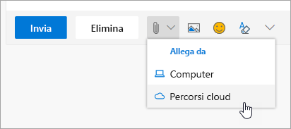

# Collaborare con i colleghi

Sono le 14:00 ed è ora di collaborare con i colleghi. Con Office 365 offre le migliori opportunità per la collaborazione, che consentono ai team di collaborare in diversi modi. 

## Strumenti
- Microsoft Teams
- Office Online
- OneNote
- SharePoint e OneDrive
- 
## Elenco di controllo per collaborare con i colleghi
- Creare o partecipare a un team di Microsoft per collaborare
- Creare e condividere file da OneDrive 
- Creare in modalità condivisa in Office 365 
- Usare allegati cloud

## Creare o partecipare a un team di Microsoft per la collaborazione

Microsoft Teams e i canali sono luoghi in cui le persone possono collaborare condividendo i file, monitorando le azioni del team e molto altro. Ogni team di Microsoft Teams dispone di un sito di SharePoint, un blocco appunti di OneNote e altre risorse. Questo servizio di Office 365 è ideale per le persone che collaborano spesso a progetti od obiettivi condivisi. 

## Condivisione di file da OneDrive
I file salvati in OneDrive for Business possono essere condivisi con qualsiasi utente dal browser o da applicazioni desktop di Office 365 come Word o Excel. È possibile condividere con altri utenti usando il nome, l'alias o l'indirizzo di posta elettronica aziendale. 

## Creare in modalità condivisa in Office 365
La creazione condivisa avviene in contemporanea con i colleghi sullo stesso file. È possibile eseguire questa operazione nelle versioni basate sul Web delle app di base di Office 365 e nelle versioni desktop di tali applicazioni a partire da Office 2016.  È possibile risparmiare tempo e collaborare sullo stesso documento. Office sincronizza automaticamente le modifiche, anche se si è offline. 

## Usare allegati cloud: mai più fogli di lavoro inviati per posta elettronica.
Quante volte capita di dover cercare la versione giusta di un documento che era stato inviato per e-mail? Ora in Office 365 è possibile condividere un collegamento al file, detto allegato cloud, in modo che tutti gli utenti lavorino sulla stessa versione.  È possibile scegliere di inviare un collegamento e se le persone possono visualizzare o modificare il file. 

