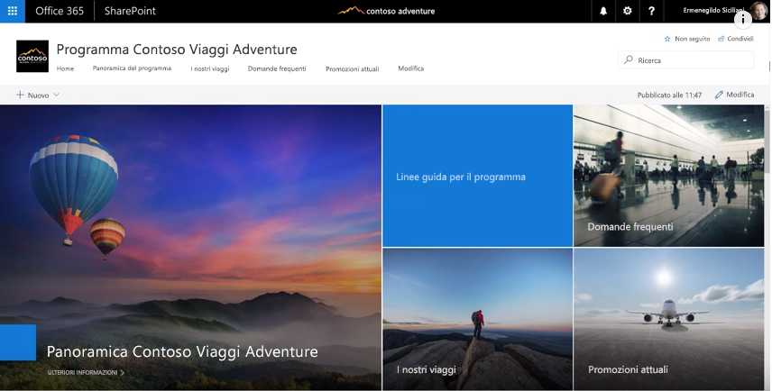

# Collegare l'intera azienda

È stata una giornata faticosa, ma prima di uscire dall'ufficio è necessario assicurarsi che tutte le persone interessate vengano aggiornate su ciò che sta accadendo. Assicurarsi che tutte le parti interessate, all'interno e all'esterno del team, comprendano gli obiettivi, lo stato di avanzamento e i risultati, è una parte importante del lavoro.  

## Strumenti
- SharePoint
- Yammer
- Outlook
- Microsoft Teams 

## Elenco di controllo per comunicare nell'intera azienda
- Conoscere il pubblico e i metodi di comunicazione che utilizzano
- Assegnare un target ai messaggi in base alla persona, ad esempio uno stakeholder del progetto, un membro del team o un dipendente
- Selezionare strumenti di comunicazione complementari tra loro, ad esempio, creare un post nella community di Yammer e inviare un avviso tramite posta elettronica 
- Creare documenti in modalità condivisa con altri membri del team
- Pubblicare le informazioni e inviare una notifica a tutte le parti interessate 
 
## Scegliere il metodo di comunicazione
Usare le informazioni riportate di seguito per decidere il modo migliore per comunicare con il team. Bilanciare l'uso di nuove tecnologie con avvisi e-mail tradizionali mentre le persone passano ai nuovi metodi di comunicazione. Un approccio coerente alla comunicazione rappresenta un modo efficace per favorire la consapevolezza e la riorganizzazione aziendale. 

**Yammer**: è possibile favorire la conversazione in un ampio gruppo di persone usando Yammer per condividere gli aggiornamenti. Pubblicare un aggiornamento standard o usare la funzionalità Annuncio per assicurare che una copia dell'aggiornamento venga recapitata nella cassetta postale di ciascun utente. 

**SharePoint**: se si vuole contattare persone esterne al gruppo di lavoro, è possibile scrivere un breve articolo, ad esempio sull'avanzamento dei lavori, per renderlo immediatamente disponibile e mantenerlo attivo per tutta la durata del progetto su SharePoint Online. Usare una pagina moderna in un sito del team di SharePoint o, per programmi più ampi, è consigliabile creare un sito di comunicazione di SharePoint. 

I siti di comunicazione di SharePoint forniscono articoli visivi e flessibili sulle novità che consentono di incorporare immagini, dashboard e testi. Le informazioni sono quindi accessibili tramite qualsiasi browser o tramite l'app di SharePoint per dispositivi mobili. Questo video fornisce una rapida panoramica di cosa possono fare questi potenti siti. Per garantire la migliore visibilità possibile, aggiungere il sito di comunicazione come scheda del gruppo di lavoro in Microsoft Teams.

**Microsoft Teams**: se questo ampio gruppo di utenti fa già parte del gruppo di lavoro in Microsoft Teams, pubblicare una nota nel canale generale con le informazioni principali e un collegamento a una pagina Wiki per un aggiornamento più completo.  Le pagine Wiki possono essere create in modo condiviso da più persone e rimangono invariate per tutta la durata del team. 

## Suggerimento per modernizzare le comunicazioni

**Per i colleghi amanti della posta elettronica**: iscriverli agli avvisi del gruppo di Yammer o del feed di notizie di SharePoint.  In questo modo riceveranno una notifica nella loro casella di posta elettronica per informarli che sono state pubblicate nuove informazioni. Potranno quindi fare clic sulle informazioni di origine senza dover creare un messaggio di posta elettronica separato.  Un consiglio interessante  Personalizzare le notifiche con Microsoft Flow o PowerApps. È consigliabile organizzare una riunione informale durante la pausa pranzo per mostrare a questi utenti come usare Microsoft Teams, SharePoint o Yammer nei dispositivi mobili. 

**Far parlare le persone** Attivare i commenti per le pagine del sito di comunicazione di SharePoint per coinvolgere maggiormente gli utenti.  Se si usa Yammer, assicurarsi che le persone partecipino alla community controllando regolarmente se ci sono nuove domande a cui rispondere. 

**Condivisione esterna**: Microsoft Teams, SharePoint e Yammer supportano tutti la condivisione esterna se l'amministratore lo consente nell'istanza di Office 365.  Con la condivisione esterna è possibile condividere gli aggiornamenti con le persone che lavorano per partner, fornitori e, naturalmente, i clienti.