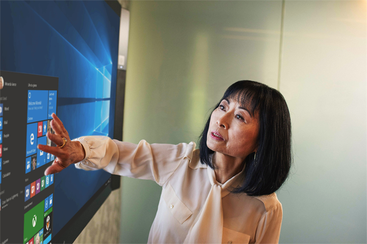
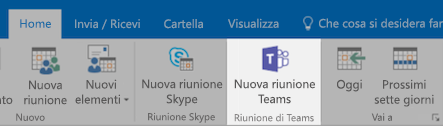
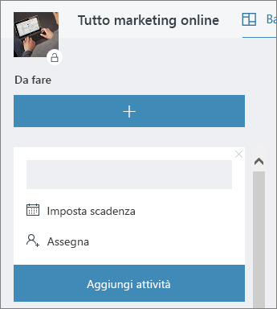

# Riunioni in ufficioMeeting at the Office

È 10:00 AM e l'ora per la riunione. In questa sezione viene illustrato rendere più produttivi le riunioni.  Comporta la procedure consigliate per la preparazione della riunione e gli strumenti di Office 365.It's 10:00 AM and time for your meeting. In this section, we'll show you how to make your meetings more productive.  This involves best practices for meeting preparation and Office 365 tools.  

## StrumentiTools
- OutlookOutlook
- Microsoft TeamsMicrosoft Teams
- Skype for BusinessSkype for Business
- OneNoteOneNote

## Elenco di controllo per la riunioneChecklist for your meeting
- Pianificazione e le riunioniPlan and book your meeting
- Partecipare a una riunioneJoin a meeting
- Informazioni presenti in una riunionePresent information in a meeting
- Utilizzare per la creazione condivisa e note di OneNote in una riunioneUse OneNote in a meeting for co-creation and notes
- Pianificazione di utilizzo in una riunione per tenere traccia delle attività per progettoUse Planner in a meeting to track action items for that project
- Terminare una riunioneEnd a meeting
 
## Pianificazione e le riunioniPlan and book your meeting
Esistono alcune operazioni da eseguire per garantire che la riunione è il livello di produttività possibile:There are a few things you can do to ensure your meeting is as productive as possible:

1. **Necessità di una riunione?** Prendere in considerazione la condivisione di un file in chat con i revisori necessari prima.**Do you need a meeting?** Consider sharing a file in chat with the necessary approvers first.  
1. **Avere una chiara agenda.**  Includere la agenda riunione nella sezione Note dell'invito alla riunione online in modo che i partecipanti possono essere preparati.**Have a clear agenda.**  Include your meeting agenda in the notes section of your online meeting invitation so attendees can be prepared.
1. **Record alla riunione**  Utilizzare le funzioni di registrazione delle riunioni in Teams Microsoft per condividere la riunione con persone che non è possono partecipare o trascrivere note sulla versione successiva.**Record your meeting**  Use meeting recording functions in Microsoft Teams to share the meeting with people who could not attend or to transcribe notes later.  

A questo punto si è pronti per tale riunione del libro: libro alla riunione con Microsoft Teams o in dettaglio le Skype for Business in Outlook. Pur pertanto consente di includere i membri del team da posizioni diverse, registrare la riunione e utilizzare video (se disponibili) per migliorare la comunicazione.Now you're ready to book that meeting:  Book the meeting with Microsoft Teams or Skype for Business details in Outlook. Doing so enables you to include team members from different locations, record the meeting and utilize video (when available) to enhance communication. 

## Partecipare a una riunioneJoin a meeting
Partecipare da qualsiasi posizione. È possibile partecipare a una Teams Microsoft o Skype per le riunioni aziendali da qualsiasi posizione tramite un dispositivo mobile, è possibile chiamare il numero di accesso nei dettagli della riunione o utilizzando applicazioni per dispositivi mobili. Quando si utilizzano le applicazioni per dispositivi mobili, tenere conto dei limiti di utilizzo di dati per dispositivi mobili che si applicano all'utente o il proprio paese.Join from anywhere. It is possible to join a Microsoft Teams or Skype for Business meeting from anywhere using a mobile device, either by calling the dial-in number in the meeting details or using the mobile apps. When using the mobile apps, be conscious of mobile data usage limits that apply to you or your country.

> [!TIP]
> **Utilizzare un auricolare.** Se ci si connette dal computer dell'utente alla scrivania, utilizzare un auricolare anziché microfono del computer in uso e gli altoparlanti per garantire una migliore qualità delle chiamate.**Use a headset.** If you are connecting from your computer at your desk, use a headset rather than your computer's built-in microphone and speakers to ensure a better call quality.

> [!TIP]
> Attivare la funzionalità video! Quando fotocamere sono disponibile, è opportuno utilizzarle, durante la comunicazione faccia a faccia fornisce non verbali che possono essere perse quando si utilizza solo VoIP. Non bisogna preoccuparsi, i fini accattivante.Turn on your video! When cameras are available, it's worth using them, as face-to-face communication provides non-verbal cues that can be missed when just using voice. Don't worry, your hair looks great. 

## Informazioni presenti in una riunionePresent information in a meeting
Condivisione di contenuto da un dispositivo è un modo straordinario per lo stato attivo alla riunione e forniscono il contesto alla discussione. In generale, condivisione dello schermo intero può essere una buona idea. Significa che tutto ciò che viene visualizzata sullo schermo verrà visualizzato nella schermata di tutti i partecipanti alla riunione. Evitare questo problema selezionando semplicemente il contenuto che si desidera condividere Microsoft Teams.Sharing content from your device is a great way to focus your meeting and provide context to the discussion. In general, sharing your entire screen can be a bad idea. It means that everything that comes up on your screen will appear on the screens of everyone attending the meeting. Avoid this by simply selecting the content you want to share in Microsoft Teams. 

## Utilizzare OneNote in una riunioneUse OneNote in a meeting
OneNote può consentire per la collaborazione in tempo reale e la creazione condivisa, rendendo strumento ideale per brainstorming e prendere nota taking nelle riunioni. Purché chiunque abbia accesso al percorso in cui è condivisa di OneNote, è possibile inserire un collegamento nel blocco note e avviare immediatamente brainstorming.OneNote can allow for real-time collaboration and co-creation, making it an ideal tool for brainstorming and note taking in meetings. As long as everyone has access to the location where the OneNote is shared, you can post a link to the notebook and start brainstorming right away.

È possibile creare una sezione specifica per Lotus notes nel blocco appunti team delle riunioni. Inoltre, è possibile utilizzare la funzionalità "dettagli sulla riunione" in OneNote per creare pagine con un riepilogo dei dettagli della riunione.You can create a specific section for meeting notes in the team notebook. You can also use the "meeting details" functionality in OneNote to create pages with a summary of the details of the meeting.

## Utilizzare pianificazione in una riunioneUse Planner in a meeting
Aggiungere direttamente le azioni in un piano per il progetto evita la trascrizione li dopo aver fatto. È consigliabile nelle riunioni di progetto di grandi dimensioni per assegnare una persona all'azione prendere appunti & di verifica. In genere si tratta di un utente diverso rispetto a singoli che esegue la riunione. Promemoria azione vengono inviati direttamente ai singoli a cui è assegnato come sono promemoria se l'elemento passa la data di scadenza.Directly adding action items into a plan for your project saves you from transcribing them after the fact. It's a best practice in large project meetings to assign someone to action tracking & note taking. This is normally a different person than the individual running the meeting. Action item reminders are sent directly to the individual to whom it is assigned as are reminders if the item passes it's due date. 

## Terminare una riunioneEnd a meeting
Quando tutti gli elementi in agenda trattati, terminare la riunione, indipendentemente dal momento. Assegnare e inviare le azioni a tutti i partecipanti. Se si collabora Teams Microsoft, è possibile condividere facilmente le attività nel canale appropriato. Le azioni possono anche essere immesso e assegnate nella visualizzazione pianificazione durante la riunione, che fornisce un modo rapido per tenere traccia per il completamento che può essere [vi si accede nel team di Microsoft](https://support.office.com/en-us/article/use-planner-in-microsoft-teams-62798a9f-e8f7-4722-a700-27dd28a06ee0).When everything on the agenda has been discussed, end the meeting, regardless of the time. Assign and send action items to all participants. If you are collaborating in Microsoft Teams, you can easily share action items in the appropriate channel. Action items can also be entered and assigned in Planner during the meeting, providing a fast way to track for completion which can also be [accessed in Microsoft Teams](https://support.office.com/en-us/article/use-planner-in-microsoft-teams-62798a9f-e8f7-4722-a700-27dd28a06ee0). 